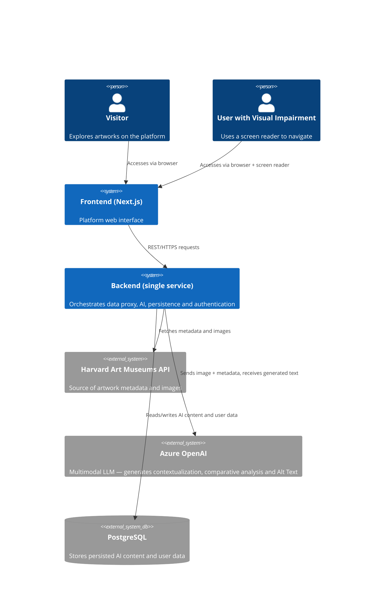
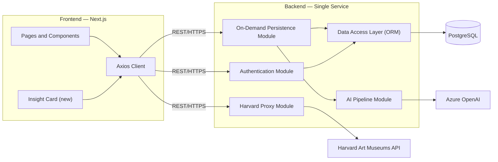
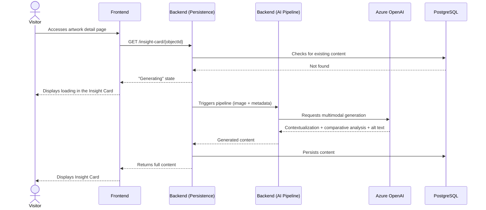
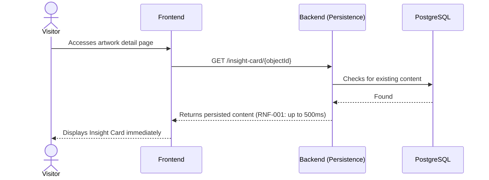
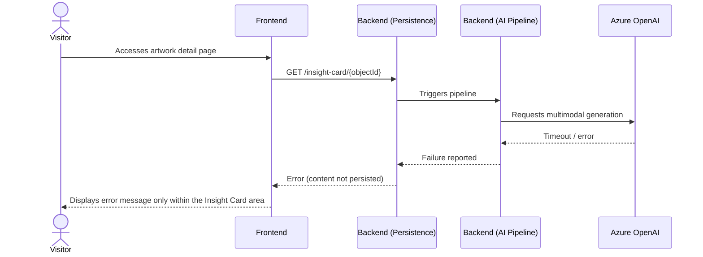
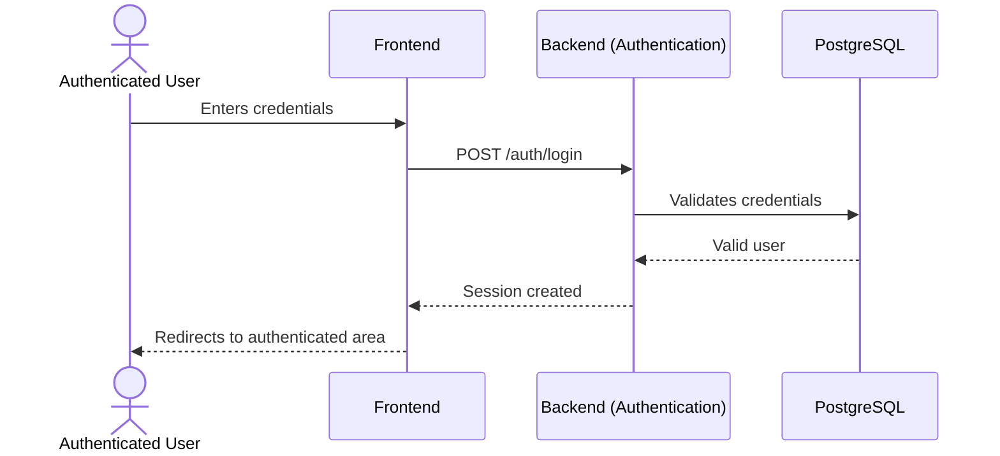
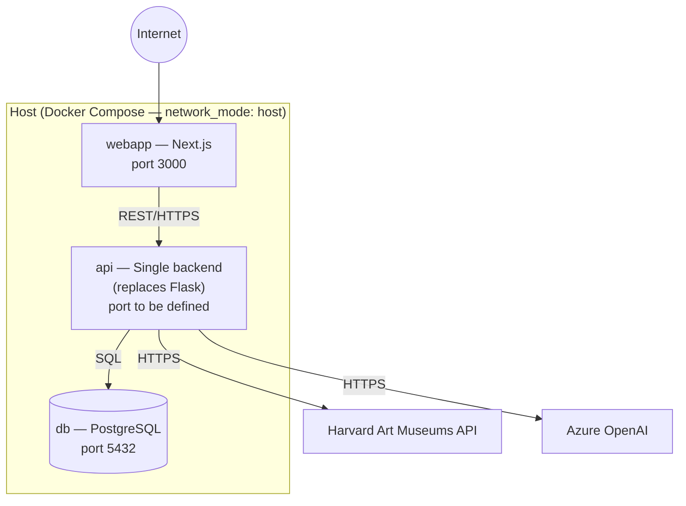

# System Architecture — Art Archive AI

**Version:** 1.0
**Date:** 2026-07-03
**Status:** In review
**Base documents:** [01 — Vision and Scope](./01-vision-scope.md), [02 — Requirements](./02-requirements.md), [03 — Use Cases](./03-use-cases.md)

---

## 1. Architecture Overview

Art Archive AI follows a **client-server** style: a web front-end (Next.js) consumes a single back-end service via REST API, which in turn integrates three external systems — the Harvard Art Museums API (artwork data), Azure OpenAI (AI-generated content) and PostgreSQL (persistence).

**Structural change relative to the MVP:** the current back-end is a Flask proxy (`proxy/proxy.py`) with the single responsibility of forwarding calls to the Harvard API and authenticating users via the Firebase Admin SDK. This expansion **replaces that proxy with a new single service** (Python, e.g. FastAPI) that absorbs:

- the Harvard Art Museums API proxy (rewritten, preserving the contract currently consumed by the front-end),
- the AI content generation pipeline (Insight Card + Alt Text),
- the on-demand persistence mechanism,
- user authentication, implemented from scratch on top of PostgreSQL, fully replacing Firebase Auth.

> **Change Note (2026-07-03):** the authentication PostgreSQL database is created from scratch — no Firebase data (users, sessions, preferences) is migrated or preserved. Firebase is discontinued entirely, with no transition step. Passages in this document that mentioned "migration" have been revised to reflect this decision.

There will not be two Python services coexisting permanently — Flask is discontinued at the end of the migration (see Section 9, Decision 1).

---

## 2. Actors and External Systems (Context Diagram)

---

## 3. Frontend Modules (Next.js)

The front-end keeps its existing structure (Next.js 14, App Router, TypeScript). No MVP module is rewritten; the expansion adds new components on top of the current base.

| Module                 | Location                                                                                         | Responsibility                                                                                               |
| ---------------------- | ------------------------------------------------------------------------------------------------ | ------------------------------------------------------------------------------------------------------------ |
| Grid and Filters (MVP) | `src/app/home/`                                                                                  | Artwork navigation and filters — unchanged                                                                   |
| Artwork Detail Page    | `src/app/object/[objectId]/page.tsx`                                                             | Displays metadata, images and artists — receives the new Insight Card                                        |
| **Insight Card (new)** | `src/app/object/[objectId]/components/insightCard/`                                              | Displays historical contextualization, comparative analysis and loading/error states (RF-004 through RF-006) |
| Authentication         | `src/app/login/`, `src/app/signUp/`, `src/actions/authActions.ts`, `src/hooks/useUserSession.ts` | Currently uses inert Firebase code; will consume the new backend's authentication endpoints (RF-013)         |
| HTTP Client            | `src/libs/axios/axios.ts`                                                                        | Axios instance pointing to the new single service (`NEXT_PUBLIC_API_URL`)                                    |
| Global State           | `jotai` (used dispersedly across components)                                                     | Client-side state management — no structural changes foreseen                                                |
| Route Middleware       | `src/middleware.ts`                                                                              | Protects authenticated routes via session cookie — will validate sessions issued by the new backend          |

**Note:** the code under `src/libs/firebase/` (config and auth) is currently commented out/inert in the front-end. Since no Firebase data is migrated, it can be removed from the repository as soon as the new authentication endpoints (RF-013, RF-014) are functional — there is no transition window to wait for.

---

## 4. Backend Modules (Single Service)

The new service replaces `proxy/proxy.py` and is organized into the following internal modules:

| Module                    | Responsibility                                                                                                                                                                      | Related Requirements                   |
| ------------------------- | ----------------------------------------------------------------------------------------------------------------------------------------------------------------------------------- | -------------------------------------- |
| **Harvard Proxy**         | Forwards and normalizes calls to the Harvard Art Museums API, preserving the contract currently consumed by the front-end (`/proxy/object/{id}`, `/proxy/object/{id}/people`, etc.) | Inherited from the MVP — no new RF     |
| **AI Pipeline**           | Builds the prompt from the artwork's image and metadata, calls multimodal Azure OpenAI, parses the response into historical contextualization, comparative analysis and Alt Text    | RF-002, RF-003, RF-007, RF-009         |
| **On-Demand Persistence** | Checks in the database whether the content already exists before triggering the AI Pipeline; persists the result after successful generation                                        | RF-001, RF-016, RF-017, RF-018, RF-019 |
| **Authentication**        | Login, session creation and validation via PostgreSQL, built from scratch; fully replaces token verification via the Firebase Admin SDK                                             | RF-013, RF-014                         |
| **Admin**                 | Endpoints supporting the administrative panel (listing of processed artworks, generation status)                                                                                    | Block 7 of doc 99                      |
| **Data Access**           | ORM and migrations layer on top of PostgreSQL (e.g. SQLAlchemy + Alembic — to be confirmed in detail in doc 05)                                                                     | RNF-003, RNF-006                       |

Every call to Azure OpenAI and to the Harvard Art Museums API happens **exclusively on the backend** — no API key is exposed to the front-end (RNF-005).

---

## 5. Database (Macro View)

This section presents only enough to give context to the architecture. The full model (ERD, data dictionary) is specified in **doc 05 — Database**.

- **AI content per artwork table**: stores historical contextualization, comparative analysis, Alt Text, prompt version and timestamps, indexed by the artwork's identifier in the Harvard API.
- **Users table**: stores identifier, email, name and credentials, replacing the records currently kept in Firebase Auth.

---

## 6. Component Diagram

---

## 7. Call Flows (Sequence Diagrams)

### 7.1 First Visit to an Artwork — Generation and Persistence (UC-01)

### 7.2 Subsequent Visit — Cached Content (UC-02)

### 7.3 Generation Failure (UC-03)

### 7.4 Platform Login (UC-06)

---

## 8. Deployment Architecture

The deployment environment remains **self-hosted via Docker Compose**, as in the MVP, with the addition of a container for PostgreSQL.

**Changes relative to the current `docker-compose.yml`:**

- The `api` service (currently built from `./proxy`, Flask) will now be built from the new single service.
- A new `db` service (official `postgres` image) is added, with a persistent volume for the data.
- The bind mount of `.firebaseAdminSDK.json` and all Firebase dependencies are removed from the `api` service from the very start of the new backend's implementation — there are no legacy users to validate, so there is no need to keep it during any transition window.
- Backend environment variables (Azure OpenAI key, PostgreSQL connection string, Harvard API key) continue to be provided via `env_file`, never hardcoded (RNF-005).

---

## 9. Architectural Decisions

| #   | Decision                                                                                                                                     | Rationale                                                                                                                                                                          |
| --- | -------------------------------------------------------------------------------------------------------------------------------------------- | ---------------------------------------------------------------------------------------------------------------------------------------------------------------------------------- |
| 1   | Replace the Flask proxy with a single new service (e.g. FastAPI), also absorbing the Harvard API proxy                                       | Avoids permanently maintaining two Python services; typing and support for asynchronous operations favor the AI pipeline, which involves potentially long external calls (RNF-002) |
| 2   | PostgreSQL as an additional container in the existing `docker-compose.yml`, with no migration to the cloud                                   | Keeps operational complexity compatible with an academic project developed individually, within a one-semester timeline                                                            |
| 3   | Every call to Azure OpenAI and to the Harvard API happens exclusively on the backend                                                         | RNF-005 — no API key may be exposed to the client                                                                                                                                  |
| 4   | The "check before generating" logic (on-demand persistence) lives entirely in the backend, never in the front-end                            | RF-016, RF-017, RF-018 — the front-end must not decide whether content needs to be generated; it only requests and receives the result                                             |
| 5   | Firebase code and credentials are removed from the project as soon as the new authentication system is functional, with no transition period | No Firebase data is preserved (decision of 2026-07-03) — there is no reason to keep legacy code or credentials beyond what is necessary for reference during initial development   |

---

## 10. Architectural Constraints

This architecture operates under the constraints already defined in previous documents:

- **Technical constraints** (doc 01, §6.1): dependency on the Harvard Art Museums API under an educational license; dependency on Azure OpenAI; PostgreSQL as the sole database for this phase.
- **RNF-001 / RNF-002**: maximum response times (500ms for cached content, 60s for generation) directly influence the design of the On-Demand Persistence module and the choice of a backend with support for asynchronous calls.
- **RNF-004**: WCAG 2.1 AA compliance is the responsibility of the Frontend module, not the Backend.
- **RNF-005**: credential security — no API key is stored or transmitted by the front-end.
- **RNF-008**: degraded availability — the architecture ensures that a failure in the AI Pipeline module or in Azure OpenAI does not bring down the Harvard Proxy module or the MVP's functionalities.

---

## 11. Known Architectural Risks

Risks identified during this design phase; formal treatment (probability, impact, mitigation) is the responsibility of **doc 15 — Risk Management Plan**.

- **Harvard proxy rewrite**: replacing `proxy.py` (currently functional) with the new single service introduces a risk of regression in MVP functionality (grid, filters, detail page). Recommended mitigation: parity tests for the new proxy before discontinuing Flask.
- **`network_mode: host`**: the current Docker Compose configuration couples the services to the host network, which limits future portability to managed or multi-host environments.
- **Absence of CI/CD**: there is no automated build/test/deploy pipeline today; manual configuration errors in the self-hosted deploy are an operational risk to consider.

---

## 12. Traceability

| Module/Component        | Related Requirements                                     | Related Use Cases          |
| ----------------------- | -------------------------------------------------------- | -------------------------- |
| Harvard Proxy           | — (inherited from the MVP)                               | —                          |
| AI Pipeline             | RF-002, RF-003, RF-007, RF-009, RNF-002, RNF-006         | UC-01, UC-03               |
| On-Demand Persistence   | RF-001, RF-016, RF-017, RF-018, RF-019, RNF-001, RNF-003 | UC-01, UC-02, UC-03        |
| Authentication          | RF-013, RF-014                                           | UC-06                      |
| Insight Card (Frontend) | RF-004, RF-005, RF-006, RF-008, RF-010, RF-011, RF-012   | UC-01, UC-03, UC-04, UC-05 |
| Data Access Layer       | RNF-003, RNF-006                                         | —                          |

> The complete matrix, connecting requirements to architecture components and test cases, will be formalized in document 16 — Traceability Matrix.
