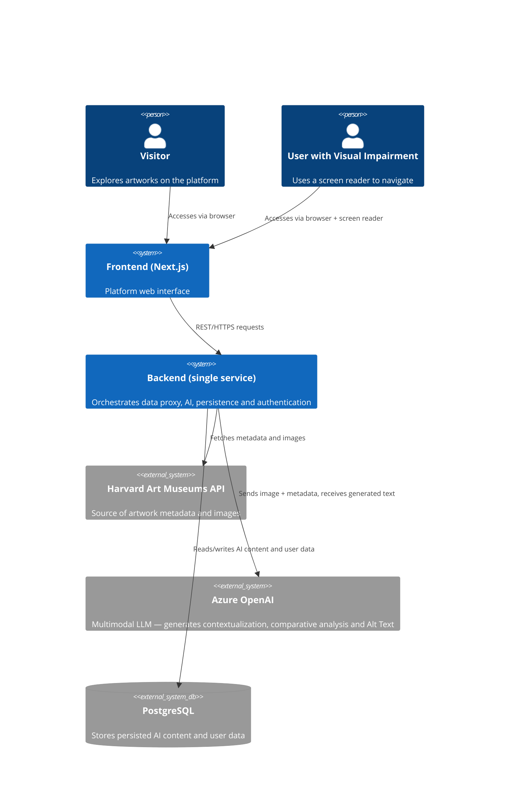
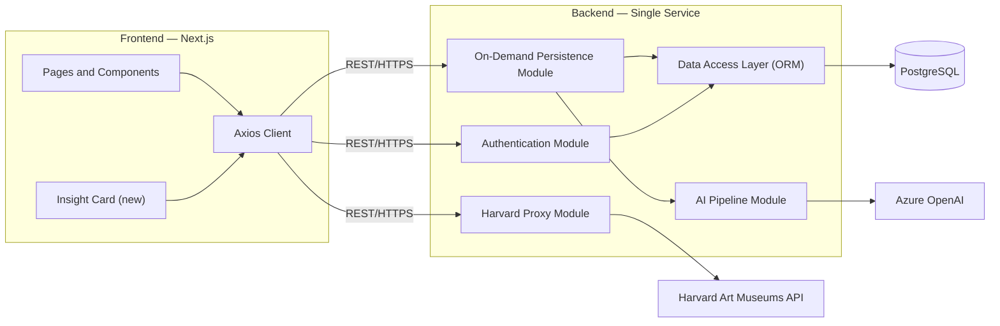
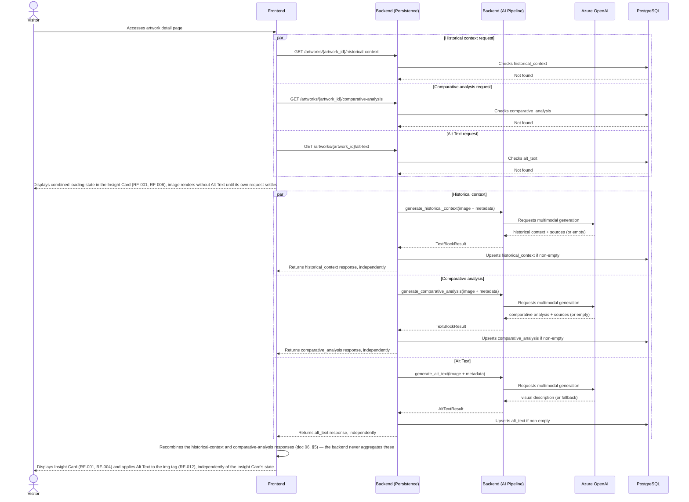
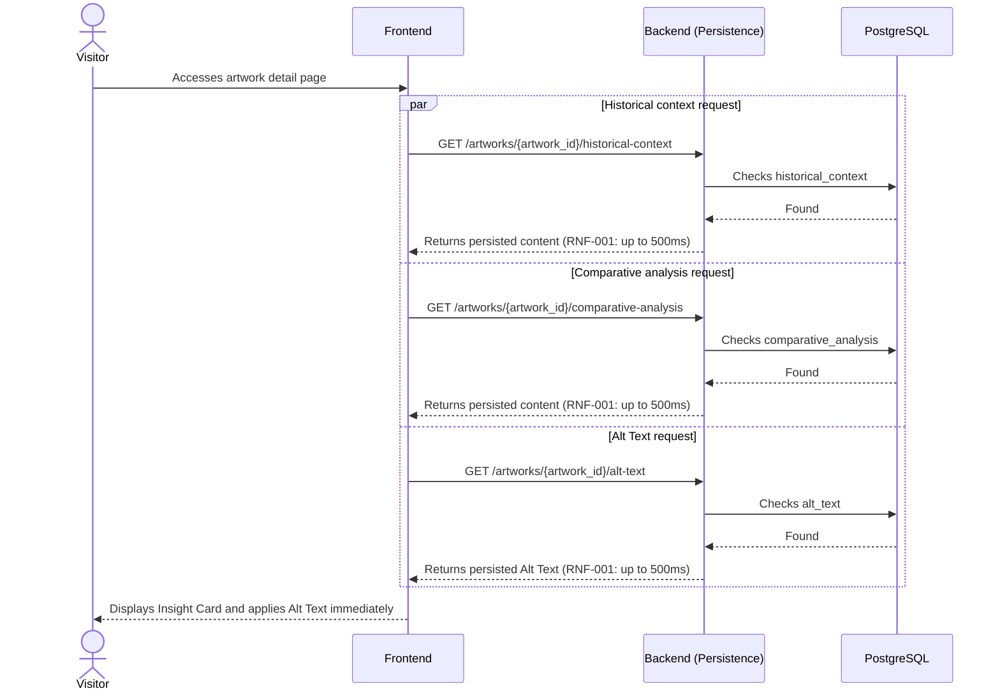
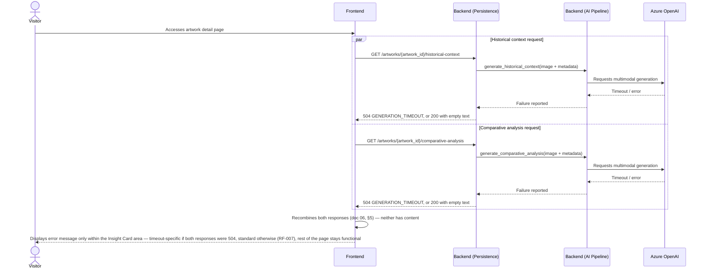
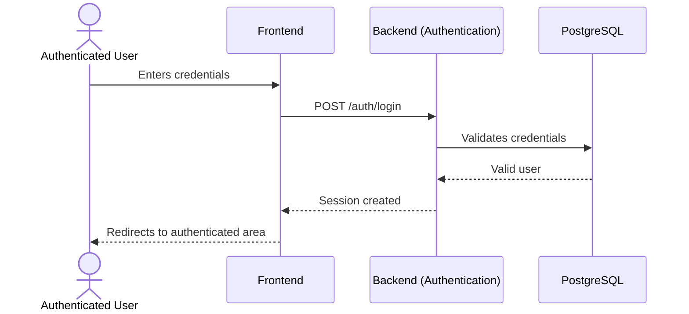
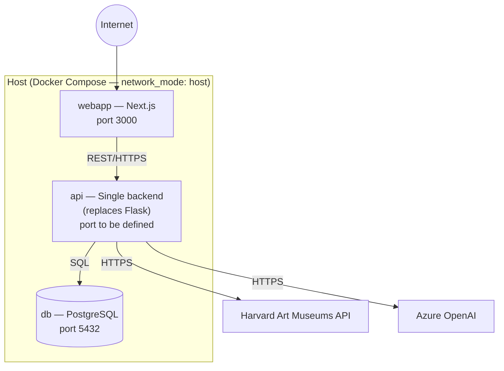

# System Architecture — Art Archive AI

**Version:** 1.1
**Date:** 2026-07-26
**Status:** In review
**Base documents:** [01 — Vision and Scope](./01-vision-scope.md), [02.1 — Insight Card](./requeriments/02.1-insight-card.md), [02.2 — Alt Text](./requeriments/02.2-alt-text.md), [02.4 — Authentication](./requeriments/02.4-authentication.md), [02.5 — Non-Functional](./requeriments/02.5-non-functional.md), [03 — Use Cases](./03-use-cases.md)

> **Change Note (2026-07-26):** requirement IDs throughout this document have been remapped from the original flat `02-requirements.md` numbering to the current split numbering (docs 02.1–02.5) — the numbers no longer align 1:1 with the previous revision. Two substantive updates: (1) the AI Pipeline module (§4) is now invoked as **three independent calls** — historical context, comparative analysis, and Alt Text are each checked, generated, and persisted on their own, per RF-001 (doc 02.1) and RF-013 (doc 02.2), instead of one combined call; (2) the Authentication module is now **email/password only** (RF-026, doc 02.4), with no Google OAuth path.
>
> **Change Note (2026-07-26, addendum):** the system policy is that **no register is ever physically deleted** — records are logically retired via an `expired_at` timestamp column (soft delete) instead. This is now reflected in §5 (Database macro view) and §9 (Decision 6). See doc 05 for the full column definition on `users` and `artwork_ai_content`.
>
> **Change Note (2026-07-26, §7 correction):** the sequence diagrams in §7 are corrected to show **three fully independent HTTP requests** fired by the front-end on artwork visit — `GET /artworks/{artwork_id}/historical-context`, `GET /artworks/{artwork_id}/comparative-analysis`, and `GET /artworks/{artwork_id}/alt-text` (doc 07, §4) — instead of one bundled `GET /artworks/{artwork_id}/insight-card` request covering all three blocks. The historical-context and comparative-analysis responses are still recombined into a single Insight Card loading/displayed/error state, but that recombination now happens in the **front-end**, once both of its independent responses have settled (doc 06, §5) — the backend performs no such aggregation.

---

## 1. Architecture Overview

Art Archive AI follows a **client-server** style: a web front-end (Next.js) consumes a single back-end service via REST API, which in turn integrates three external systems — the Harvard Art Museums API (artwork data), Azure OpenAI (AI-generated content) and PostgreSQL (persistence).

**Structural change relative to the MVP:** the current back-end is a Flask proxy (`proxy/proxy.py`) with the single responsibility of forwarding calls to the Harvard API and authenticating users via the Firebase Admin SDK. This expansion **replaces that proxy with a new single service** (Python, e.g. FastAPI) that absorbs:

- the Harvard Art Museums API proxy (rewritten, preserving the contract currently consumed by the front-end),
- the AI content generation pipeline (Insight Card + Alt Text),
- the on-demand persistence mechanism,
- user authentication, implemented from scratch on top of PostgreSQL, fully replacing Firebase Auth.

There will not be two Python services coexisting permanently — Flask is discontinued at the end of the migration (see Section 9, Decision 1).

---

## 2. Actors and External Systems (Context Diagram)

---

## 3. Frontend Modules (Next.js)

The front-end keeps its existing structure (Next.js 14, App Router, TypeScript). No MVP module is rewritten; the expansion adds new components on top of the current base.

| Module                 | Location                                                                                         | Responsibility                                                                                                                                            |
| ---------------------- | ------------------------------------------------------------------------------------------------ | --------------------------------------------------------------------------------------------------------------------------------------------------------- |
| Grid and Filters (MVP) | `src/app/home/`                                                                                  | Artwork navigation and filters — unchanged                                                                                                                |
| Artwork Detail Page    | `src/app/object/[objectId]/page.tsx`                                                             | Displays metadata, images and artists — receives the new Insight Card                                                                                     |
| **Insight Card (new)** | `src/app/object/[objectId]/components/insightCard/`                                              | Displays historical context and comparative analysis (each independently available) and the combined loading/error states (RF-001, RF-005 through RF-008) |
| Authentication         | `src/app/login/`, `src/app/signUp/`, `src/actions/authActions.ts`, `src/hooks/useUserSession.ts` | Currently uses inert Firebase code; will consume the new backend's email/password-only authentication endpoints (RF-026 through RF-031)                   |
| HTTP Client            | `src/libs/axios/axios.ts`                                                                        | Axios instance pointing to the new single service (`NEXT_PUBLIC_API_URL`)                                                                                 |
| Global State           | `jotai` (used dispersedly across components)                                                     | Client-side state management — no structural changes foreseen                                                                                             |
| Route Middleware       | `src/middleware.ts`                                                                              | Protects authenticated routes via session cookie — will validate sessions issued by the new backend                                                       |

**Note:** the code under `src/libs/firebase/` (config and auth) is currently commented out/inert in the front-end. Since no Firebase data is migrated, it can be removed from the repository as soon as the new authentication endpoints (RF-026, RF-027) are functional — there is no transition window to wait for.

---

## 4. Backend Modules (Single Service)

The new service replaces `proxy/proxy.py` and is organized into the following internal modules:

| Module                    | Responsibility                                                                                                                                                                                                                       | Related Requirements                   |
| ------------------------- | ------------------------------------------------------------------------------------------------------------------------------------------------------------------------------------------------------------------------------------ | -------------------------------------- |
| **Harvard Proxy**         | Forwards and normalizes calls to the Harvard Art Museums API, preserving the contract currently consumed by the front-end (`/proxy/object/{id}`, `/proxy/object/{id}/people`, etc.)                                                  | Inherited from the MVP — no new RF     |
| **AI Pipeline**           | Exposes three independent generation functions — historical context, comparative analysis, and Alt Text — each building its own prompt from the artwork's image and metadata and calling multimodal Azure OpenAI on its own (doc 09) | RF-002, RF-003, RF-009, RF-010, RF-011 |
| **On-Demand Persistence** | Checks in the database, per block, whether the content already exists before triggering the corresponding AI Pipeline call; persists each block's result independently after successful generation (doc 06)                          | RF-001, RF-004, RF-013                 |
| **Authentication**        | Login, session creation and validation via PostgreSQL, built from scratch, email/password only — fully replaces token verification via the Firebase Admin SDK, with no third-party identity provider                                 | RF-026 through RF-031                  |
| **Data Access**           | ORM and migrations layer on top of PostgreSQL (e.g. SQLAlchemy + Alembic — to be confirmed in detail in doc 05)                                                                                                                      | RNF-003, RNF-006                       |

Every call to Azure OpenAI and to the Harvard Art Museums API happens **exclusively on the backend** — no API key is exposed to the front-end (RNF-005).

---

## 5. Database (Macro View)

This section presents only enough to give context to the architecture. The full model (ERD, data dictionary) is specified in `spcecs/05-database.md`.

- **AI content per artwork table**: stores historical context, comparative analysis, and Alt Text as three **independently nullable** columns, each with its own prompt version and generation timestamp, indexed by the artwork's identifier in the Harvard API — since each block is checked, generated, and persisted on its own (RF-001, RF-013). Carries an `expired_at` column for soft delete (see below).
- **Sources table**: stores zero or more source URLs per generated text block (historical context or comparative analysis), satisfying RF-010.
- **Users table**: stores identifier, email, name, and a password hash — email/password is the sole credential (RF-026), replacing the records currently kept in Firebase Auth. Carries an `expired_at` column for soft delete (see below).
- **Password reset tokens table**: single-use, expiring tokens backing the "Forgot Password"/"Change Password" flow (RF-029, RF-030).
- **Soft delete policy**: no register in this database is ever physically deleted. Retiring a user account or an artwork's AI content is modeled by setting `expired_at` to the moment of retirement; the row itself is preserved. A `NULL` `expired_at` means the register is active. Application queries that read "current" data (login, on-demand persistence checks) must filter on `expired_at IS NULL`.

---

## 6. Component Diagram

---

## 7. Call Flows (Sequence Diagrams)

### 7.1 First Visit to an Artwork — Independent Generation and Persistence (UC-01)

**Note:** the three `par` branches above represent three fully independent HTTP requests (doc 07, §4), each hitting its own backend request handler — they are drawn together only to show that the front-end fires them concurrently on the same visit. No shared backend state or synchronization point connects them; a slow or failed request never blocks or is blocked by the other two.

---

### 7.2 Subsequent Visit — Cached Content (UC-02)

---

### 7.3 Generation Failure — Both Insight Card Blocks Fail (UC-03)

Alt Text is not shown in this diagram — it is a third, fully decoupled request (§7.1). A failure in `generate_alt_text` only affects the fallback message applied to the image (RF-011, scenario 3) and has no bearing on the Insight Card's state.

Note: if only **one** of the two Insight Card requests above fails, the flow does not reach this error path at all — the front-end's recombination (doc 06, §5) shows the successful block normally, with no error displayed (RF-007, scenario 1).

---

### 7.4 Platform Login (UC-06)

---

## 8. Deployment Architecture

The deployment environment remains **self-hosted via Docker Compose**, as in the MVP, with the addition of a container for PostgreSQL.

**Changes relative to the current `docker-compose.yml`:**

- The `api` service (currently built from `./proxy`, Flask) will now be built from the new single service.
- A new `db` service (official `postgres` image) is added, with a persistent volume for the data.
- The bind mount of `.firebaseAdminSDK.json` and all Firebase dependencies are removed from the `api` service from the very start of the new backend's implementation — there are no legacy users to validate, so there is no need to keep it during any transition window.
- Backend environment variables (Azure OpenAI key, PostgreSQL connection string, Harvard API key) continue to be provided via `env_file`, never hardcoded (RNF-005).

---

## 9. Architectural Decisions

| #   | Decision                                                                                                                                            | Rationale                                                                                                                                                                                                                                                                                                                                    |
| --- | --------------------------------------------------------------------------------------------------------------------------------------------------- | -------------------------------------------------------------------------------------------------------------------------------------------------------------------------------------------------------------------------------------------------------------------------------------------------------------------------------------------- |
| 1   | Replace the Flask proxy with a single new service (e.g. FastAPI), also absorbing the Harvard API proxy                                              | Avoids permanently maintaining two Python services; typing and support for asynchronous operations favor the AI pipeline, which involves potentially long external calls (RNF-002)                                                                                                                                                           |
| 2   | PostgreSQL as an additional container in the existing `docker-compose.yml`, with no migration to the cloud                                          | Keeps operational complexity compatible with an academic project developed individually, within a one-semester timeline                                                                                                                                                                                                                      |
| 3   | Every call to Azure OpenAI and to the Harvard API happens exclusively on the backend                                                                | RNF-005 — no API key may be exposed to the client                                                                                                                                                                                                                                                                                            |
| 4   | The "check before generating" logic (on-demand persistence) lives entirely in the backend, never in the front-end, and runs independently per block | RF-001, RF-004, RF-013 — the front-end must not decide whether content needs to be generated; it only requests and receives the result                                                                                                                                                                                                       |
| 5   | Firebase code and credentials are removed from the project as soon as the new authentication system is functional, with no transition period        | No Firebase data is preserved — there is no reason to keep legacy code or credentials beyond what is necessary for reference during initial development                                                                                                                                                                                      |
| 6   | Soft delete via an `expired_at` timestamp column on `users` and `artwork_ai_content`, instead of physical `DELETE` statements                       | System-wide policy: no register is ever physically removed. Preserves audit history on `users` and avoids irrecoverably discarding AI-generated content on `artwork_ai_content`, which is costly to regenerate. Active registers have `expired_at IS NULL`; all reads of "current" data must filter on this condition (`05-database.md`, §6) |

---

## 10. Architectural Constraints

This architecture operates under the constraints already defined in previous documents:

- **Technical constraints** (doc 01, §6.1): dependency on the Harvard Art Museums API under an educational license; dependency on Azure OpenAI; PostgreSQL as the sole database for this phase.
- **RNF-001 / RNF-002**: maximum response times (500ms per already-persisted block, 60s shared budget across the three independent generation calls) directly influence the design of the On-Demand Persistence module and the choice of a backend with support for asynchronous, concurrent calls.
- **RNF-004**: WCAG 2.1 AA compliance is the responsibility of the Frontend module, not the Backend.
- **RNF-005**: credential security — no API key is stored or transmitted by the front-end.
- **RNF-008**: degraded availability — the architecture ensures that a failure in the AI Pipeline module or in Azure OpenAI does not bring down the Harvard Proxy module or the MVP's functionalities.

---

## 11. Known Architectural Risks

Risks identified during this design phase; formal treatment (probability, impact, mitigation) is the responsibility of **doc 15 — Risk Management Plan**.

- **Harvard proxy rewrite**: replacing `proxy.py` (currently functional) with the new single service introduces a risk of regression in MVP functionality (grid, filters, detail page). Recommended mitigation: parity tests for the new proxy before discontinuing Flask.
- **`network_mode: host`**: the current Docker Compose configuration couples the services to the host network, which limits future portability to managed or multi-host environments.
- **Absence of CI/CD**: there is no automated build/test/deploy pipeline today; manual configuration errors in the self-hosted deploy are an operational risk to consider.

---

## 12. Traceability

| Module/Component        | Related Requirements                                           | Related Use Cases          |
| ----------------------- | -------------------------------------------------------------- | -------------------------- |
| Harvard Proxy           | — (inherited from the MVP)                                     | —                          |
| AI Pipeline             | RF-002, RF-003, RF-009, RF-010, RF-011, RNF-002, RNF-006       | UC-01, UC-03               |
| On-Demand Persistence   | RF-001, RF-004, RF-013, RNF-001, RNF-003                       | UC-01, UC-02, UC-03        |
| Authentication          | RF-026, RF-027, RF-028, RF-029, RF-030, RF-031                 | UC-06                      |
| Insight Card (Frontend) | RF-001, RF-005, RF-006, RF-007, RF-008, RF-014, RF-015, RF-016 | UC-01, UC-03, UC-04, UC-05 |
| Alt Text (Frontend)     | RF-011, RF-012, RF-013                                         | UC-01, UC-02               |
| Data Access Layer       | RNF-003, RNF-006                                               | —                          |

> The complete matrix, connecting requirements to architecture components and test cases, will be formalized in document 16 — Traceability Matrix.
