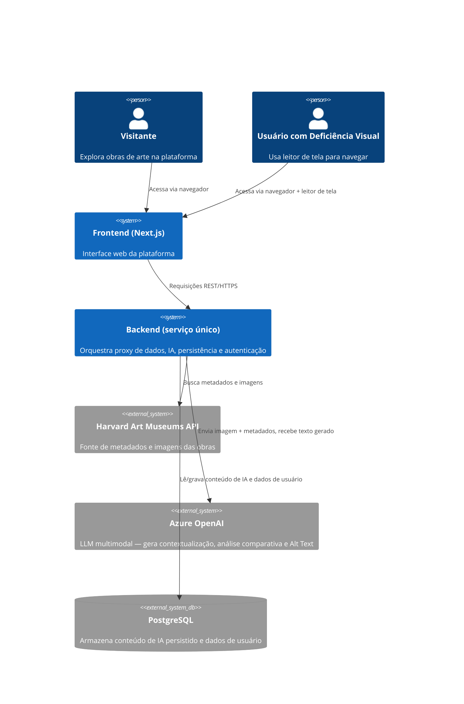
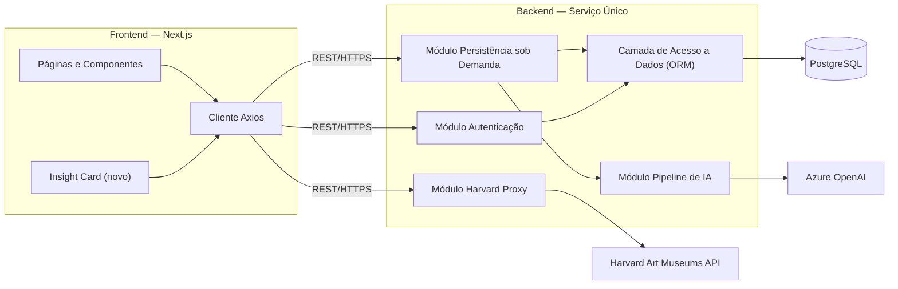
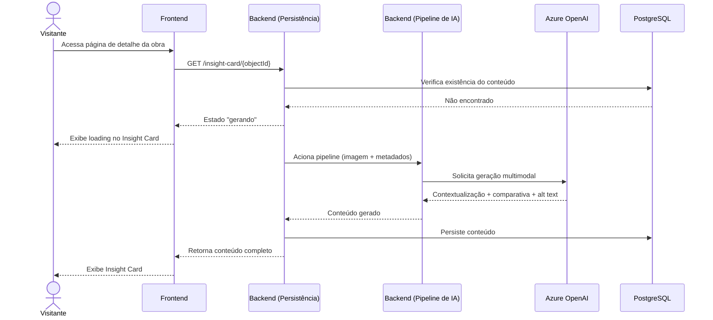
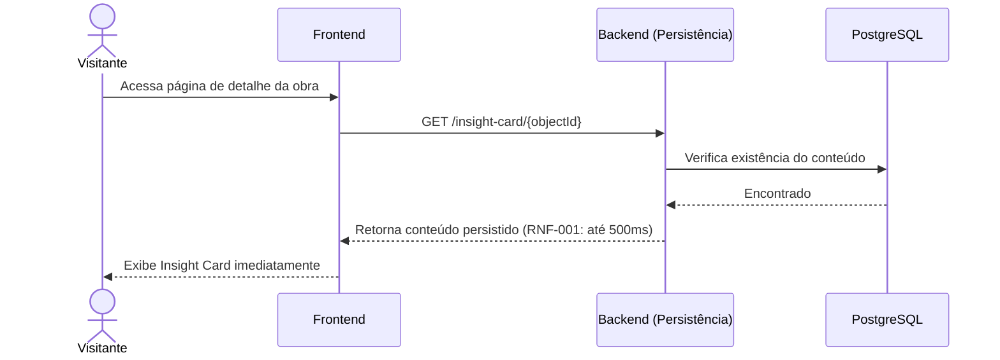
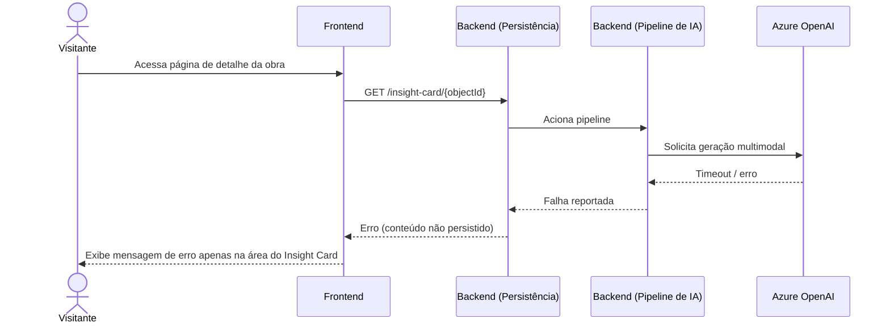
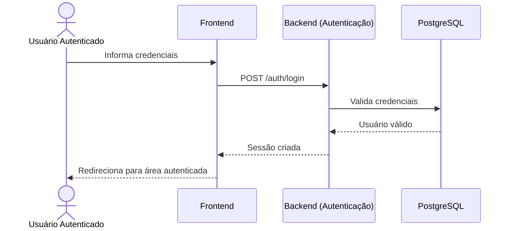
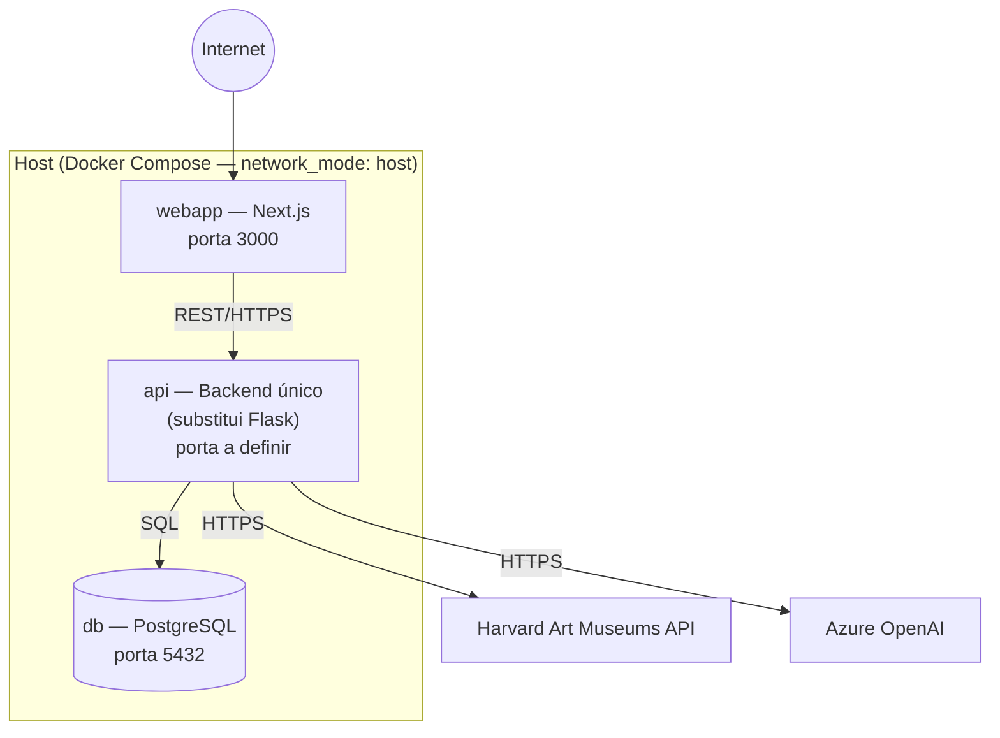

# Arquitetura do Sistema — Art Archive AI

**Versão:** 1.0
**Data:** 2026-07-03
**Status:** Em revisão
**Documentos base:** [01 — Visão e Escopo](./01-visao-escopo.md), [02 — Requisitos](./02-requisitos.md), [03 — Casos de Uso](./03-casos-de-uso.md)

---

## 1. Visão Geral da Arquitetura

O Art Archive AI segue um estilo **cliente-servidor**: um front-end web (Next.js) consome um único serviço de back-end via API REST, que por sua vez integra três sistemas externos — a Harvard Art Museums API (dados das obras), o Azure OpenAI (geração de conteúdo por IA) e o PostgreSQL (persistência).

**Mudança estrutural em relação ao MVP:** o back-end atual é um proxy Flask (`proxy/proxy.py`) com responsabilidade única de repassar chamadas à Harvard API e autenticar usuários via Firebase Admin SDK. Esta expansão **substitui esse proxy por um novo serviço único** (Python, ex.: FastAPI) que absorve:

- o proxy da Harvard Art Museums API (reescrito, preservando o contrato hoje consumido pelo front-end),
- o pipeline de geração de conteúdo por IA (Insight Card + Alt Text),
- o mecanismo de persistência sob demanda,
- a autenticação de usuários, implementada do zero sobre PostgreSQL, substituindo integralmente o Firebase Auth.

> **Nota de Alteração (2026-07-03):** o PostgreSQL de autenticação é criado do zero — nenhum dado do Firebase (usuários, sessões, preferências) é migrado ou preservado. O Firebase é descontinuado integralmente, sem etapa de transição. Trechos deste documento que mencionavam "migração" foram revisados para refletir essa decisão.

Não haverá dois serviços Python coexistindo permanentemente — o Flask é descontinuado ao final da migração (ver Seção 9, Decisão 1).

---

## 2. Atores e Sistemas Externos (Diagrama de Contexto)

---

## 3. Módulos do Frontend (Next.js)

O front-end mantém a estrutura já existente (Next.js 14, App Router, TypeScript). Nenhum módulo do MVP é reescrito; a expansão adiciona componentes novos sobre a base atual.

| Módulo                    | Localização                                                                                      | Responsabilidade                                                                                        |
| ------------------------- | ------------------------------------------------------------------------------------------------ | ------------------------------------------------------------------------------------------------------- |
| Grade e Filtros (MVP)     | `src/app/home/`                                                                                  | Navegação e filtros de obras — inalterado                                                               |
| Página de Detalhe da Obra | `src/app/object/[objectId]/page.tsx`                                                             | Exibe metadados, imagens e artistas — recebe o novo Insight Card                                        |
| **Insight Card (novo)**   | `src/app/object/[objectId]/components/insightCard/`                                              | Exibe contextualização histórica, análise comparativa e estados de loading/erro (RF-004 a RF-006)       |
| Autenticação              | `src/app/login/`, `src/app/signUp/`, `src/actions/authActions.ts`, `src/hooks/useUserSession.ts` | Hoje usa código Firebase inerte; passa a consumir os endpoints de autenticação do novo backend (RF-013) |
| Cliente HTTP              | `src/libs/axios/axios.ts`                                                                        | Instância Axios apontando para o novo serviço único (`NEXT_PUBLIC_API_URL`)                             |
| Estado Global             | `jotai` (uso disperso pelos componentes)                                                         | Gerenciamento de estado do lado cliente — sem mudanças estruturais previstas                            |
| Middleware de Rotas       | `src/middleware.ts`                                                                              | Protege rotas autenticadas via cookie de sessão — passa a validar sessão emitida pelo novo backend      |

**Nota:** o código em `src/libs/firebase/` (config e auth) está hoje comentado/inerte no front-end. Como nenhum dado do Firebase é migrado, ele pode ser removido do repositório assim que os novos endpoints de autenticação (RF-013, RF-014) estiverem funcionais — não há janela de transição a esperar.

---

## 4. Módulos do Backend (Serviço Único)

O novo serviço substitui o `proxy/proxy.py` e é organizado nos seguintes módulos internos:

| Módulo                       | Responsabilidade                                                                                                                                                              | Requisitos Relacionados                |
| ---------------------------- | ----------------------------------------------------------------------------------------------------------------------------------------------------------------------------- | -------------------------------------- |
| **Harvard Proxy**            | Repassa e normaliza chamadas à Harvard Art Museums API, preservando o contrato hoje consumido pelo front-end (`/proxy/object/{id}`, `/proxy/object/{id}/people`, etc.)        | Herdado do MVP — sem RF novo           |
| **Pipeline de IA**           | Monta o prompt a partir da imagem e metadados da obra, chama o Azure OpenAI multimodal, faz o parse da resposta em contextualização histórica, análise comparativa e Alt Text | RF-002, RF-003, RF-007, RF-009         |
| **Persistência sob Demanda** | Verifica no banco se o conteúdo já existe antes de acionar o Pipeline de IA; persiste o resultado após geração bem-sucedida                                                   | RF-001, RF-016, RF-017, RF-018, RF-019 |
| **Autenticação**             | Login, criação e validação de sessão via PostgreSQL, construída do zero; substitui integralmente a verificação de token via Firebase Admin SDK                                | RF-013, RF-014                         |
| **Admin**                    | Endpoints de suporte ao painel administrativo (listagem de obras processadas, status de geração)                                                                              | Bloco 7 do doc 99                      |
| **Acesso a Dados**           | Camada de ORM e migrations sobre o PostgreSQL (ex.: SQLAlchemy + Alembic — a confirmar em detalhe no doc 05)                                                                  | RNF-003, RNF-006                       |

Toda chamada ao Azure OpenAI e à Harvard Art Museums API ocorre **exclusivamente no backend** — nenhuma chave de API é exposta ao front-end (RNF-005).

---

## 5. Banco de Dados (Visão Macro)

Esta seção apresenta apenas o suficiente para contextualizar a arquitetura. O modelo completo (DER, dicionário de dados) é especificado no **doc 05 — Banco de Dados**.

- **Tabela de conteúdo de IA por obra**: armazena contextualização histórica, análise comparativa, Alt Text, versão do prompt e timestamps, indexada pelo identificador da obra na Harvard API.
- **Tabela de usuários**: armazena identificador, e-mail, nome e credenciais, substituindo os registros hoje mantidos no Firebase Auth.

---

## 6. Diagrama de Componentes

---

## 7. Fluxos de Chamada (Diagramas de Sequência)

### 7.1 Primeira Visita a uma Obra — Geração e Persistência (UC-01)

### 7.2 Visita Subsequente — Conteúdo em Cache (UC-02)

### 7.3 Falha na Geração (UC-03)

### 7.4 Login na Plataforma (UC-06)

---

## 8. Arquitetura de Implantação

O ambiente de implantação permanece **self-hosted via Docker Compose**, como no MVP, com a adição de um container para o PostgreSQL.

**Mudanças em relação ao `docker-compose.yml` atual:**

- O serviço `api` (hoje construído a partir de `./proxy`, Flask) passa a ser construído a partir do novo serviço único.
- Um novo serviço `db` (imagem oficial `postgres`) é adicionado, com volume persistente para os dados.
- O bind mount de `.firebaseAdminSDK.json` e todas as dependências do Firebase são removidos do serviço `api` desde o início da implementação do novo backend — não há usuários legados a validar, portanto não há necessidade de mantê-lo durante nenhuma janela de transição.
- Variáveis de ambiente do backend (chave do Azure OpenAI, string de conexão do PostgreSQL, chave da Harvard API) seguem via `env_file`, nunca hardcoded (RNF-005).

---

## 9. Decisões Arquiteturais

| #   | Decisão                                                                                                                                             | Motivo                                                                                                                                                                                     |
| --- | --------------------------------------------------------------------------------------------------------------------------------------------------- | ------------------------------------------------------------------------------------------------------------------------------------------------------------------------------------------ |
| 1   | Substituir o proxy Flask por um único serviço novo (ex.: FastAPI), absorvendo também o proxy da Harvard API                                         | Evita manter dois serviços Python permanentemente; tipagem e suporte a operações assíncronas favorecem o pipeline de IA, que envolve chamadas externas potencialmente longas (RNF-002)     |
| 2   | PostgreSQL como container adicional no `docker-compose.yml` existente, sem migração para nuvem                                                      | Mantém a complexidade operacional compatível com um projeto acadêmico desenvolvido individualmente, dentro do cronograma de um semestre                                                    |
| 3   | Toda chamada ao Azure OpenAI e à Harvard API ocorre exclusivamente no backend                                                                       | RNF-005 — nenhuma chave de API pode ser exposta ao cliente                                                                                                                                 |
| 4   | A lógica de "verificar antes de gerar" (persistência sob demanda) vive inteiramente no backend, nunca no front-end                                  | RF-016, RF-017, RF-018 — o front-end não deve decidir se um conteúdo precisa ser gerado; ele apenas solicita e recebe o resultado                                                          |
| 5   | O código e as credenciais do Firebase são removidos do projeto assim que o novo sistema de autenticação estiver funcional, sem período de transição | Nenhum dado do Firebase é preservado (decisão de 2026-07-03) — não há razão para manter código ou credenciais legadas além do necessário para referência durante o desenvolvimento inicial |

---

## 10. Restrições Arquiteturais

Esta arquitetura opera sob as restrições já definidas em documentos anteriores:

- **Restrições técnicas** (doc 01, §6.1): dependência da Harvard Art Museums API sob licença educacional; dependência do Azure OpenAI; PostgreSQL como único banco de dados desta fase.
- **RNF-001 / RNF-002**: tempos de resposta máximos (500ms para conteúdo em cache, 60s para geração) influenciam diretamente o desenho do módulo de Persistência sob Demanda e a escolha por um backend com suporte a chamadas assíncronas.
- **RNF-004**: conformidade WCAG 2.1 AA é responsabilidade do módulo de Frontend, não do Backend.
- **RNF-005**: segurança de credenciais — nenhuma chave de API é armazenada ou transmitida pelo front-end.
- **RNF-008**: disponibilidade degradada — a arquitetura garante que uma falha no módulo de Pipeline de IA ou no Azure OpenAI não derruba o módulo Harvard Proxy nem as funcionalidades do MVP.

---

## 11. Riscos Arquiteturais Conhecidos

Riscos identificados nesta fase de design; tratamento formal (probabilidade, impacto, mitigação) fica a cargo do **doc 15 — Plano de Gerenciamento de Riscos**.

- **Reescrita do proxy Harvard**: substituir o `proxy.py` (hoje funcional) pelo novo serviço único introduz risco de regressão nas funcionalidades do MVP (grid, filtros, página de detalhe). Mitigação recomendada: testes de paridade do novo proxy antes de descontinuar o Flask.
- **`network_mode: host`**: a configuração atual do Docker Compose acopla os serviços à rede do host, o que limita a portabilidade futura para ambientes gerenciados ou multi-host.
- **Ausência de CI/CD**: não há pipeline automatizado de build/teste/deploy hoje; erros de configuração manual no deploy self-hosted são um risco operacional a considerar.

---

## 12. Rastreabilidade

| Módulo/Componente        | Requisitos Relacionados                                  | Casos de Uso Relacionados  |
| ------------------------ | -------------------------------------------------------- | -------------------------- |
| Harvard Proxy            | — (herdado do MVP)                                       | —                          |
| Pipeline de IA           | RF-002, RF-003, RF-007, RF-009, RNF-002, RNF-006         | UC-01, UC-03               |
| Persistência sob Demanda | RF-001, RF-016, RF-017, RF-018, RF-019, RNF-001, RNF-003 | UC-01, UC-02, UC-03        |
| Autenticação             | RF-013, RF-014                                           | UC-06                      |
| Insight Card (Frontend)  | RF-004, RF-005, RF-006, RF-008, RF-010, RF-011, RF-012   | UC-01, UC-03, UC-04, UC-05 |
| Camada de Acesso a Dados | RNF-003, RNF-006                                         | —                          |

> A matriz completa, conectando requisitos a componentes de arquitetura e casos de teste, será formalizada no documento 16 — Matriz de Rastreabilidade.
