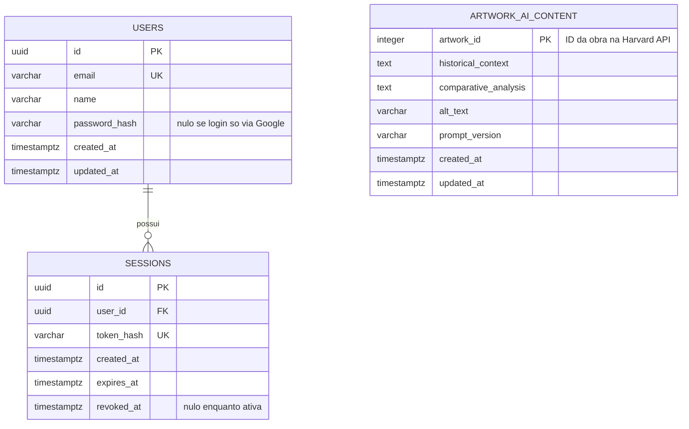

# Banco de Dados — Art Archive AI

**Versão:** 1.0
**Data:** 2026-07-03
**Status:** Em revisão
**Documentos base:** [01 — Visão e Escopo](./01-visao-escopo.md), [02 — Requisitos](./02-requisitos.md), [04 — Arquitetura do Sistema](./04-arquitetura.md)

---

## 1. Visão Geral e Escopo do Modelo de Dados

> **Nota de Alteração (2026-07-03):** o PostgreSQL é criado **do zero** — nenhum dado do Firebase (usuários, sessões, preferências) é migrado ou preservado. O Firebase Auth é descontinuado integralmente. Isso elimina a necessidade de qualquer coluna ou tabela dedicada a mapear registros legados do Firebase — a tabela `saved_artworks` e a coluna `firebase_uid`, presentes em uma versão anterior deste documento, foram removidas (ver Seção 6).

O PostgreSQL introduzido nesta expansão tem dois propósitos, ambos já delimitados no doc 04 (§5):

1. **Armazenar o conteúdo gerado por IA** (contextualização histórica, análise comparativa, Alt Text) para cada obra, sob a lógica de persistência sob demanda (RF-016 a RF-019).
2. **Armazenar dados de usuário** para o novo sistema de autenticação, construído do zero sobre PostgreSQL (RF-013, RF-014).

**O que este banco de dados explicitamente não faz:** ele não replica os metadados da obra (título, artista, imagem, dimensões etc.). Esses dados continuam vindo sempre da Harvard Art Museums API via módulo Harvard Proxy (doc 04, §4) — duplicá-los no PostgreSQL criaria um problema de sincronização sem necessidade, já que nenhum RF exige cache desses metadados.

---

## 2. Diagrama Entidade-Relacionamento



**Nota sobre `ARTWORK_AI_CONTENT`:** esta entidade não tem chave estrangeira para `USERS`. Ela é completamente independente do domínio de usuários — o conteúdo gerado por IA existe por obra, não por usuário.

---

## 3. Descrição das Entidades

| Entidade               | Propósito                                                                                                                                                                                      |
| ---------------------- | ---------------------------------------------------------------------------------------------------------------------------------------------------------------------------------------------- |
| **users**              | Substitui os registros de usuário do Firebase Auth. Suporta login por e-mail/senha e por Google OAuth, conforme oferecido no MVP original.                                                     |
| **sessions**           | Controla sessões ativas emitidas pelo backend, permitindo revogação imediata no logout — inspirada na capacidade de `revoke_refresh_tokens` que o Firebase Admin SDK oferecia no MVP original. |
| **artwork_ai_content** | Núcleo do mecanismo de persistência sob demanda: uma linha por obra processada com sucesso pelo pipeline de IA (RF-009, RF-016 a RF-018).                                                      |

---

## 4. Esquema Relacional (DDL)

```sql
CREATE EXTENSION IF NOT EXISTS pgcrypto;

-- ============================================================
-- USERS
-- ============================================================
CREATE TABLE users (
    id              UUID PRIMARY KEY DEFAULT gen_random_uuid(),
    email           VARCHAR(255) NOT NULL,
    name            VARCHAR(255) NOT NULL,
    password_hash   VARCHAR(255),
    google_id       VARCHAR(255),
    created_at      TIMESTAMPTZ NOT NULL DEFAULT now(),
    updated_at      TIMESTAMPTZ NOT NULL DEFAULT now(),

    CONSTRAINT chk_users_has_credential
        CHECK (password_hash IS NOT NULL OR google_id IS NOT NULL)
);

CREATE UNIQUE INDEX ux_users_email ON users (email);
CREATE UNIQUE INDEX ux_users_google_id ON users (google_id) WHERE google_id IS NOT NULL;

-- ============================================================
-- SESSIONS
-- ============================================================
CREATE TABLE sessions (
    id              UUID PRIMARY KEY DEFAULT gen_random_uuid(),
    user_id         UUID NOT NULL REFERENCES users(id) ON DELETE CASCADE,
    token_hash      VARCHAR(255) NOT NULL,
    created_at      TIMESTAMPTZ NOT NULL DEFAULT now(),
    expires_at      TIMESTAMPTZ NOT NULL,
    revoked_at      TIMESTAMPTZ
);

CREATE UNIQUE INDEX ux_sessions_token_hash ON sessions (token_hash);
CREATE INDEX ix_sessions_user_id ON sessions (user_id);
CREATE INDEX ix_sessions_expires_at ON sessions (expires_at);

-- ============================================================
-- ARTWORK_AI_CONTENT
-- ============================================================
CREATE TABLE artwork_ai_content (
    artwork_id              INTEGER PRIMARY KEY,
    historical_context      TEXT NOT NULL,
    comparative_analysis    TEXT NOT NULL,
    alt_text                VARCHAR(300) NOT NULL,
    prompt_version          VARCHAR(20) NOT NULL,
    created_at              TIMESTAMPTZ NOT NULL DEFAULT now(),
    updated_at              TIMESTAMPTZ NOT NULL DEFAULT now()
);
```

---

## 5. Dicionário de Dados

### 5.1 `users`

| Coluna          | Tipo         | Nulo? | Descrição                                                                | Requisito |
| --------------- | ------------ | ----- | ------------------------------------------------------------------------ | --------- |
| `id`            | UUID         | Não   | Identificador interno do usuário no PostgreSQL                           | RF-013    |
| `email`         | VARCHAR(255) | Não   | E-mail do usuário, usado como identificador de login                     | RF-013    |
| `name`          | VARCHAR(255) | Não   | Nome de exibição do usuário                                              | RF-013    |
| `password_hash` | VARCHAR(255) | Sim   | Hash da senha (bcrypt/argon2); nulo se o usuário só usa login via Google | RF-013    |
| `google_id`     | VARCHAR(255) | Sim   | Subject ID do Google OAuth; nulo se o usuário só usa login por senha     | RF-013    |
| `created_at`    | TIMESTAMPTZ  | Não   | Data de criação do registro                                              | —         |
| `updated_at`    | TIMESTAMPTZ  | Não   | Data da última atualização do registro                                   | —         |

### 5.2 `sessions`

| Coluna       | Tipo         | Nulo? | Descrição                                                                      | Requisito |
| ------------ | ------------ | ----- | ------------------------------------------------------------------------------ | --------- |
| `id`         | UUID         | Não   | Identificador da sessão                                                        | RF-013    |
| `user_id`    | UUID         | Não   | Referência ao usuário dono da sessão                                           | RF-013    |
| `token_hash` | VARCHAR(255) | Não   | Hash do token de sessão apresentado pelo cliente (nunca o token em texto puro) | RNF-005   |
| `created_at` | TIMESTAMPTZ  | Não   | Momento de criação da sessão (login)                                           | RF-013    |
| `expires_at` | TIMESTAMPTZ  | Não   | Momento de expiração natural da sessão                                         | RF-013    |
| `revoked_at` | TIMESTAMPTZ  | Sim   | Preenchido no logout; nulo enquanto a sessão está ativa                        | RF-014    |

### 5.3 `artwork_ai_content`

| Coluna                 | Tipo         | Nulo?    | Descrição                                                                          | Requisito |
| ---------------------- | ------------ | -------- | ---------------------------------------------------------------------------------- | --------- |
| `artwork_id`           | INTEGER      | Não (PK) | ID da obra na Harvard Art Museums API (`objectid`) — chave natural                 | RF-017    |
| `historical_context`   | TEXT         | Não      | Bloco de contextualização histórica gerado pela IA                                 | RF-002    |
| `comparative_analysis` | TEXT         | Não      | Bloco de análise comparativa gerado pela IA                                        | RF-003    |
| `alt_text`             | VARCHAR(300) | Não      | Texto alternativo descritivo da imagem, gerado pela IA (50–300 caracteres, RF-007) | RF-007    |
| `prompt_version`       | VARCHAR(20)  | Não      | Identificador da versão do prompt que gerou este conteúdo (ex: `v1`)               | RNF-006   |
| `created_at`           | TIMESTAMPTZ  | Não      | Momento da primeira geração e persistência                                         | RF-017    |
| `updated_at`           | TIMESTAMPTZ  | Não      | Momento da última atualização (regeneração manual via painel admin, se houver)     | —         |

---

## 6. Decisões de Modelagem e Justificativas

| #   | Decisão                                                                                  | Motivo                                                                                                                                                                                                                                                                          |
| --- | ---------------------------------------------------------------------------------------- | ------------------------------------------------------------------------------------------------------------------------------------------------------------------------------------------------------------------------------------------------------------------------------- |
| 1   | `artwork_id` (não um `serial` autoincrement) como chave primária de `artwork_ai_content` | RF-017 exige explicitamente que "o registro é criado com o ID da obra como chave"; além disso, toda leitura (RF-016, RF-018) é feita por esse ID — usá-lo como PK evita um índice adicional e uma junção desnecessária                                                          |
| 2   | UUID como chave primária de `users`, `sessions` e `saved_artworks`                       | Evita expor volume/sequência de cadastros em uma API pública; evita colisão de identificadores ao migrar registros do Firebase, que já usa UIDs alfanuméricos não sequenciais                                                                                                   |
| 3   | Tabela `sessions` dedicada, em vez de JWT sem estado no servidor                         | Preserva a capacidade de revogação imediata de sessão que o backend atual já oferece via Firebase Admin SDK (`revoke_refresh_tokens`), exigida pela paridade funcional de logout do RF-014. Um JWT stateless não pode ser invalidado antes de expirar                           |
| 4   | `password_hash` e `google_id` como colunas nulas, em vez de um enum `auth_provider`      | O MVP original oferece login por e-mail/senha e por Google OAuth (confirmado nos fluxogramas de autenticação existentes); um usuário pode ter uma ou ambas as credenciais. Uma constraint `CHECK` garante que ao menos uma esteja presente, sem precisar de uma coluna derivada |
| 5   | Nenhuma tabela local para metadados de obras (título, artista, imagem etc.)              | Esses dados continuam vindo sempre da Harvard Art Museums API via módulo Harvard Proxy (doc 04, §4); duplicá-los criaria um problema de sincronização sem que nenhum RF exija esse cache                                                                                        |
| 6   | Nenhuma coluna de status (`pending`/`failed`) em `artwork_ai_content`                    | RF-017 (cenário 2) determina que, se a persistência falhar, o conteúdo não é salvo — é apenas retornado ao usuário, com o erro registrado em log. Logo, a existência de uma linha já significa "processado com sucesso" (RF-009), tornando uma coluna de status redundante      |
| 7   | Índice único parcial (`WHERE ... IS NOT NULL`) em `google_id`                            | O PostgreSQL já trata múltiplos `NULL` como distintos em índices únicos comuns; o índice parcial é usado para reduzir o tamanho do índice ignorando as linhas nulas, já que nem todo usuário fará login via Google                                                              |
| 8   | `TIMESTAMPTZ` em vez de `TIMESTAMP` em todas as colunas de data/hora                     | Evita ambiguidade de fuso horário — boa prática padrão para sistemas com usuários potencialmente em fusos diferentes                                                                                                                                                            |

> **Decisões removidas em 2026-07-03:** a antiga Decisão 6 (`saved_artworks` mínima, justificada pela migração de "preferências salvas" do RF-015) e a antiga Decisão 8 (`firebase_uid` mantido para mapeamento durante a transição) deixaram de existir junto com a decisão de criar o PostgreSQL do zero, sem migração de dados do Firebase.

---

## 7. Estratégia de Migrations

As migrations serão gerenciadas via **Alembic** (ferramenta de migração associada ao SQLAlchemy, ORM escolhido no doc 04, §4). Ordem inicial de criação, alinhada à Fase 2 do doc 99:

1. `0001_create_users` — cria `users` com seus índices e constraint de credencial
2. `0002_create_sessions` — cria `sessions`, dependente de `users`
3. `0003_create_artwork_ai_content` — cria `artwork_ai_content`, independente das demais

Essa ordem respeita as dependências de chave estrangeira e permite que o schema de `artwork_ai_content` (necessário para o pipeline de IA) seja validado isoladamente, sem esperar o schema de usuários — conforme a regra de não-bloqueio já registrada no doc 99 (§5).

---

## 8. Considerações de Performance e Índices

- **RNF-001 (resposta em até 500ms para conteúdo em cache):** a busca em `artwork_ai_content` é sempre por chave primária (`artwork_id`), o que já garante uma busca por índice B-tree de custo logarítmico — nenhum índice adicional é necessário para este volume de dados.
- **RNF-003 (confiabilidade da persistência):** a ausência de colunas de status intermediário (Decisão 6) simplifica a garantia de que toda linha presente representa conteúdo válido e completo, sem estados parciais a inconsistentes.
- **Escala futura:** o dimensionamento para centenas de milhares de obras, incluindo eventual indexação vetorial para busca por similaridade, é tratado separadamente no **doc 19 — Estudo de Viabilidade Técnica (RAG/Embeddings)**, fora do escopo deste documento.

---

## 9. Rastreabilidade

| Entidade             | Requisitos Relacionados                                         | Casos de Uso Relacionados |
| -------------------- | --------------------------------------------------------------- | ------------------------- |
| `users`              | RF-013, RF-014                                                  | UC-06                     |
| `sessions`           | RF-013, RF-014                                                  | UC-06                     |
| `artwork_ai_content` | RF-002, RF-003, RF-007, RF-009, RF-016, RF-017, RF-018, RNF-006 | UC-01, UC-02              |

> A matriz completa, conectando requisitos a componentes de arquitetura e casos de teste, será formalizada no documento 16 — Matriz de Rastreabilidade.
