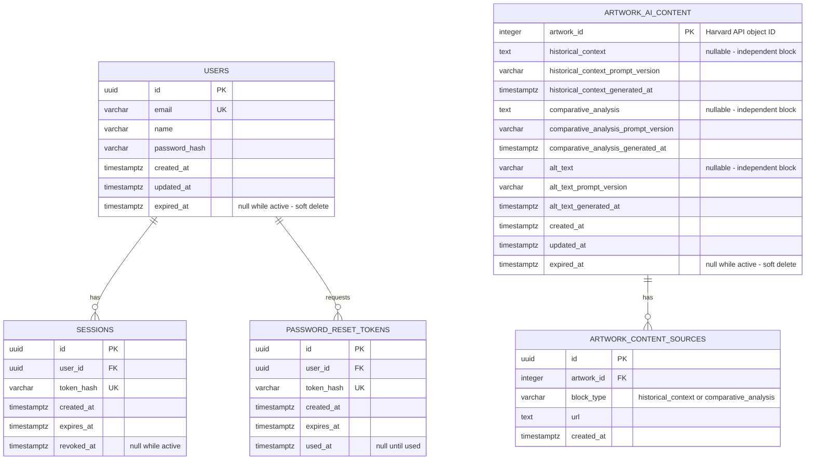

# Database — Art Archive AI

**Version:** 2.1
**Date:** 2026-07-26
**Status:** In review
**Base documents:** [01 — Vision and Scope](./01-vision-scope.md), [02.1 — Insight Card](./requeriments/02.1-insight-card.md), [02.2 — Alt Text](./requeriments/02.2-alt-text.md), [02.4 — Authentication](./requeriments/02.4-authentication.md), [02.5 — Non-Functional](./requeriments/02.5-non-functional.md), [04 — System Architecture](./04-architecture.md)

---

## 1. Overview and Scope of the Data Model

> **Change Note (2026-07-26):** revised to align with the split requirements documents (02.1–02.5), which superseded the original `02-requirements.md` this schema was first built against. Two structural changes were required:
>
> 1. **Independent per-block persistence.** RF-001/RF-002/RF-003/RF-004 (doc 02.1) require the historical-context and comparative-analysis blocks to be checked, generated, and persisted **independently** of each other, and RF-013 (doc 02.2) requires Alt Text to be generated and persisted through its own dedicated call, independent of both. A row with, say, `historical_context` filled and `comparative_analysis` still empty is now a normal, expected state (RF-004, scenario 3) — not an anomaly. The three content columns of `artwork_ai_content` are therefore now **independently nullable**, each with its own `prompt_version` and `generated_at`, replacing the single shared `prompt_version`/timestamps from v1.0. A new `artwork_content_sources` table is added to satisfy RF-010 (sources returned per text block), which v1.0 did not model at all.
> 2. **Google OAuth removed.** RF-026 (doc 02.4) establishes email/password as the **sole** authentication mechanism, with no third-party identity provider involved. The `google_id` column, its partial unique index, and the `chk_users_has_credential` constraint (which existed only to allow either credential type) are removed from `users`. This closes the inconsistency flagged in doc 02.4's own closing note. A `password_reset_tokens` table is added, closing the gap previously flagged as a pending issue in doc 07 (§8, item 2), needed to support RF-029/RF-030.
>
> The original 2026-07-03 change note is preserved below for history: PostgreSQL was created **from scratch** — no Firebase data (users, sessions, preferences) was migrated or preserved. Firebase Auth is fully discontinued. This eliminated the need for any column or table dedicated to mapping legacy Firebase records — the `saved_artworks` table and the `firebase_uid` column, present in an earlier draft, were removed (see Section 6).
>
> **Change Note (2026-07-26, v2.1):** the system-wide policy is that **no register is ever physically deleted**. A nullable `expired_at TIMESTAMPTZ` column is added to `users` and `artwork_ai_content` to model soft delete: `NULL` means the register is active, a timestamp means it was logically retired at that moment. `sessions` and `password_reset_tokens` are unaffected — their existing `revoked_at`/`used_at`/`expires_at` columns already model each record's own lifecycle (session/token validity), which is a distinct concept from soft-deleting the parent register. `artwork_content_sources` also gets no column of its own: its rows are scoped to a block on `artwork_ai_content` and are considered retired implicitly when their parent artwork's row is expired (see Decision 12, §6).

The PostgreSQL introduced in this expansion has two purposes, both already delimited in doc 04 (§5):

1. **Store AI-generated content** (historical context, comparative analysis, Alt Text, and their sources) for each artwork, under the on-demand, per-block persistence logic (RF-001 through RF-004, RF-010, RF-013).
2. **Store user data** for the new authentication system, built from scratch on top of PostgreSQL, email/password only (RF-026 through RF-031).

**What this database explicitly does not do:** it does not replicate the artwork's metadata (title, artist, image, dimensions, etc.). This data always continues to come from the Harvard Art Museums API via the Harvard Proxy module (doc 04, §4) — duplicating it in PostgreSQL would create an unnecessary synchronization problem, since no RF requires caching this metadata.

---

## 2. Entity-Relationship Diagram



**Note on `ARTWORK_AI_CONTENT`:** this entity has no foreign key to `USERS`. It is completely independent from the user domain — AI-generated content exists per artwork, not per user. Its three content columns are filled **independently and asynchronously** — none of them requires the others to be present (RF-001, RF-004).

---

## 3. Entity Descriptions

| Entity                      | Purpose                                                                                                                                                                                                                                                                                                           |
| --------------------------- | ----------------------------------------------------------------------------------------------------------------------------------------------------------------------------------------------------------------------------------------------------------------------------------------------------------------- |
| **users**                   | Stores registered accounts. Email/password is the sole credential type (RF-026) — no `google_id` or equivalent. Never physically deleted — retired accounts are soft-deleted via `expired_at`.                                                                                                                    |
| **sessions**                | Controls active sessions issued by the backend, allowing immediate revocation on logout (RF-028).                                                                                                                                                                                                                 |
| **password_reset_tokens**   | Single-use, expiring tokens backing the "Forgot Password" / "Change Password" flow (RF-029, RF-030).                                                                                                                                                                                                              |
| **artwork_ai_content**      | Core of the on-demand persistence mechanism: one row per artwork with at least one successfully generated block. Each of the three content columns is generated, checked, and persisted independently (RF-001 through RF-004, RF-013). Never physically deleted — retired rows are soft-deleted via `expired_at`. |
| **artwork_content_sources** | Zero or more sources per generated text block (historical context or comparative analysis), satisfying RF-010. Alt Text has no associated sources — doc 02.2 does not require any.                                                                                                                                |

---

## 4. Relational Schema (DDL)

```sql
CREATE EXTENSION IF NOT EXISTS pgcrypto;

-- ============================================================
-- USERS
-- ============================================================
CREATE TABLE users (
    id              UUID PRIMARY KEY DEFAULT gen_random_uuid(),
    email           VARCHAR(255) NOT NULL,
    name            VARCHAR(255) NOT NULL,
    password_hash   VARCHAR(255) NOT NULL,
    created_at      TIMESTAMPTZ NOT NULL DEFAULT now(),
    updated_at      TIMESTAMPTZ NOT NULL DEFAULT now(),
    expired_at      TIMESTAMPTZ
);

CREATE UNIQUE INDEX ux_users_email ON users (email);

-- ============================================================
-- SESSIONS
-- ============================================================
CREATE TABLE sessions (
    id              UUID PRIMARY KEY DEFAULT gen_random_uuid(),
    user_id         UUID NOT NULL REFERENCES users(id) ON DELETE CASCADE,
    token_hash      VARCHAR(255) NOT NULL,
    created_at      TIMESTAMPTZ NOT NULL DEFAULT now(),
    expires_at      TIMESTAMPTZ NOT NULL,
    revoked_at      TIMESTAMPTZ
);

CREATE UNIQUE INDEX ux_sessions_token_hash ON sessions (token_hash);
CREATE INDEX ix_sessions_user_id ON sessions (user_id);
CREATE INDEX ix_sessions_expires_at ON sessions (expires_at);

-- ============================================================
-- PASSWORD_RESET_TOKENS
-- ============================================================
CREATE TABLE password_reset_tokens (
    id              UUID PRIMARY KEY DEFAULT gen_random_uuid(),
    user_id         UUID NOT NULL REFERENCES users(id) ON DELETE CASCADE,
    token_hash      VARCHAR(255) NOT NULL,
    created_at      TIMESTAMPTZ NOT NULL DEFAULT now(),
    expires_at      TIMESTAMPTZ NOT NULL,
    used_at         TIMESTAMPTZ
);

CREATE UNIQUE INDEX ux_password_reset_tokens_token_hash ON password_reset_tokens (token_hash);
CREATE INDEX ix_password_reset_tokens_user_id ON password_reset_tokens (user_id);

-- ============================================================
-- ARTWORK_AI_CONTENT
-- ============================================================
CREATE TABLE artwork_ai_content (
    artwork_id                              INTEGER PRIMARY KEY,

    historical_context                      TEXT,
    historical_context_prompt_version       VARCHAR(20),
    historical_context_generated_at         TIMESTAMPTZ,

    comparative_analysis                    TEXT,
    comparative_analysis_prompt_version     VARCHAR(20),
    comparative_analysis_generated_at       TIMESTAMPTZ,

    alt_text                                VARCHAR(300),
    alt_text_prompt_version                 VARCHAR(20),
    alt_text_generated_at                   TIMESTAMPTZ,

    created_at                              TIMESTAMPTZ NOT NULL DEFAULT now(),
    updated_at                              TIMESTAMPTZ NOT NULL DEFAULT now(),
    expired_at                              TIMESTAMPTZ,

    CONSTRAINT chk_artwork_ai_content_has_block
        CHECK (historical_context IS NOT NULL OR comparative_analysis IS NOT NULL OR alt_text IS NOT NULL)
);

-- ============================================================
-- ARTWORK_CONTENT_SOURCES
-- ============================================================
CREATE TABLE artwork_content_sources (
    id              UUID PRIMARY KEY DEFAULT gen_random_uuid(),
    artwork_id      INTEGER NOT NULL REFERENCES artwork_ai_content(artwork_id) ON DELETE CASCADE,
    block_type      VARCHAR(30) NOT NULL,
    url             TEXT NOT NULL,
    created_at      TIMESTAMPTZ NOT NULL DEFAULT now(),

    CONSTRAINT chk_sources_block_type
        CHECK (block_type IN ('historical_context', 'comparative_analysis'))
);

CREATE INDEX ix_sources_artwork_block ON artwork_content_sources (artwork_id, block_type);
```

---

## 5. Data Dictionary

### 5.1 `users`

| Column          | Type         | Nullable? | Description                                                                                                                                             | Requirement                             |
| --------------- | ------------ | --------- | ------------------------------------------------------------------------------------------------------------------------------------------------------- | --------------------------------------- |
| `id`            | UUID         | No        | Internal identifier of the user in PostgreSQL                                                                                                           | RF-026                                  |
| `email`         | VARCHAR(255) | No        | User's email, used as the login identifier                                                                                                              | RF-026                                  |
| `name`          | VARCHAR(255) | No        | User's display name, collected at sign-up                                                                                                               | RF-027                                  |
| `password_hash` | VARCHAR(255) | No        | Password hash (bcrypt/argon2) — always present, since email/password is the sole credential (RF-026)                                                    | RF-026                                  |
| `created_at`    | TIMESTAMPTZ  | No        | Record creation date                                                                                                                                    | —                                       |
| `updated_at`    | TIMESTAMPTZ  | No        | Date of the record's last update                                                                                                                        | —                                       |
| `expired_at`    | TIMESTAMPTZ  | Yes       | Soft-delete marker: null while the account is active; set to the retirement moment when the account is deactivated. The row is never physically deleted | — (system policy, doc 04 §9 Decision 6) |

### 5.2 `sessions`

| Column       | Type         | Nullable? | Description                                                                    | Requirement |
| ------------ | ------------ | --------- | ------------------------------------------------------------------------------ | ----------- |
| `id`         | UUID         | No        | Session identifier                                                             | RF-026      |
| `user_id`    | UUID         | No        | Reference to the user who owns the session                                     | RF-026      |
| `token_hash` | VARCHAR(255) | No        | Hash of the session token presented by the client (never the plain-text token) | RNF-005     |
| `created_at` | TIMESTAMPTZ  | No        | Moment the session was created (login)                                         | RF-026      |
| `expires_at` | TIMESTAMPTZ  | No        | Moment of the session's natural expiration                                     | RF-031      |
| `revoked_at` | TIMESTAMPTZ  | Yes       | Filled on logout; null while the session is active                             | RF-028      |

### 5.3 `password_reset_tokens`

| Column       | Type         | Nullable? | Description                                                                      | Requirement |
| ------------ | ------------ | --------- | -------------------------------------------------------------------------------- | ----------- |
| `id`         | UUID         | No        | Token record identifier                                                          | RF-029      |
| `user_id`    | UUID         | No        | Reference to the user who requested the reset                                    | RF-029      |
| `token_hash` | VARCHAR(255) | No        | Hash of the token sent by email (never the plain-text token)                     | RNF-005     |
| `created_at` | TIMESTAMPTZ  | No        | Moment the reset was requested                                                   | RF-029      |
| `expires_at` | TIMESTAMPTZ  | No        | Moment the token stops being valid                                               | RF-030      |
| `used_at`    | TIMESTAMPTZ  | Yes       | Filled once the token is consumed; null while still usable — enforces single-use | RF-030      |

### 5.4 `artwork_ai_content`

| Column                                | Type         | Nullable? | Description                                                                                                                                                | Requirement                             |
| ------------------------------------- | ------------ | --------- | ---------------------------------------------------------------------------------------------------------------------------------------------------------- | --------------------------------------- |
| `artwork_id`                          | INTEGER      | No (PK)   | ID of the artwork in the Harvard Art Museums API (`objectid`) — natural key                                                                                | RF-004                                  |
| `historical_context`                  | TEXT         | Yes       | Historical context block. Null while not yet successfully generated — an empty-string result from the LLM (RF-002, scenario 3) is never written here       | RF-002                                  |
| `historical_context_prompt_version`   | VARCHAR(20)  | Yes       | Prompt version that produced this block (null if the block itself is null)                                                                                 | RNF-006                                 |
| `historical_context_generated_at`     | TIMESTAMPTZ  | Yes       | Moment this block was generated and persisted                                                                                                              | RF-004                                  |
| `comparative_analysis`                | TEXT         | Yes       | Comparative analysis block. Same null-while-missing semantics as `historical_context` (RF-003, scenario 3.2)                                               | RF-003                                  |
| `comparative_analysis_prompt_version` | VARCHAR(20)  | Yes       | Prompt version that produced this block                                                                                                                    | RNF-006                                 |
| `comparative_analysis_generated_at`   | TIMESTAMPTZ  | Yes       | Moment this block was generated and persisted                                                                                                              | RF-004                                  |
| `alt_text`                            | VARCHAR(300) | Yes       | Descriptive alternative text for the image, generated independently (RF-013). Null while not yet generated                                                 | RF-011                                  |
| `alt_text_prompt_version`             | VARCHAR(20)  | Yes       | Prompt version that produced the Alt Text                                                                                                                  | RNF-006                                 |
| `alt_text_generated_at`               | TIMESTAMPTZ  | Yes       | Moment the Alt Text was generated and persisted                                                                                                            | RF-013                                  |
| `created_at`                          | TIMESTAMPTZ  | No        | Moment the row was first created (first block ever persisted for this artwork)                                                                             | —                                       |
| `updated_at`                          | TIMESTAMPTZ  | No        | Moment of the row's last update (any block persisted or re-persisted)                                                                                      | —                                       |
| `expired_at`                          | TIMESTAMPTZ  | Yes       | Soft-delete marker: null while the row is active; set to the retirement moment when this artwork's content is retired. The row is never physically deleted | — (system policy, doc 04 §9 Decision 6) |

### 5.5 `artwork_content_sources`

| Column       | Type        | Nullable? | Description                                                                            | Requirement    |
| ------------ | ----------- | --------- | -------------------------------------------------------------------------------------- | -------------- |
| `id`         | UUID        | No        | Source record identifier                                                               | RF-010         |
| `artwork_id` | INTEGER     | No        | Reference to `artwork_ai_content.artwork_id`                                           | RF-010         |
| `block_type` | VARCHAR(30) | No        | Which block this source supports: `historical_context` or `comparative_analysis`       | RF-010         |
| `url`        | TEXT        | No        | The web page consulted by the LLM, considered relevant under the source-relevance rule | RF-010, RF-009 |
| `created_at` | TIMESTAMPTZ | No        | Moment this source was recorded, alongside its block's generation                      | —              |

---

## 6. Modeling Decisions and Rationale

| #   | Decision                                                                                                                                 | Rationale                                                                                                                                                                                                                                                                                                                                                                                                                                                                                                                                                                |
| --- | ---------------------------------------------------------------------------------------------------------------------------------------- | ------------------------------------------------------------------------------------------------------------------------------------------------------------------------------------------------------------------------------------------------------------------------------------------------------------------------------------------------------------------------------------------------------------------------------------------------------------------------------------------------------------------------------------------------------------------------ |
| 1   | `artwork_id` (not an auto-increment `serial`) as the primary key of `artwork_ai_content`                                                 | RF-004 requires that "the record is created with the artwork's ID as the key"; every read (RF-001) is done by this ID — using it as the PK avoids an additional index and an unnecessary join                                                                                                                                                                                                                                                                                                                                                                            |
| 2   | UUID as the primary key of `users`, `sessions`, and `password_reset_tokens`                                                              | Avoids exposing the volume/sequence of registrations in a public API                                                                                                                                                                                                                                                                                                                                                                                                                                                                                                     |
| 3   | Dedicated `sessions` table, instead of stateless server-side JWT                                                                         | Preserves immediate session-revocation on logout (RF-028) — a stateless JWT cannot be invalidated before it expires                                                                                                                                                                                                                                                                                                                                                                                                                                                      |
| 4   | `password_hash` is `NOT NULL`, with no alternate-credential column                                                                       | RF-026 establishes email/password as the sole authentication mechanism, with no third-party identity provider — there is no second credential type to make either column nullable for                                                                                                                                                                                                                                                                                                                                                                                    |
| 5   | No local table for artwork metadata (title, artist, image, etc.)                                                                         | This data always continues to come from the Harvard Art Museums API via the Harvard Proxy module (doc 04, §4); duplicating it would create a synchronization problem with no RF requiring this cache                                                                                                                                                                                                                                                                                                                                                                     |
| 6   | No status column (`pending`/`failed`) in `artwork_ai_content`                                                                            | RF-002/RF-003 (scenario 3) and RF-004 (scenario 2) determine that a block that returns empty or fails to persist is simply not written — it stays `NULL`. Therefore, for each column, non-null already means "processed successfully for that block," making a status column redundant                                                                                                                                                                                                                                                                                   |
| 7   | `TIMESTAMPTZ` instead of `TIMESTAMP` in all date/time columns                                                                            | Avoids time-zone ambiguity — standard good practice for systems with users potentially in different time zones                                                                                                                                                                                                                                                                                                                                                                                                                                                           |
| 8   | Three content columns of `artwork_ai_content` are independently nullable, each with its own `prompt_version`/`generated_at`              | RF-001 and RF-004 require the historical-context and comparative-analysis blocks to be checked and persisted independently of each other, and RF-013 requires Alt Text to be generated through a fully separate call. A single shared `prompt_version`/timestamp pair (as in v1.0) could not represent three blocks generated at different times, possibly by different prompt versions                                                                                                                                                                                  |
| 9   | Dedicated `artwork_content_sources` table instead of a JSON/array column on `artwork_ai_content`                                         | RF-010 requires a variable number of sources per block (zero or more), each independently useful to query/display (RF-017, doc 02.3) — a relational child table keeps the per-source `url` queryable and lets `ON DELETE CASCADE` clean up sources if an artwork's content row is ever removed, without needing JSON-array manipulation logic in the application layer                                                                                                                                                                                                   |
| 10  | `password_reset_tokens` as a dedicated table instead of columns on `users`                                                               | RF-029/RF-030 require a single-use, expiring, re-requestable token per reset attempt — a user could request multiple resets over time; a child table keeps history and lets `used_at` enforce single-use without overloading the `users` row                                                                                                                                                                                                                                                                                                                             |
| 11  | Nullable `expired_at` on `users` and `artwork_ai_content` only, not on `sessions`, `password_reset_tokens`, or `artwork_content_sources` | System policy: no register is ever physically deleted (doc 04 §9, Decision 6). `sessions` and `password_reset_tokens` already carry their own lifecycle columns (`revoked_at`/`expires_at`, `used_at`/`expires_at`) for a different purpose (validity of that specific record, not soft-deleting the account); adding `expired_at` there would duplicate that meaning. `artwork_content_sources` rows are scoped to their parent `artwork_ai_content` row and are treated as retired implicitly whenever that parent row is expired, so no column of their own is needed |

---

## 7. Migration Strategy

Migrations will be managed via **Alembic** (the migration tool associated with SQLAlchemy, the ORM chosen in doc 04, §4). Initial creation order:

1. `0001_create_users` — creates `users` with its email index
2. `0002_create_sessions` — creates `sessions`, dependent on `users`
3. `0003_create_password_reset_tokens` — creates `password_reset_tokens`, dependent on `users`
4. `0004_create_artwork_ai_content` — creates `artwork_ai_content`, independent of the user-domain tables
5. `0005_create_artwork_content_sources` — creates `artwork_content_sources`, dependent on `artwork_ai_content`

This order respects foreign-key dependencies and allows the `artwork_ai_content`/`artwork_content_sources` schema (needed for the AI pipeline) to be validated in isolation, without waiting for the users schema.

---

## 8. Performance and Indexing Considerations

- **RNF-001 (≤500ms per block, for already-persisted content):** lookups in `artwork_ai_content` are always by primary key (`artwork_id`), which already guarantees a B-tree index lookup with logarithmic cost. Because the three content columns live on the same row, checking "is this block already persisted?" for any of the three is a single indexed row fetch followed by a null check on the relevant column — no additional index is necessary for this data volume.
- **RNF-003 (persistence reliability):** the absence of intermediate status columns (Decision 6) simplifies the guarantee that every non-null column value represents valid, complete content for that block, with no partial or inconsistent per-block states.
- **Sources lookup:** `ix_sources_artwork_block` supports the common access pattern of "give me the sources for this artwork's historical-context block" without a sequential scan.
- **Future scale:** sizing for hundreds of thousands of artworks, including eventual vector indexing for similarity search, is addressed separately in **doc 19 — Technical Feasibility Study (RAG/Embeddings)**, out of scope for this document.
- **Soft delete and query filtering:** since no register is ever physically deleted (Decision 12), every read of "current" data on `users` (e.g. login) and `artwork_ai_content` (e.g. on-demand persistence checks) must add `WHERE expired_at IS NULL`. Both tables are small enough at this project's scale that no partial index on `expired_at IS NULL` is needed yet; this should be revisited alongside the future-scale study in doc 19 if the active/expired ratio grows large.

---

## 9. Traceability

| Entity                    | Related Requirements                                             | Related Use Cases |
| ------------------------- | ---------------------------------------------------------------- | ----------------- |
| `users`                   | RF-026, RF-027                                                   | UC-06             |
| `sessions`                | RF-026, RF-028, RF-031                                           | UC-06             |
| `password_reset_tokens`   | RF-029, RF-030                                                   | UC-06             |
| `artwork_ai_content`      | RF-001 through RF-004, RF-011, RF-013, RNF-001, RNF-003, RNF-006 | UC-01, UC-02      |
| `artwork_content_sources` | RF-009, RF-010                                                   | UC-01             |

> The complete matrix, connecting requirements to architecture components and test cases, will be formalized in document 16 — Traceability Matrix.
