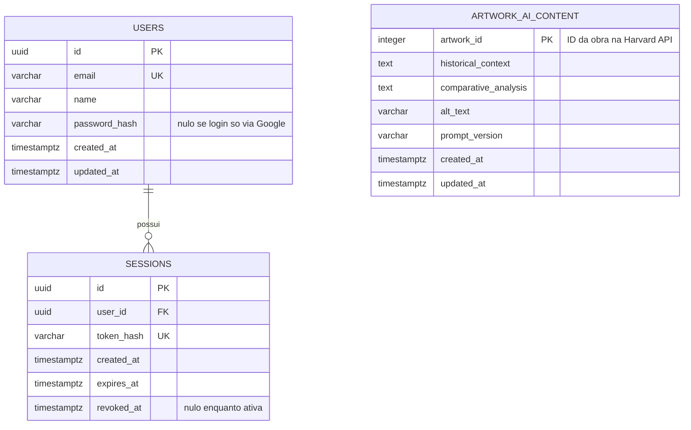

# Database — Art Archive AI

**Version:** 1.0
**Date:** 2026-07-03
**Status:** In review
**Base documents:** [01 — Vision and Scope](./01-vision-scope.md), [02 — Requirements](./02-requirements.md), [04 — System Architecture](./04-architecture.md)

---

## 1. Overview and Scope of the Data Model

> **Change Note (2026-07-03):** PostgreSQL is created **from scratch** — no Firebase data (users, sessions, preferences) is migrated or preserved. Firebase Auth is fully discontinued. This eliminates the need for any column or table dedicated to mapping legacy Firebase records — the `saved_artworks` table and the `firebase_uid` column, present in an earlier version of this document, have been removed (see Section 6).

The PostgreSQL introduced in this expansion has two purposes, both already delimited in doc 04 (§5):

1. **Store AI-generated content** (historical contextualization, comparative analysis, Alt Text) for each artwork, under the on-demand persistence logic (RF-016 through RF-019).
2. **Store user data** for the new authentication system, built from scratch on top of PostgreSQL (RF-013, RF-014).

**What this database explicitly does not do:** it does not replicate the artwork's metadata (title, artist, image, dimensions, etc.). This data always continues to come from the Harvard Art Museums API via the Harvard Proxy module (doc 04, §4) — duplicating it in PostgreSQL would create an unnecessary synchronization problem, since no FR requires caching this metadata.

---

## 2. Entity-Relationship Diagram



**Note on `ARTWORK_AI_CONTENT`:** this entity has no foreign key to `USERS`. It is completely independent from the user domain — AI-generated content exists per artwork, not per user.

---

## 3. Entity Descriptions

| Entity                 | Purpose                                                                                                                                                                                           |
| ---------------------- | ------------------------------------------------------------------------------------------------------------------------------------------------------------------------------------------------- |
| **users**              | Replaces Firebase Auth's user records. Supports login by email/password and by Google OAuth, as offered in the original MVP.                                                                      |
| **sessions**           | Controls active sessions issued by the backend, allowing immediate revocation on logout — inspired by the `revoke_refresh_tokens` capability that Firebase Admin SDK offered in the original MVP. |
| **artwork_ai_content** | Core of the on-demand persistence mechanism: one row per artwork successfully processed by the AI pipeline (RF-009, RF-016 through RF-018).                                                       |

---

## 4. Relational Schema (DDL)

```sql
CREATE EXTENSION IF NOT EXISTS pgcrypto;

-- ============================================================
-- USERS
-- ============================================================
CREATE TABLE users (
    id              UUID PRIMARY KEY DEFAULT gen_random_uuid(),
    email           VARCHAR(255) NOT NULL,
    name            VARCHAR(255) NOT NULL,
    password_hash   VARCHAR(255),
    google_id       VARCHAR(255),
    created_at      TIMESTAMPTZ NOT NULL DEFAULT now(),
    updated_at      TIMESTAMPTZ NOT NULL DEFAULT now(),

    CONSTRAINT chk_users_has_credential
        CHECK (password_hash IS NOT NULL OR google_id IS NOT NULL)
);

CREATE UNIQUE INDEX ux_users_email ON users (email);
CREATE UNIQUE INDEX ux_users_google_id ON users (google_id) WHERE google_id IS NOT NULL;

-- ============================================================
-- SESSIONS
-- ============================================================
CREATE TABLE sessions (
    id              UUID PRIMARY KEY DEFAULT gen_random_uuid(),
    user_id         UUID NOT NULL REFERENCES users(id) ON DELETE CASCADE,
    token_hash      VARCHAR(255) NOT NULL,
    created_at      TIMESTAMPTZ NOT NULL DEFAULT now(),
    expires_at      TIMESTAMPTZ NOT NULL,
    revoked_at      TIMESTAMPTZ
);

CREATE UNIQUE INDEX ux_sessions_token_hash ON sessions (token_hash);
CREATE INDEX ix_sessions_user_id ON sessions (user_id);
CREATE INDEX ix_sessions_expires_at ON sessions (expires_at);

-- ============================================================
-- ARTWORK_AI_CONTENT
-- ============================================================
CREATE TABLE artwork_ai_content (
    artwork_id              INTEGER PRIMARY KEY,
    historical_context      TEXT NOT NULL,
    comparative_analysis    TEXT NOT NULL,
    alt_text                VARCHAR(300) NOT NULL,
    prompt_version          VARCHAR(20) NOT NULL,
    created_at              TIMESTAMPTZ NOT NULL DEFAULT now(),
    updated_at              TIMESTAMPTZ NOT NULL DEFAULT now()
);
```

---

## 5. Data Dictionary

### 5.1 `users`

| Column          | Type         | Nullable? | Description                                                             | Requirement |
| --------------- | ------------ | --------- | ----------------------------------------------------------------------- | ----------- |
| `id`            | UUID         | No        | Internal identifier of the user in PostgreSQL                           | RF-013      |
| `email`         | VARCHAR(255) | No        | User's email, used as the login identifier                              | RF-013      |
| `name`          | VARCHAR(255) | No        | User's display name                                                     | RF-013      |
| `password_hash` | VARCHAR(255) | Yes       | Password hash (bcrypt/argon2); null if the user only logs in via Google | RF-013      |
| `google_id`     | VARCHAR(255) | Yes       | Google OAuth subject ID; null if the user only logs in via password     | RF-013      |
| `created_at`    | TIMESTAMPTZ  | No        | Record creation date                                                    | —           |
| `updated_at`    | TIMESTAMPTZ  | No        | Date of the record's last update                                        | —           |

### 5.2 `sessions`

| Column       | Type         | Nullable? | Description                                                                    | Requirement |
| ------------ | ------------ | --------- | ------------------------------------------------------------------------------ | ----------- |
| `id`         | UUID         | No        | Session identifier                                                             | RF-013      |
| `user_id`    | UUID         | No        | Reference to the user who owns the session                                     | RF-013      |
| `token_hash` | VARCHAR(255) | No        | Hash of the session token presented by the client (never the plain-text token) | RNF-005     |
| `created_at` | TIMESTAMPTZ  | No        | Moment the session was created (login)                                         | RF-013      |
| `expires_at` | TIMESTAMPTZ  | No        | Moment of the session's natural expiration                                     | RF-013      |
| `revoked_at` | TIMESTAMPTZ  | Yes       | Filled on logout; null while the session is active                             | RF-014      |

### 5.3 `artwork_ai_content`

| Column                 | Type         | Nullable? | Description                                                                                 | Requirement |
| ---------------------- | ------------ | --------- | ------------------------------------------------------------------------------------------- | ----------- |
| `artwork_id`           | INTEGER      | No (PK)   | ID of the artwork in the Harvard Art Museums API (`objectid`) — natural key                 | RF-017      |
| `historical_context`   | TEXT         | No        | Block of historical contextualization generated by the AI                                   | RF-002      |
| `comparative_analysis` | TEXT         | No        | Block of comparative analysis generated by the AI                                           | RF-003      |
| `alt_text`             | VARCHAR(300) | No        | Descriptive alternative text for the image, generated by the AI (50–300 characters, RF-007) | RF-007      |
| `prompt_version`       | VARCHAR(20)  | No        | Identifier of the prompt version that generated this content (e.g. `v1`)                    | RNF-006     |
| `created_at`           | TIMESTAMPTZ  | No        | Moment of the first generation and persistence                                              | RF-017      |
| `updated_at`           | TIMESTAMPTZ  | No        | Moment of the last update (manual regeneration via admin panel, if any)                     | —           |

---

## 6. Modeling Decisions and Rationale

| #   | Decision                                                                                 | Rationale                                                                                                                                                                                                                                                                      |
| --- | ---------------------------------------------------------------------------------------- | ------------------------------------------------------------------------------------------------------------------------------------------------------------------------------------------------------------------------------------------------------------------------------ |
| 1   | `artwork_id` (not an auto-increment `serial`) as the primary key of `artwork_ai_content` | RF-017 explicitly requires that "the record is created with the artwork's ID as the key"; furthermore, every read (RF-016, RF-018) is done by this ID — using it as the PK avoids an additional index and an unnecessary join                                                  |
| 2   | UUID as the primary key of `users`, `sessions`, and `saved_artworks`                     | Avoids exposing the volume/sequence of registrations in a public API; avoids identifier collisions when migrating records from Firebase, which already uses non-sequential alphanumeric UIDs                                                                                   |
| 3   | Dedicated `sessions` table, instead of stateless server-side JWT                         | Preserves the immediate session-revocation capability that the current backend already offers via Firebase Admin SDK (`revoke_refresh_tokens`), required by the functional parity of logout in RF-014. A stateless JWT cannot be invalidated before it expires                 |
| 4   | `password_hash` and `google_id` as nullable columns, instead of an `auth_provider` enum  | The original MVP offers login by email/password and by Google OAuth (confirmed in the existing authentication flowcharts); a user may have one or both credentials. A `CHECK` constraint guarantees that at least one is present, without needing a derived column             |
| 5   | No local table for artwork metadata (title, artist, image, etc.)                         | This data always continues to come from the Harvard Art Museums API via the Harvard Proxy module (doc 04, §4); duplicating it would create a synchronization problem with no FR requiring this cache                                                                           |
| 6   | No status column (`pending`/`failed`) in `artwork_ai_content`                            | RF-017 (scenario 2) determines that, if persistence fails, the content is not saved — it is only returned to the user, with the error recorded in the log. Therefore, the existence of a row already means "processed successfully" (RF-009), making a status column redundant |
| 7   | Partial unique index (`WHERE ... IS NOT NULL`) on `google_id`                            | PostgreSQL already treats multiple `NULL`s as distinct in ordinary unique indexes; the partial index is used to reduce index size by ignoring null rows, since not every user will log in via Google                                                                           |
| 8   | `TIMESTAMPTZ` instead of `TIMESTAMP` in all date/time columns                            | Avoids time-zone ambiguity — standard good practice for systems with users potentially in different time zones                                                                                                                                                                 |

> **Decisions removed on 2026-07-03:** the former Decision 6 (a minimal `saved_artworks`, justified by migrating "saved preferences" from RF-015) and the former Decision 8 (`firebase_uid` kept for mapping during the transition) ceased to exist along with the decision to create PostgreSQL from scratch, without migrating Firebase data.

---

## 7. Migration Strategy

Migrations will be managed via **Alembic** (the migration tool associated with SQLAlchemy, the ORM chosen in doc 04, §4). Initial creation order, aligned with Phase 2 of doc 99:

1. `0001_create_users` — creates `users` with its indexes and credential constraint
2. `0002_create_sessions` — creates `sessions`, dependent on `users`
3. `0003_create_artwork_ai_content` — creates `artwork_ai_content`, independent of the others

This order respects foreign-key dependencies and allows the `artwork_ai_content` schema (needed for the AI pipeline) to be validated in isolation, without waiting for the users schema — following the non-blocking rule already recorded in doc 99 (§5).

---

## 8. Performance and Indexing Considerations

- **RNF-001 (response within 500ms for cached content):** lookups in `artwork_ai_content` are always by primary key (`artwork_id`), which already guarantees a B-tree index lookup with logarithmic cost — no additional index is necessary for this data volume.
- **RNF-003 (persistence reliability):** the absence of intermediate status columns (Decision 6) simplifies the guarantee that every existing row represents valid, complete content, with no partial or inconsistent states.
- **Future scale:** sizing for hundreds of thousands of artworks, including eventual vector indexing for similarity search, is addressed separately in **doc 19 — Technical Feasibility Study (RAG/Embeddings)**, out of scope for this document.

---

## 9. Traceability

| Entity               | Related Requirements                                            | Related Use Cases |
| -------------------- | --------------------------------------------------------------- | ----------------- |
| `users`              | RF-013, RF-014                                                  | UC-06             |
| `sessions`           | RF-013, RF-014                                                  | UC-06             |
| `artwork_ai_content` | RF-002, RF-003, RF-007, RF-009, RF-016, RF-017, RF-018, RNF-006 | UC-01, UC-02      |

> The complete matrix, connecting requirements to architecture components and test cases, will be formalized in document 16 — Traceability Matrix.
