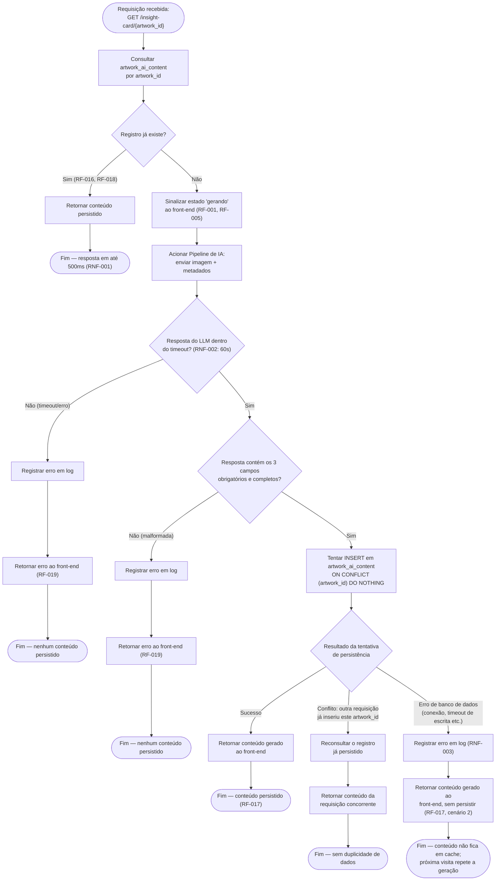

# Diagrama de Fluxo de Persistência — Art Archive AI

**Versão:** 1.0
**Data:** 2026-07-03
**Status:** Em revisão
**Documentos base:** [01 — Visão e Escopo](./01-visao-escopo.md), [02 — Requisitos](./02-requisitos.md), [04 — Arquitetura do Sistema](./04-arquitetura.md), [05 — Banco de Dados](./05-banco-de-dados.md)

---

## 1. Objetivo

Este documento é a fonte única de verdade para o mecanismo de **"verificar antes de gerar"** — o núcleo da persistência sob demanda descrita no doc 01 (§3.2, objetivo 2) e especificada em detalhe pelos RF-001, RF-016 a RF-019 e RNF-001 a RNF-003 do doc 02.

Os diagramas de sequência do doc 04 (§7.1 a §7.3) já mostram os três caminhos principais (geração, cache, falha) em nível de arquitetura. Este documento aprofunda esses mesmos caminhos em um único fluxograma de decisão, cobrindo também um cenário não detalhado anteriormente: **duas requisições simultâneas para a mesma obra sem conteúdo persistido** (condição de corrida).

---

## 2. Fluxograma Completo



---

## 3. Descrição dos Passos e Decisões

| Nó                                         | Descrição                                                                                                                                              | Requisito                                                 |
| ------------------------------------------ | ------------------------------------------------------------------------------------------------------------------------------------------------------ | --------------------------------------------------------- |
| Consultar `artwork_ai_content`             | Primeira ação do backend ao receber a requisição — nenhuma chamada à IA ocorre antes desta verificação                                                 | RF-016                                                    |
| Registro já existe? (Sim)                  | Caminho de cache — o conteúdo é retornado diretamente, sem acionar o Pipeline de IA                                                                    | RF-016, RF-018, RNF-001                                   |
| Sinalizar estado "gerando"                 | O backend informa ao front-end que a geração foi disparada, permitindo a exibição do estado de carregamento                                            | RF-001, RF-005                                            |
| Acionar Pipeline de IA                     | Envia a imagem e os metadados da obra ao módulo de Pipeline de IA (doc 04, §4), que por sua vez chama o Azure OpenAI                                   | RF-002, RF-003, RF-007                                    |
| Resposta dentro do timeout? (Não)          | Timeout de 60 segundos (RNF-002) ou erro de comunicação com o LLM — tratado como falha de geração                                                      | RF-019, RNF-002                                           |
| Resposta contém os 3 campos? (Não)         | Validação de completude: contextualização histórica, análise comparativa e Alt Text devem estar todos presentes e não vazios antes de prosseguir       | RF-002, RF-003, RF-007, RF-019                            |
| Tentar INSERT com `ON CONFLICT DO NOTHING` | Tentativa de persistência atômica — ver Seção 4 para a justificativa desta escolha                                                                     | RF-009, RF-017                                            |
| Resultado: Sucesso                         | Caminho feliz — o conteúdo gerado é persistido e retornado na mesma resposta                                                                           | RF-017 (cenário 1)                                        |
| Resultado: Conflito                        | Outra requisição concorrente já processou e persistiu esta mesma obra entre a verificação inicial e a tentativa de escrita — ver Seção 4               | Não coberto por RF explícito; decisão de design (Seção 4) |
| Resultado: Erro de banco                   | A geração foi bem-sucedida, mas a escrita no PostgreSQL falhou (conexão perdida, etc.) — o conteúdo ainda é entregue ao usuário, mas não fica em cache | RF-017 (cenário 2)                                        |

---

## 4. Tratamento de Concorrência (Condição de Corrida)

**Problema não coberto pelos documentos anteriores:** RF-016 descreve a verificação como um passo único ("o backend verifica... e a chamada à IA só ocorre se o conteúdo não existir"), mas não define o que acontece se **duas requisições para a mesma obra sem conteúdo persistido chegarem simultaneamente** — por exemplo, dois visitantes diferentes abrindo a mesma obra nova ao mesmo tempo. Sem tratamento, ambas as requisições veriam "não existe" na verificação inicial, e ambas chamariam o LLM e tentariam inserir o mesmo `artwork_id` — a segunda tentativa de `INSERT` violaria a chave primária de `artwork_ai_content` (doc 05, §4).

**Decisão de design:** a inserção usa `INSERT ... ON CONFLICT (artwork_id) DO NOTHING` em vez de um `INSERT` simples. Isso significa:

- A primeira requisição a concluir a geração insere o registro normalmente.
- A segunda requisição, ao tentar inserir o mesmo `artwork_id` já existente, não recebe um erro de violação de constraint — a operação simplesmente não insere nada, e o backend reconsulta o registro (já persistido pela primeira requisição) para retornar ao usuário.

**Motivo:** essa abordagem evita expor um erro 500 ao segundo visitante apenas por má sorte de timing, sem exigir um mecanismo de lock distribuído (desnecessário para o volume de tráfego esperado neste projeto acadêmico). O custo aceito é que, no pior caso, o LLM pode ser chamado duas vezes para a mesma obra na primeira janela de concorrência — apenas um dos dois resultados é persistido, o outro é descartado após uso.

---

## 5. Pseudocódigo da Lógica de Verificação

```python
async def get_or_generate_insight_card(artwork_id: int) -> InsightCardResponse:
    existing = await db.get_artwork_ai_content(artwork_id)
    if existing:
        return InsightCardResponse.from_db(existing)  # RF-016, RF-018

    artwork = await harvard_proxy.get_object(artwork_id)

    try:
        generated = await ai_pipeline.generate(
            image_url=artwork.primary_image_url,
            metadata=artwork.metadata,
            timeout=GENERATION_TIMEOUT_SECONDS,  # RNF-002: 60s
        )
    except (TimeoutError, LLMError):
        log.error(f"Falha na geração para artwork_id={artwork_id}")
        raise InsightCardGenerationError()  # RF-019

    if not generated.is_complete():
        log.error(f"Resposta incompleta do LLM para artwork_id={artwork_id}")
        raise InsightCardGenerationError()  # RF-019

    try:
        inserted = await db.insert_artwork_ai_content(
            artwork_id, generated, on_conflict="do_nothing"
        )
        if not inserted:
            existing = await db.get_artwork_ai_content(artwork_id)
            return InsightCardResponse.from_db(existing)  # requisição concorrente venceu
    except DatabaseError as e:
        log.error(f"Falha ao persistir artwork_id={artwork_id}: {e}")
        return InsightCardResponse.from_generated(generated)  # RF-017, cenário 2

    return InsightCardResponse.from_generated(generated)  # RF-017, cenário 1
```

---

## 6. Checkpoints de Tempo

| Etapa do fluxo                                                                    | Orçamento de tempo                                                          | Requisito       |
| --------------------------------------------------------------------------------- | --------------------------------------------------------------------------- | --------------- |
| Consulta inicial + retorno de conteúdo em cache                                   | Até 500ms                                                                   | RNF-001         |
| Consulta inicial → resposta completa do LLM → persistência → retorno ao front-end | Até 60s                                                                     | RNF-002         |
| A partir de 60s sem resposta do LLM                                               | Aciona o caminho de timeout (Seção 2, nó "Resposta dentro do timeout? Não") | RNF-002, RF-019 |

---

## 7. Casos de Borda

| Cenário                                                        | Tratamento no fluxo                                                                                                                                                                                                                                              | Referência                        |
| -------------------------------------------------------------- | ---------------------------------------------------------------------------------------------------------------------------------------------------------------------------------------------------------------------------------------------------------------- | --------------------------------- |
| Metadados da obra incompletos (sem data ou técnica)            | Absorvido dentro do Pipeline de IA antes deste fluxo começar — a geração prossegue normalmente com os dados disponíveis, sem acionar o caminho de erro                                                                                                           | RF-002 (cenário 2)                |
| Imagem da obra inacessível (URL inválida)                      | Hoje resulta em falha total da geração (caminho de erro deste fluxo) — nenhum conteúdo é persistido, incluindo o Alt Text. **Pendência já registrada no doc 03 (§5):** avaliar se um texto padrão de aviso deve ser gerado neste caso, em vez de nenhum Alt Text | RF-007 (cenário 2)                |
| Duas requisições simultâneas para obra sem conteúdo persistido | Tratado via `INSERT ... ON CONFLICT DO NOTHING` + reconsulta (Seção 4)                                                                                                                                                                                           | Decisão de design deste documento |
| Falha de escrita no banco após geração bem-sucedida            | Conteúdo é entregue ao usuário sem persistir; erro registrado em log; próxima visita repete a geração                                                                                                                                                            | RF-017 (cenário 2), RNF-003       |
| Timeout do LLM (acima de 60s)                                  | Caminho de erro — mensagem exibida apenas na área do Insight Card, resto da página funcional                                                                                                                                                                     | RF-006, RF-019, RNF-002           |

---

## 8. Rastreabilidade

| Elemento do Fluxo            | Requisitos Relacionados     | Casos de Uso Relacionados |
| ---------------------------- | --------------------------- | ------------------------- |
| Verificação antes de gerar   | RF-001, RF-016              | UC-01, UC-02              |
| Geração via Pipeline de IA   | RF-002, RF-003, RF-007      | UC-01                     |
| Timeout / erro de geração    | RF-006, RF-019, RNF-002     | UC-03                     |
| Persistência bem-sucedida    | RF-009, RF-017 (cenário 1)  | UC-01                     |
| Falha de persistência        | RF-017 (cenário 2), RNF-003 | UC-01, UC-03              |
| Conflito de concorrência     | — (decisão de design)       | UC-01                     |
| Retorno de conteúdo em cache | RF-018, RNF-001             | UC-02                     |

> A matriz completa, conectando requisitos a componentes de arquitetura e casos de teste, será formalizada no documento 16 — Matriz de Rastreabilidade.
