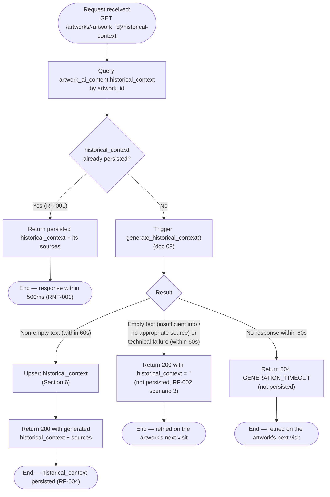
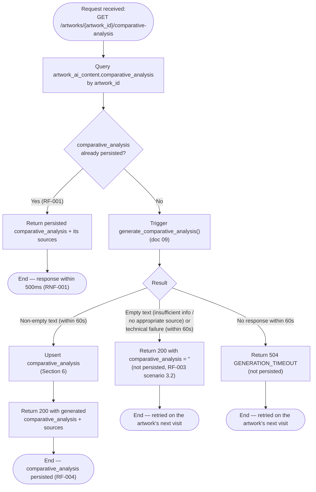
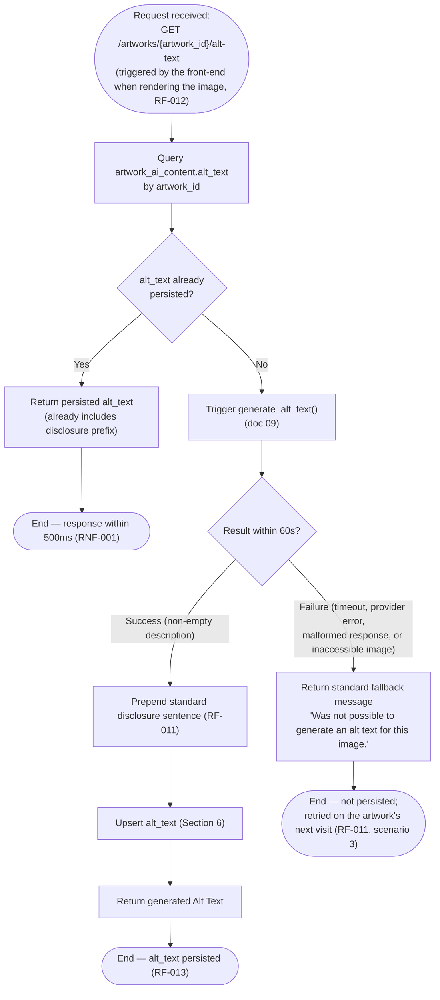
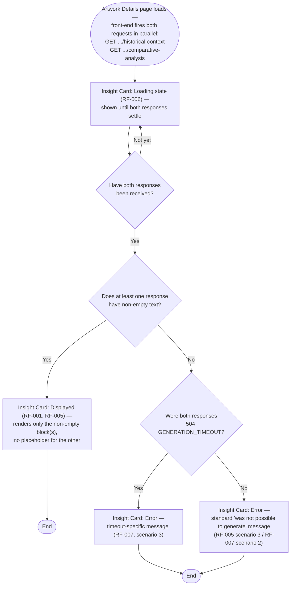

# Persistence Flow Diagram — Art Archive AI

**Version:** 2.1
**Date:** 2026-07-26
**Status:** In review
**Base documents:** [02.1 — Insight Card](./requeriments/02.1-insight-card.md), [02.2 — Alt Text](./requeriments/02.2-alt-text.md), [02.5 — Non-Functional](./requeriments/02.5-non-functional.md), [04 — System Architecture](./04-architecture.md), [05 — Database](./05-database.md)

---

## 1. Purpose

This document is the single source of truth for the **"check before generating"** mechanism described in doc 01 (§3.2, objective 2) and specified in detail by RF-001 through RF-004, RF-009, RF-010, RF-013, and RNF-001 through RNF-003 of docs 02.1/02.2.

This document covers **three fully independent backend flows** — one per content block — since RF-001 and RF-013 both require each block to be checked, generated, and persisted on its own, behind its own dedicated request:

- **Section 2** — the Historical Context flow, per RF-002.
- **Section 3** — the Comparative Analysis flow, per RF-003.
- **Section 4** — the Alt Text flow, per RF-013.

Although the three backend flows never know about, wait on, or share state with one another, the front-end still presents the first two as a **single Insight Card region** with one combined loading/displayed/error state (RF-001, RF-005, RF-006, RF-007). **Section 5** specifies exactly how the front-end recombines the two independent responses into that single state — this recombination happens entirely on the client; the backend performs no aggregation of its own.

It also covers a scenario not detailed at the architecture level: **two simultaneous requests for the same artwork, for the same missing block** (race condition), now handled at column granularity rather than row granularity.

> **Change Note (2026-07-26):** revised to align with docs 02.1/02.2, which superseded the original `02-requirements.md` this flow was designed against. The previous version modeled a single check ("does the record exist?"), a single generation call producing all three fields, and a single all-or-nothing `INSERT ... ON CONFLICT DO NOTHING`. That no longer matches RF-001 (the two Insight Card blocks are checked and generated independently, 0/1/2 calls depending on what's missing) or RF-013 (Alt Text has its own dedicated call and flow). The concurrency-handling insert (Section 6) is also revised: because a row can now be partially filled, the previous "insert or discard" pattern is replaced by a per-column, first-writer-wins upsert.
>
> **Change Note (2026-07-26, v2.1):** the historical-context and comparative-analysis blocks are no longer served by a single bundled "Insight Card" backend flow. Each is now its own independent flow, behind its own dedicated HTTP request (doc 07, §4) — mirroring how Alt Text already worked. The single combined loading/displayed/error state the Insight Card UI shows (RF-001, RF-005, RF-006, RF-007) is still produced, but now by the **front-end**, which fires both requests in parallel and combines their two independent responses — this logic is now formalized in the new Section 5. All subsequent sections have been renumbered accordingly (former §4–§8 are now §6–§10).

---

## 2. Historical Context Flow (Independent — RF-002)

### 2.1 Flowchart



**Key design point (RF-007):** unlike the previous, bundled design, this endpoint alone never determines whether the Insight Card shows an error to the visitor — a `504` here simply means _this_ call timed out. Whether the Insight Card ends up in an error state depends on what `GET /artworks/{artwork_id}/comparative-analysis` independently returns as well; that recombination is specified in Section 5.

### 2.2 Description of Steps and Decisions

| Node                                               | Description                                                                                                                               | Requirement                                 |
| -------------------------------------------------- | ----------------------------------------------------------------------------------------------------------------------------------------- | ------------------------------------------- |
| Query `artwork_ai_content.historical_context`      | First action taken upon receiving the request — no AI call occurs before this check                                                       | RF-001                                      |
| `historical_context` already persisted?            | Checked independently of `comparative_analysis` — this request never looks at, or waits on, the other column                              | RF-001                                      |
| Trigger `generate_historical_context()`            | Only called if the column is missing                                                                                                      | RF-001, RF-002, RF-009                      |
| Result: non-empty text                             | Happy path — content is persisted (Section 6) and returned as part of a `200`                                                             | RF-002 (scenario 1), RF-004                 |
| Result: empty text (insufficient info / no source) | Valid LLM outcome, not an error — stays unpersisted, returned as `200` with `historical_context: ""`, retried on the artwork's next visit | RF-002 (scenario 3), RF-010 (scenario 10.2) |
| Result: technical failure (non-timeout) within 60s | Provider error or malformed response — returned identically to the empty-text case, still a `200` (RF-007, scenario 1)                    | RF-007                                      |
| Result: no response within 60s (timeout)           | RNF-002's per-call ceiling reached — this specific request returns `504 GENERATION_TIMEOUT`                                               | RNF-002                                     |

---

## 3. Comparative Analysis Flow (Independent — RF-003)

### 3.1 Flowchart



Mirrors Section 2 in every respect, calling `generate_comparative_analysis()` instead. Same key design point applies: this endpoint alone never decides the Insight Card's displayed/error state — see Section 5.

### 3.2 Description of Steps and Decisions

| Node                                               | Description                                                                                                                                 | Requirement                                   |
| -------------------------------------------------- | ------------------------------------------------------------------------------------------------------------------------------------------- | --------------------------------------------- |
| Query `artwork_ai_content.comparative_analysis`    | First action taken upon receiving the request — no AI call occurs before this check                                                         | RF-001                                        |
| `comparative_analysis` already persisted?          | Checked independently of `historical_context` — this request never looks at, or waits on, the other column                                  | RF-001                                        |
| Trigger `generate_comparative_analysis()`          | Only called if the column is missing                                                                                                        | RF-001, RF-003, RF-009                        |
| Result: non-empty text                             | Happy path — content is persisted (Section 6) and returned as part of a `200`                                                               | RF-003 (scenario 1), RF-004                   |
| Result: empty text (insufficient info / no source) | Valid LLM outcome, not an error — stays unpersisted, returned as `200` with `comparative_analysis: ""`, retried on the artwork's next visit | RF-003 (scenario 3.2), RF-010 (scenario 10.2) |
| Result: technical failure (non-timeout) within 60s | Provider error or malformed response — returned identically to the empty-text case, still a `200` (RF-007, scenario 1)                      | RF-007                                        |
| Result: no response within 60s (timeout)           | RNF-002's per-call ceiling reached — this specific request returns `504 GENERATION_TIMEOUT`                                                 | RNF-002                                       |

---

## 4. Alt Text Flow (Independent — RF-013)

### 3.1 Flowchart



Unlike the two Insight Card blocks, Alt Text has no "insufficient information → empty string" path (doc 02.2 defines none) — any failure to produce a non-empty description is treated as a generation failure, resolved by the fallback message rather than an empty value, and the `alt` attribute is consequently never empty or absent (RF-012).

---

## 5. Front-End Aggregation — Insight Card Combined State (RF-001, RF-005, RF-006, RF-007)

Sections 2 and 3 are two fully independent backend flows, behind two fully independent HTTP requests (doc 07, §4) — neither backend flow has any awareness of, or synchronization with, the other. **The recombination of their two responses into the Insight Card's single loading/displayed/error state happens entirely in front-end client code.** No backend endpoint performs this aggregation.

### 5.1 Flowchart



### 5.2 Description of Steps and Decisions

| Node                                       | Description                                                                                                                                                                                         | Requirement                              |
| ------------------------------------------ | --------------------------------------------------------------------------------------------------------------------------------------------------------------------------------------------------- | ---------------------------------------- |
| Fire both requests in parallel             | The front-end triggers `GET .../historical-context` and `GET .../comparative-analysis` at the same time, on page load — neither waits for the other                                                 | RF-001                                   |
| Loading state                              | Shown from the moment both requests are fired until both have a settled response (success, empty, or timeout) — never transitions on just one                                                       | RF-006                                   |
| Both responses received?                   | The front-end waits for both promises to settle (e.g. `Promise.allSettled`) before making any display decision                                                                                      | RF-001, RF-006                           |
| At least one non-empty?                    | If either block has text, the Insight Card moves to Displayed, rendering only the non-empty block(s) — the other is simply omitted, no error shown                                                  | RF-001, RF-005 (scenario 2)              |
| Both responses were 504?                   | The narrower error condition — both underlying requests independently timed out                                                                                                                     | RF-007 (scenario 3)                      |
| Otherwise (both empty, not both timed out) | Every other "both empty" combination — insufficient info on both, a non-timeout failure on either or both, or one timeout mixed with one non-timeout empty — collapses to the same standard message | RF-005 (scenario 3), RF-007 (scenario 2) |

**Key design point:** Alt Text plays no part in this aggregation. It is applied to the image as soon as its own independent request settles (Section 4), regardless of whatever state the Insight Card is in at that moment.

---

## 6. Concurrency Handling (Race Condition)

**Problem:** two requests for the same artwork, both missing the same block, may arrive simultaneously — for example, two different visitors opening the same new artwork at the same time. Without handling, both would see the block as missing on their independent checks, both would call the corresponding `generate_*()` function, and both would attempt to persist a result for the same `(artwork_id, column)`.

**Design decision:** because a row can now be legitimately partial (Section 1), the previous all-or-nothing `INSERT ... ON CONFLICT (artwork_id) DO NOTHING` no longer fits — it would silently discard a second block's content if the row already exists from the first block being persisted earlier. Persistence instead uses a **per-column, first-writer-wins upsert**, guarded by a `WHERE` clause that only applies the write if that specific column is still `NULL`:

```sql
INSERT INTO artwork_ai_content (
    artwork_id, historical_context, historical_context_prompt_version,
    historical_context_generated_at, created_at, updated_at
)
VALUES (:artwork_id, :text, :prompt_version, now(), now(), now())
ON CONFLICT (artwork_id) DO UPDATE SET
    historical_context                 = EXCLUDED.historical_context,
    historical_context_prompt_version  = EXCLUDED.historical_context_prompt_version,
    historical_context_generated_at    = EXCLUDED.historical_context_generated_at,
    updated_at                         = now()
WHERE artwork_ai_content.historical_context IS NULL;
```

The same pattern applies independently to `comparative_analysis` and `alt_text`, each in its own upsert statement, each guarded by its own column's `IS NULL` check.

- The first request to finish generating a given block persists it normally (the `WHERE` condition is true).
- A second, concurrent request that finishes generating **the same block** afterward has its `UPDATE` silently skipped by the `WHERE` clause (the column is no longer `NULL`) — but the second request still returns its own freshly generated content to its own caller; only the persisted copy is discarded.
- Two concurrent requests generating **different** blocks for the same artwork (e.g., one triggers only `historical_context`, the other only `comparative_analysis`) never conflict — each writes its own column, and the `ON CONFLICT ... DO UPDATE` path correctly merges into the same row rather than overwriting the other's already-persisted column, since each statement's `SET` list only ever touches its own block's columns.

**Rationale:** this avoids exposing a 500 error to the second visitor merely due to bad timing luck, without requiring a distributed lock (unnecessary for the traffic volume expected in this academic project). The accepted cost, unchanged from the previous design, is that the LLM may be called twice for the same block during the first concurrency window — only one of the two results is persisted, the other is discarded after being returned to its caller.

---

## 7. Verification Logic Pseudocode

Each function below backs exactly one HTTP request handler (doc 07, §4) — there is no shared function that resolves more than one block. In particular, the `asyncio.gather`-based aggregation from the previous revision is removed: there is no longer a single request handler that waits on both text blocks, since Section 5's aggregation now happens in front-end code, not here.

```python
async def get_or_generate_historical_context(artwork_id: int) -> TextBlockResponse:
    row = await db.get_artwork_ai_content(artwork_id)
    if row and row.historical_context is not None:
        return TextBlockResponse.from_db(row.historical_context, sources=row.historical_context_sources)

    artwork = await harvard_proxy.get_object(artwork_id)
    try:
        result = await ai_pipeline.generate_historical_context(
            artwork.primary_image_url, artwork.metadata, timeout=GENERATION_TIMEOUT_SECONDS  # RNF-002: 60s
        )
    except TimeoutError:
        raise HistoricalContextTimeoutError()  # → 504 GENERATION_TIMEOUT (doc 07)
    except (ImageUnavailableError, LLMProviderError, LLMIncompleteResponseError):
        return TextBlockResponse.empty()  # treated identically to insufficient information, RF-007 scenario 1

    if result.text == "":
        return TextBlockResponse.empty()  # RF-002 scenario 3 / RF-010 scenario 10.2 — not persisted

    await upsert_if_null(artwork_id, "historical_context", result)  # Section 6
    return TextBlockResponse.generated(result.text, result.sources)


async def get_or_generate_comparative_analysis(artwork_id: int) -> TextBlockResponse:
    # mirrors get_or_generate_historical_context(), calling generate_comparative_analysis()
    # and raising ComparativeAnalysisTimeoutError() instead
    ...


async def get_or_generate_alt_text(artwork_id: int) -> str:
    row = await db.get_artwork_ai_content(artwork_id)
    if row and row.alt_text is not None:
        return row.alt_text  # RF-013 — already includes the disclosure prefix

    artwork = await harvard_proxy.get_object(artwork_id)
    try:
        result = await ai_pipeline.generate_alt_text(
            artwork.primary_image_url, artwork.metadata, timeout=GENERATION_TIMEOUT_SECONDS  # RNF-002: 60s
        )
    except (TimeoutError, ImageUnavailableError, LLMProviderError, LLMIncompleteResponseError):
        return ALT_TEXT_FALLBACK_MESSAGE  # RF-011 scenario 3 — never persisted

    alt_text = STANDARD_AI_DISCLOSURE_PREFIX + result.text  # RF-011
    await upsert_if_null(artwork_id, "alt_text", AltTextResult(alt_text, result.prompt_version))
    return alt_text
```

---

## 8. Time Checkpoints

| Flow stage                                                                                   | Time budget                                                                                                                                             | Requirement     |
| -------------------------------------------------------------------------------------------- | ------------------------------------------------------------------------------------------------------------------------------------------------------- | --------------- |
| Initial query + return of an already-persisted block                                         | Up to 500ms, measured **per block independently**                                                                                                       | RNF-001         |
| A single triggered `generate_*()` call, from trigger to that block's own result              | Up to 60s                                                                                                                                               | RNF-002         |
| The two Insight Card requests, when the front-end fires them together and both must generate | Bounded by the two concurrent 60s calls running in parallel (Sections 2–3) — not their sum, since the front-end waits on both independently (Section 5) | RNF-002         |
| Insight Card combined error state reaching the timeout-specific message                      | Only reached if **both** underlying requests independently return `504 GENERATION_TIMEOUT` (Section 5)                                                  | RNF-002, RF-007 |
| Alt Text request, when generation is triggered                                               | Up to 60s, independent of the two Insight Card requests happening for the same artwork visit                                                            | RNF-002, RF-013 |

RNF-002 frames historical context, comparative analysis, and Alt Text as sharing "a single 60-second window... counted from when generation is triggered": in practice, this is the budget each of up to three independently-fired, concurrently-triggered requests receives when a visitor loads an artwork's detail page (RF-012). The three calls do not block or extend one another — RNF-002's guarantee is only that partial success (any one of the three returning in time) is used normally, and that the platform is only considered to have hit the overall generation timeout if **none** of the triggered calls returned within that window.

---

## 9. Edge Cases

| Scenario                                                                 | Handling in the flow                                                                                                                                                                                                          | Reference                                |
| ------------------------------------------------------------------------ | ----------------------------------------------------------------------------------------------------------------------------------------------------------------------------------------------------------------------------- | ---------------------------------------- |
| Incomplete artwork metadata (no date or technique)                       | Absorbed inside the AI Pipeline before this flow begins — generation proceeds normally with the available data, for whichever block(s) are triggered, without an error path                                                   | RF-002 (scenario 2), RF-011 (scenario 2) |
| Artwork image inaccessible (invalid URL)                                 | Each of the (up to three) independent calls fails on its own Step 1 image check (doc 09, §4) — results in that specific block staying empty/unpersisted, or the Alt Text fallback message, without affecting the other blocks | RF-011 (scenario 3)                      |
| Two simultaneous requests for an artwork, both missing the same block    | Handled via the per-column, first-writer-wins upsert (Section 6)                                                                                                                                                              | Design decision of this document         |
| Two simultaneous requests for an artwork, missing _different_ blocks     | No conflict — each request's upsert only ever touches its own column                                                                                                                                                          | Design decision of this document         |
| Write failure to the database after successful generation for a block    | That block's content is delivered to the user without being persisted; error logged; that block alone is retried on the artwork's next visit — the other blocks are unaffected                                                | RF-004 (scenario 2), RNF-003             |
| One Insight Card request times out (504), the other returns successfully | The front-end (Section 5) sees one 504 and one 200-with-content; since at least one response has content, the successful block is shown — no error is displayed anywhere (RF-007, scenario 1)                                 | RF-007, RNF-002                          |
| Both Insight Card requests time out (504)                                | The front-end (Section 5) sees two 504s — timeout-specific error message (RF-007, scenario 3); the artwork's title, image, and metadata remain visible and functional                                                         | RF-006, RF-007, RNF-002                  |
| Both Insight Card requests come back with no content, but not both 504   | Standard "was not possible to generate" message (RF-007, scenario 2), decided front-end-side (Section 5) — same message as the "both genuinely empty" case (RF-005, scenario 3)                                               | RF-005, RF-007                           |

---

## 10. Traceability

| Flow Element                                                                    | Related Requirements           | Related Use Cases |
| ------------------------------------------------------------------------------- | ------------------------------ | ----------------- |
| Per-block check before generating                                               | RF-001                         | UC-01, UC-02      |
| Generation via AI Pipeline (Insight Card blocks)                                | RF-002, RF-003, RF-009, RF-010 | UC-01             |
| Generation via AI Pipeline (Alt Text)                                           | RF-011, RF-013                 | UC-01             |
| Front-end aggregation into a combined loading/displayed/error state (Section 5) | RF-001, RF-005, RF-006, RF-007 | UC-01, UC-03      |
| Timeout / generation error                                                      | RF-007, RNF-002                | UC-03             |
| Successful persistence                                                          | RF-004 (scenario 1), RF-013    | UC-01             |
| Persistence failure                                                             | RF-004 (scenario 2), RNF-003   | UC-01, UC-03      |
| Partial persistence (only one block succeeds)                                   | RF-004 (scenario 3)            | UC-01             |
| Concurrency conflict (per-column upsert)                                        | — (design decision)            | UC-01             |
| Return of cached content                                                        | RF-001, RNF-001                | UC-02             |

> The complete matrix, connecting requirements to architecture components and test cases, will be formalized in document 16 — Traceability Matrix.
