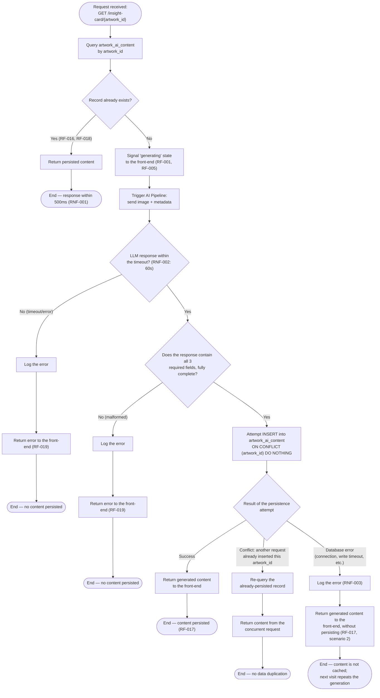

# Persistence Flow Diagram — Art Archive AI

**Version:** 1.0
**Date:** 2026-07-03
**Status:** In review
**Base documents:** [01 — Vision and Scope](./01-vision-scope.md), [02 — Requirements](./02-requirements.md), [04 — System Architecture](./04-architecture.md), [05 — Database](./05-database.md)

---

## 1. Purpose

This document is the single source of truth for the **"check before generating"** mechanism — the core of the on-demand persistence described in doc 01 (§3.2, objective 2) and specified in detail by RF-001, RF-016 through RF-019, and RNF-001 through RNF-003 of doc 02.

The sequence diagrams in doc 04 (§7.1 through §7.3) already show the three main paths (generation, cache, failure) at the architecture level. This document goes deeper into these same paths in a single decision flowchart, also covering a scenario not detailed previously: **two simultaneous requests for the same artwork with no persisted content** (race condition).

---

## 2. Complete Flowchart



---

## 3. Description of Steps and Decisions

| Node                                         | Description                                                                                                                                      | Requirement                                                |
| -------------------------------------------- | ------------------------------------------------------------------------------------------------------------------------------------------------ | ---------------------------------------------------------- |
| Query `artwork_ai_content`                   | First action taken by the backend upon receiving the request — no AI call occurs before this check                                               | RF-016                                                     |
| Record already exists? (Yes)                 | Cache path — content is returned directly, without triggering the AI Pipeline                                                                    | RF-016, RF-018, RNF-001                                    |
| Signal "generating" state                    | The backend informs the front-end that generation has been triggered, allowing the loading state to be displayed                                 | RF-001, RF-005                                             |
| Trigger AI Pipeline                          | Sends the artwork's image and metadata to the AI Pipeline module (doc 04, §4), which in turn calls Azure OpenAI                                  | RF-002, RF-003, RF-007                                     |
| Response within the timeout? (No)            | 60-second timeout (RNF-002) or communication error with the LLM — treated as a generation failure                                                | RF-019, RNF-002                                            |
| Response contains all 3 fields? (No)         | Completeness validation: historical context, comparative analysis, and Alt Text must all be present and non-empty before proceeding              | RF-002, RF-003, RF-007, RF-019                             |
| Attempt INSERT with `ON CONFLICT DO NOTHING` | Attempt at atomic persistence — see Section 4 for the rationale behind this choice                                                               | RF-009, RF-017                                             |
| Result: Success                              | Happy path — the generated content is persisted and returned in the same response                                                                | RF-017 (scenario 1)                                        |
| Result: Conflict                             | Another concurrent request already processed and persisted this same artwork between the initial check and the write attempt — see Section 4     | Not covered by an explicit FR; design decision (Section 4) |
| Result: Database error                       | Generation succeeded, but the write to PostgreSQL failed (connection lost, etc.) — the content is still delivered to the user, but is not cached | RF-017 (scenario 2)                                        |

---

## 4. Concurrency Handling (Race Condition)

**Problem not covered by previous documents:** RF-016 describes the check as a single step ("the backend checks... and the call to the AI only occurs if the content does not exist"), but does not define what happens if **two requests for the same artwork with no persisted content arrive simultaneously** — for example, two different visitors opening the same new artwork at the same time. Without handling, both requests would see "does not exist" on the initial check, and both would call the LLM and attempt to insert the same `artwork_id` — the second `INSERT` attempt would violate the primary key of `artwork_ai_content` (doc 05, §4).

**Design decision:** the insert uses `INSERT ... ON CONFLICT (artwork_id) DO NOTHING` instead of a plain `INSERT`. This means:

- The first request to finish generation inserts the record normally.
- The second request, when attempting to insert the same, already-existing `artwork_id`, does not receive a constraint-violation error — the operation simply inserts nothing, and the backend re-queries the record (already persisted by the first request) to return it to the user.

**Rationale:** this approach avoids exposing a 500 error to the second visitor merely due to bad timing luck, without requiring a distributed lock mechanism (unnecessary for the traffic volume expected in this academic project). The accepted cost is that, in the worst case, the LLM may be called twice for the same artwork during the first concurrency window — only one of the two results is persisted, the other is discarded after use.

---

## 5. Verification Logic Pseudocode

```python
async def get_or_generate_insight_card(artwork_id: int) -> InsightCardResponse:
    existing = await db.get_artwork_ai_content(artwork_id)
    if existing:
        return InsightCardResponse.from_db(existing)  # RF-016, RF-018

    artwork = await harvard_proxy.get_object(artwork_id)

    try:
        generated = await ai_pipeline.generate(
            image_url=artwork.primary_image_url,
            metadata=artwork.metadata,
            timeout=GENERATION_TIMEOUT_SECONDS,  # RNF-002: 60s
        )
    except (TimeoutError, LLMError):
        log.error(f"Generation failed for artwork_id={artwork_id}")
        raise InsightCardGenerationError()  # RF-019

    if not generated.is_complete():
        log.error(f"Incomplete LLM response for artwork_id={artwork_id}")
        raise InsightCardGenerationError()  # RF-019

    try:
        inserted = await db.insert_artwork_ai_content(
            artwork_id, generated, on_conflict="do_nothing"
        )
        if not inserted:
            existing = await db.get_artwork_ai_content(artwork_id)
            return InsightCardResponse.from_db(existing)  # concurrent request won
    except DatabaseError as e:
        log.error(f"Failed to persist artwork_id={artwork_id}: {e}")
        return InsightCardResponse.from_generated(generated)  # RF-017, scenario 2

    return InsightCardResponse.from_generated(generated)  # RF-017, scenario 1
```

---

## 6. Time Checkpoints

| Flow stage                                                                    | Time budget                                                                   | Requirement     |
| ----------------------------------------------------------------------------- | ----------------------------------------------------------------------------- | --------------- |
| Initial query + return of cached content                                      | Up to 500ms                                                                   | RNF-001         |
| Initial query → complete LLM response → persistence → return to the front-end | Up to 60s                                                                     | RNF-002         |
| From 60s onward with no LLM response                                          | Triggers the timeout path (Section 2, node "Response within the timeout? No") | RNF-002, RF-019 |

---

## 7. Edge Cases

| Scenario                                                           | Handling in the flow                                                                                                                                                                                                                                                      | Reference                        |
| ------------------------------------------------------------------ | ------------------------------------------------------------------------------------------------------------------------------------------------------------------------------------------------------------------------------------------------------------------------- | -------------------------------- |
| Incomplete artwork metadata (no date or technique)                 | Absorbed inside the AI Pipeline before this flow begins — generation proceeds normally with the available data, without triggering the error path                                                                                                                         | RF-002 (scenario 2)              |
| Artwork image inaccessible (invalid URL)                           | Today results in total generation failure (this flow's error path) — no content is persisted, including the Alt Text. **Pending issue already recorded in doc 03 (§5):** evaluate whether a default warning text should be generated in this case, instead of no Alt Text | RF-007 (scenario 2)              |
| Two simultaneous requests for an artwork with no persisted content | Handled via `INSERT ... ON CONFLICT DO NOTHING` + re-query (Section 4)                                                                                                                                                                                                    | Design decision of this document |
| Write failure to the database after successful generation          | Content is delivered to the user without being persisted; error logged; next visit repeats the generation                                                                                                                                                                 | RF-017 (scenario 2), RNF-003     |
| LLM timeout (above 60s)                                            | Error path — message displayed only in the Insight Card area, rest of the page functional                                                                                                                                                                                 | RF-006, RF-019, RNF-002          |

---

## 8. Traceability

| Flow Element               | Related Requirements         | Related Use Cases |
| -------------------------- | ---------------------------- | ----------------- |
| Check before generating    | RF-001, RF-016               | UC-01, UC-02      |
| Generation via AI Pipeline | RF-002, RF-003, RF-007       | UC-01             |
| Timeout / generation error | RF-006, RF-019, RNF-002      | UC-03             |
| Successful persistence     | RF-009, RF-017 (scenario 1)  | UC-01             |
| Persistence failure        | RF-017 (scenario 2), RNF-003 | UC-01, UC-03      |
| Concurrency conflict       | — (design decision)          | UC-01             |
| Return of cached content   | RF-018, RNF-001              | UC-02             |

> The complete matrix, connecting requirements to architecture components and test cases, will be formalized in document 16 — Traceability Matrix.
