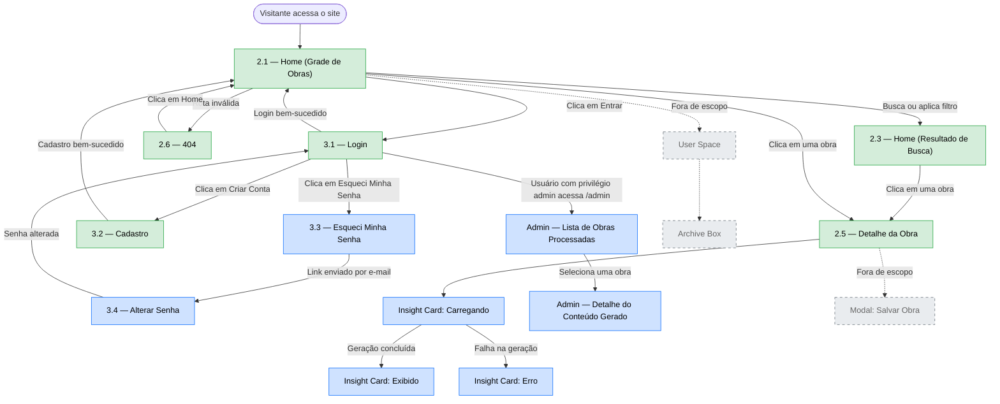
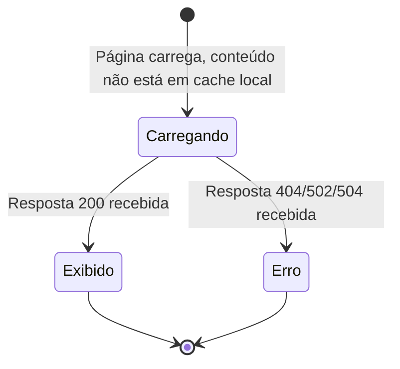
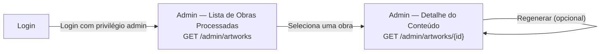

# Navegação e Fluxo — Art Archive AI

**Versão:** 1.0
**Data:** 2026-07-03
**Status:** Em revisão
**Documentos base:** [02 — Requisitos](./02-requisitos.md), [03 — Casos de Uso](./03-casos-de-uso.md), [06 — Fluxo de Persistência](./06-fluxo-persistencia.md), [07 — API Contract](./07-api-contract.md)

---

## 1. Objetivo

Mapear as telas e transições da experiência do usuário na plataforma expandida. Diferente do diagrama de navegabilidade original do MVP (`documentation/Navigability Diagrams/`), que inclui telas planejadas mas nunca implementadas, este documento parte do **estado real do código atual** (rotas em `src/app/`) e sobrepõe as telas e estados novos introduzidos por esta expansão.

---

## 2. Reconciliação com o Diagrama de Navegabilidade Original do MVP

| Tela (diagrama original)        | Rota no código atual                                               | Status                                                                        |
| ------------------------------- | ------------------------------------------------------------------ | ----------------------------------------------------------------------------- |
| 2.1 — Home (Grid)               | `src/app/home/`                                                    | Implementada                                                                  |
| 2.3 — Home (Search Result)      | `src/app/home/` (mesmo componente, estado interno de filtro/busca) | Implementada como estado, não como rota separada                              |
| 2.4 — Loading Screen            | `src/app/home/` (estado interno)                                   | Implementada como estado                                                      |
| 2.5 — Artwork Details           | `src/app/object/[objectId]/`                                       | Implementada                                                                  |
| 2.6 — 404                       | `src/app/not-found.tsx`                                            | Implementada                                                                  |
| 3.1 — Sign in                   | `src/app/login/`                                                   | UI implementada; lógica de autenticação (Firebase) está inerte/comentada hoje |
| 3.2 — Sign up                   | `src/app/signUp/`                                                  | UI implementada; lógica de autenticação inerte                                |
| 3.3 — Forgot password           | —                                                                  | **Nunca implementada** — apenas planejada no diagrama original                |
| 3.4 — Change password           | —                                                                  | **Nunca implementada** — apenas planejada                                     |
| 4.2 — Modal Save to Archive Box | —                                                                  | **Nunca implementada**                                                        |
| 4.3 — User Space                | —                                                                  | **Nunca implementada**                                                        |
| 4.4 / 4.5 — Archive Box         | —                                                                  | **Nunca implementada**                                                        |

Essa reconciliação é a mesma constatação já registrada no doc 05 (Decisão 6): a funcionalidade de "preferências salvas" (Archive Box) existe apenas em diagramas antigos, não no código.

---

## 3. Escopo desta Expansão na Navegação

**Novo nesta expansão:**

- Estados do **Insight Card** dentro da tela de Detalhe da Obra (carregando, exibido, erro) — RF-004, RF-005, RF-006, doc 06.
- Fluxo completo de autenticação via backend próprio, incluindo as telas **Esqueci Minha Senha** e **Alterar Senha**, planejadas desde o MVP original mas nunca construídas — agora necessárias para cumprir a paridade funcional de recuperação de senha exigida pelo RF-014 e formalizadas como endpoints no doc 07 (§5).
- **Painel Administrativo** (lista de obras processadas e detalhe do conteúdo gerado) — doc 04 (§4) e doc 07 (§6).

**Fora do escopo desta expansão** (ver Seção 8): User Space, Archive Box e o modal de salvar obra — nenhum RF desta expansão cobre a construção dessas telas (doc 01, §5.2).

---

## 4. Diagrama de Navegabilidade Geral



**Legenda:** verde = já implementada no MVP · azul = nova nesta expansão · cinza tracejado = fora do escopo (referência apenas).

---

## 5. Fluxo Detalhado — Autenticação

O fluxo de telas (Login → Cadastro → Esqueci Minha Senha → Alterar Senha) permanece estruturalmente igual ao planejado no diagrama original do MVP. A mudança desta expansão é o que acontece **por trás** de cada tela: as chamadas passam a ir para os endpoints do doc 07 (§5) em vez do Firebase Auth.

| Transição                                     | Endpoint acionado                   | Requisito         |
| --------------------------------------------- | ----------------------------------- | ----------------- |
| Login → Home (sucesso)                        | `POST /auth/login`                  | RF-013            |
| Cadastro → Home (sucesso)                     | `POST /auth/register`               | RF-014 (paridade) |
| Esqueci Minha Senha → aviso de e-mail enviado | `POST /auth/password-reset/request` | RF-014 (paridade) |
| Link do e-mail → Alterar Senha → Login        | `POST /auth/password-reset/confirm` | RF-014 (paridade) |

---

## 6. Fluxo Detalhado — Estados do Insight Card

O Insight Card não introduz uma nova rota — ele é uma região com três estados possíveis dentro da tela de Detalhe da Obra (2.5), consumindo `GET /artworks/{artwork_id}/insight-card` (doc 07, §4).



| Estado     | Descrição                                                                        | Requisito      |
| ---------- | -------------------------------------------------------------------------------- | -------------- |
| Carregando | Exibido enquanto a requisição ao backend está em andamento (client-side, RF-005) | RF-005         |
| Exibido    | Conteúdo completo (contextualização + comparativa) renderizado                   | RF-004         |
| Erro       | Mensagem de erro na área do card; resto da página permanece funcional            | RF-006, RF-019 |

Os três estados devem ser anunciados corretamente por tecnologia assistiva via `aria-live` (RF-011) — ver doc 03, UC-05.

---

## 7. Fluxo Detalhado — Painel Administrativo (Novo)



> **Dependência pendente:** o acesso a `/admin/*` exige a distinção de privilégio administrativo (`is_admin`) ainda não definida no schema — pendência já registrada no doc 07 (§8, item 1). A navegação para esta seção deve ser bloqueada até essa definição ser resolvida.

---

## 8. Fora do Escopo desta Expansão

As telas **User Space**, **Archive Box** e o **Modal de Salvar Obra** aparecem no diagrama da Seção 4 apenas como referência de navegação futura (linhas tracejadas). Elas não são construídas nesta expansão porque:

- Nenhum RF do doc 02 cobre a implementação dessas telas.
- O doc 01 (§5.2) exclui explicitamente funcionalidades do MVP original que não foram entregues.
- O doc 05 (Decisão 6) já modela `saved_artworks` de forma mínima exatamente por essa razão — os dados têm um lugar para existir, mas a interface para gerenciá-los não faz parte deste semestre.

---

## 9. Critérios de Aceite de Navegação

```gherkin
Funcionalidade: Navegação para recuperação de senha

  Cenário: Usuário solicita redefinição de senha
    Dado que o usuário está na tela de Login
    Quando ele clica em "Esqueci Minha Senha"
    Então a tela "Esqueci Minha Senha" é exibida
    E, ao informar um e-mail válido, um aviso de confirmação é exibido

  Cenário: Usuário conclui a alteração de senha
    Dado que o usuário acessou o link de redefinição recebido por e-mail
    Quando ele informa e confirma a nova senha na tela "Alterar Senha"
    Então o usuário é redirecionado para a tela de Login
```

```gherkin
Funcionalidade: Navegação do Insight Card

  Cenário: Transição de carregando para exibido
    Dado que o usuário acessa a tela de Detalhe da Obra
    E o Insight Card está no estado "Carregando"
    Quando a requisição ao backend retorna com sucesso
    Então o estado muda para "Exibido", sem recarregar a página
```

---

## 10. Rastreabilidade

| Elemento de Navegação                  | Requisitos Relacionados        | Casos de Uso Relacionados |
| -------------------------------------- | ------------------------------ | ------------------------- |
| Home, Detalhe da Obra, 404 (herdadas)  | —                              | —                         |
| Login, Cadastro, Esqueci/Alterar Senha | RF-013, RF-014                 | UC-06                     |
| Estados do Insight Card                | RF-004, RF-005, RF-006, RF-011 | UC-01, UC-03, UC-05       |
| Painel Administrativo                  | — (Bloco 7 do doc 99)          | —                         |

> A matriz completa, conectando requisitos a componentes de arquitetura e casos de teste, será formalizada no documento 16 — Matriz de Rastreabilidade.
