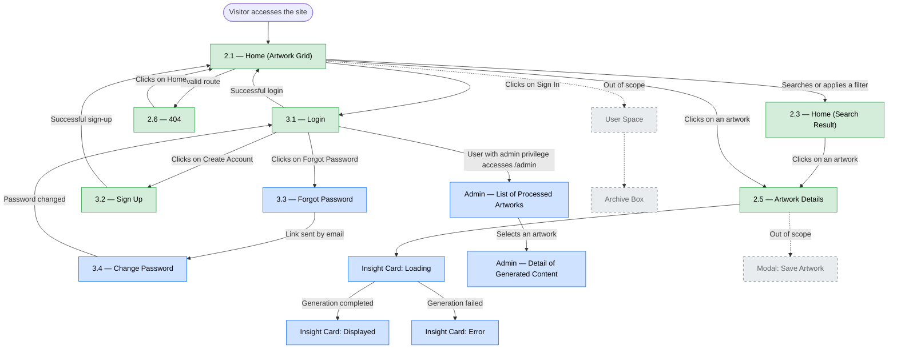
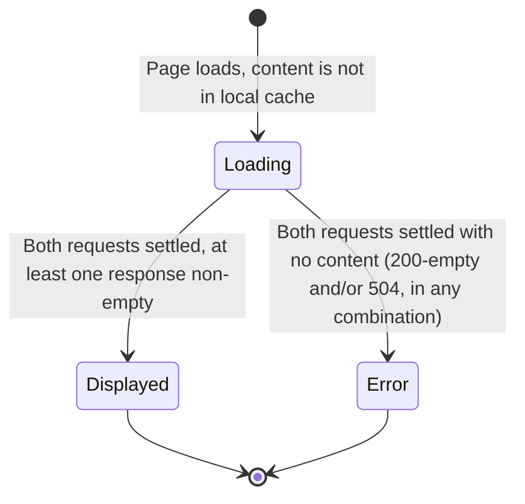
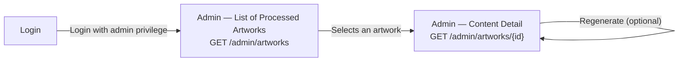

# Navigation and Flow — Art Archive AI

**Version:** 1.2
**Date:** 2026-07-26
**Status:** Under review
**Base documents:** [02.1 — Insight Card](./requeriments/02.1-insight-card.md), [02.3 — ARIA Accessibility](./requeriments/02.3-aria-accessibility.md), [02.4 — Authentication](./requeriments/02.4-authentication.md), [03 — Use Cases](./03-use-cases.md), [06 — Persistence Flow](./06-persistence-flow.md), [07 — API Contract](./07-api-contract.md)

> **Change Note (2026-07-26):** requirement IDs throughout this document have been remapped from the original flat `02-requirements.md` numbering to the current split numbering (docs 02.1–02.5) — the numbers no longer align 1:1 with the previous revision. The Insight Card state model (§6) is clarified to reflect that, although the two Insight Card blocks are checked and generated independently on the backend (RF-001), the front-end still only exposes three states and never renders one block before the other.
>
> **Change Note (2026-07-26, v1.2):** §6 is corrected — the Insight Card consumes **two independent endpoints**, `GET /artworks/{artwork_id}/historical-context` and `GET /artworks/{artwork_id}/comparative-analysis` (doc 07, §4), fired by the front-end in parallel, not a single bundled `GET /artworks/{artwork_id}/insight-card` request. The three front-end states (Loading/Displayed/Error) are unchanged, but they are now produced by the front-end recombining these two independent responses (doc 06, §5) rather than by a single backend-aggregated response.

---

## 1. Purpose

Map the screens and transitions of the user experience on the expanded platform. Unlike the original MVP navigability diagram (`documentation/Navigability Diagrams/`), which includes planned screens that were never implemented, this document starts from the **actual state of the current code** (routes in `src/app/`) and overlays the new screens and states introduced by this expansion.

---

## 2. Reconciliation with the Original MVP Navigability Diagram

| Screen (original diagram)       | Route in current code                                          | Status                                                                           |
| ------------------------------- | -------------------------------------------------------------- | -------------------------------------------------------------------------------- |
| 2.1 — Home (Grid)               | `src/app/home/`                                                | Implemented                                                                      |
| 2.3 — Home (Search Result)      | `src/app/home/` (same component, internal filter/search state) | Implemented as a state, not as a separate route                                  |
| 2.4 — Loading Screen            | `src/app/home/` (internal state)                               | Implemented as a state                                                           |
| 2.5 — Artwork Details           | `src/app/object/[objectId]/`                                   | Implemented                                                                      |
| 2.6 — 404                       | `src/app/not-found.tsx`                                        | Implemented                                                                      |
| 3.1 — Sign in                   | `src/app/login/`                                               | UI implemented; authentication logic (Firebase) is currently inert/commented out |
| 3.2 — Sign up                   | `src/app/signUp/`                                              | UI implemented; authentication logic inert                                       |
| 3.3 — Forgot password           | —                                                              | **Never implemented** — only planned in the original diagram                     |
| 3.4 — Change password           | —                                                              | **Never implemented** — only planned                                             |
| 4.2 — Modal Save to Archive Box | —                                                              | **Never implemented**                                                            |
| 4.3 — User Space                | —                                                              | **Never implemented**                                                            |
| 4.4 / 4.5 — Archive Box         | —                                                              | **Never implemented**                                                            |

This reconciliation is the same finding already recorded in doc 05 (Decision 6): the "saved preferences" functionality (Archive Box) exists only in old diagrams, not in the code.

---

## 3. Scope of This Expansion in Navigation

**New in this expansion:**

- States of the **Insight Card** within the Artwork Details screen (loading, displayed, error), covering both blocks independently under the hood while never rendering one before the other — RF-001, RF-005, RF-006, RF-007, doc 06.
- Complete authentication flow via the project's own backend, including the **Forgot Password** and **Change Password** screens, planned since the original MVP but never built — now required by RF-029 and RF-030, and formalized as endpoints in doc 07 (§5).
- **Administrative Panel** (list of processed artworks and detail of generated content) — doc 04 (§4) and doc 07 (§6).

**Out of scope for this expansion** (see Section 8): User Space, Archive Box, and the save-artwork modal — no FR of this expansion covers the construction of these screens (doc 01, §5.2).

---

## 4. General Navigability Diagram



**Legend:** green = already implemented in the MVP · blue = new in this expansion · dashed gray = out of scope (reference only).

---

## 5. Detailed Flow — Authentication

The screen flow (Login → Sign Up → Forgot Password → Change Password) remains structurally the same as planned in the original MVP diagram. What changes in this expansion is what happens **behind** each screen: calls now go to the endpoints in doc 07 (§5) instead of Firebase Auth.

| Transition                                  | Endpoint triggered                  | Requirement |
| ------------------------------------------- | ----------------------------------- | ----------- |
| Login → Home (success)                      | `POST /auth/login`                  | RF-026      |
| Sign Up → Home (success)                    | `POST /auth/register`               | RF-027      |
| Forgot Password → confirmation-email notice | `POST /auth/password-reset/request` | RF-029      |
| Email link → Change Password → Login        | `POST /auth/password-reset/confirm` | RF-030      |

---

## 6. Detailed Flow — Insight Card States

The Insight Card does not introduce a new route — it is a region with three possible **front-end** states within the Artwork Details screen (2.5), consuming **two independent endpoints** fired in parallel: `GET /artworks/{artwork_id}/historical-context` and `GET /artworks/{artwork_id}/comparative-analysis` (doc 07, §4). The backend checks and generates each block independently, behind its own request, with no awareness of the other (RF-001, doc 06 §2/§3) — the front-end is the one that recombines the two responses (doc 06, §5) and only ever transitions once, from Loading to either Displayed or Error, once **both** requests have settled; it never shows one block before the other.



| State     | Description                                                                                                                                                      | Requirement    |
| --------- | ---------------------------------------------------------------------------------------------------------------------------------------------------------------- | -------------- |
| Loading   | Displayed while both requests are in flight (client-side); covers both blocks at once                                                                            | RF-006         |
| Displayed | At least one of the two responses has content; only the non-empty block(s) are rendered, no placeholder for the other                                            | RF-001, RF-005 |
| Error     | Both responses ended up without content — standard message, or the timeout-specific message if both were `504 GENERATION_TIMEOUT`; rest of page stays functional | RF-007         |

The three states must be correctly announced by assistive technology via `aria-live="polite"` (RF-015) — see doc 02.3, RF-015.

Alt Text follows its own, third, fully decoupled request (`GET /artworks/{artwork_id}/alt-text`, doc 07, §4) — it is applied to the image's `alt` attribute independently, whenever that request settles, regardless of which of the three states above the Insight Card is in at that moment.

---

## 7. Detailed Flow — Administrative Panel (New)



> **Pending dependency:** access to `/admin/*` requires the distinction of administrative privilege (`is_admin`), which is not yet defined in the schema — a pending issue already recorded in doc 07 (§8, item 1). Navigation to this section must be blocked until this definition is resolved.

---

## 8. Out of Scope for This Expansion

The **User Space**, **Archive Box**, and **Save Artwork Modal** screens appear in the Section 4 diagram only as a reference for future navigation (dashed lines). They are not built in this expansion because:

- No RF in docs 02.1–02.5 covers the implementation of these screens.
- Doc 01 (§5.2) explicitly excludes functionalities from the original MVP that were not delivered.
- Doc 05 defines no table for this data at all (no `saved_artworks` or equivalent) — there is no RF requiring this cache, consistent with doc 05 §1's stance that PostgreSQL only stores AI-generated content and user/auth data, nothing else.

---

## 9. Navigation Acceptance Criteria

```gherkin
Feature: Navigation for password recovery

  Scenario: User requests a password reset
    Given the user is on the Login screen
    When they click on "Forgot Password"
    Then the "Forgot Password" screen is displayed
    And, upon entering a valid email, a confirmation notice is displayed

  Scenario: User completes the password change
    Given the user has accessed the reset link received by email
    When they enter and confirm the new password on the "Change Password" screen
    Then the user is redirected to the Login screen
```

```gherkin
Feature: Insight Card navigation

  Scenario: Transition from loading to displayed
    Given the user accesses the Artwork Details screen
    And the Insight Card is in the "Loading" state
    When the request to the backend returns successfully
    Then the state changes to "Displayed", without reloading the page

  Scenario: One block succeeds, the other does not — still no error
    Given the user accesses the Artwork Details screen
    And the Insight Card is in the "Loading" state
    When the historical-context request returns non-empty content
    And the comparative-analysis request returns without content (empty text or 504)
    Then the state changes to "Displayed", rendering only the historical-context block
    And no error message is shown anywhere in the Insight Card

  Scenario: Transition from loading to error — standard message
    Given the user accesses the Artwork Details screen
    And the Insight Card is in the "Loading" state
    When both the historical-context and comparative-analysis requests settle without content
    And at least one of them did not fail specifically due to a timeout
    Then the state changes to "Error", showing the standard "was not possible to generate" message
    And the rest of the page (title, image, metadata) remains functional

  Scenario: Transition from loading to error — timeout-specific message
    Given the user accesses the Artwork Details screen
    And the Insight Card is in the "Loading" state
    When both the historical-context and comparative-analysis requests return 504 GENERATION_TIMEOUT
    Then the state changes to "Error", showing the timeout-specific message
    And the rest of the page (title, image, metadata) remains functional
```

---

## 10. Traceability

| Navigation Element                                                          | Related Requirements                                           | Related Use Cases   |
| --------------------------------------------------------------------------- | -------------------------------------------------------------- | ------------------- |
| Home, Artwork Details, 404 (inherited)                                      | —                                                              | —                   |
| Login, Sign Up, Forgot/Change Password                                      | RF-026, RF-027, RF-029, RF-030                                 | UC-06               |
| Insight Card states                                                         | RF-001, RF-005, RF-006, RF-007, RF-015                         | UC-01, UC-03, UC-05 |
| Administrative Panel                                                        | — (Block 7 of doc 99)                                          | —                   |
| Sitewide accessibility (Home, Search, Artwork Details, Login, Sign Up, 404) | RF-018, RF-019, RF-020, RF-021, RF-022, RF-023, RF-024, RF-025 | UC-05               |

> The complete matrix, connecting requirements to architecture components and test cases, will be formalized in document 16 — Traceability Matrix.
