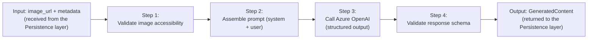
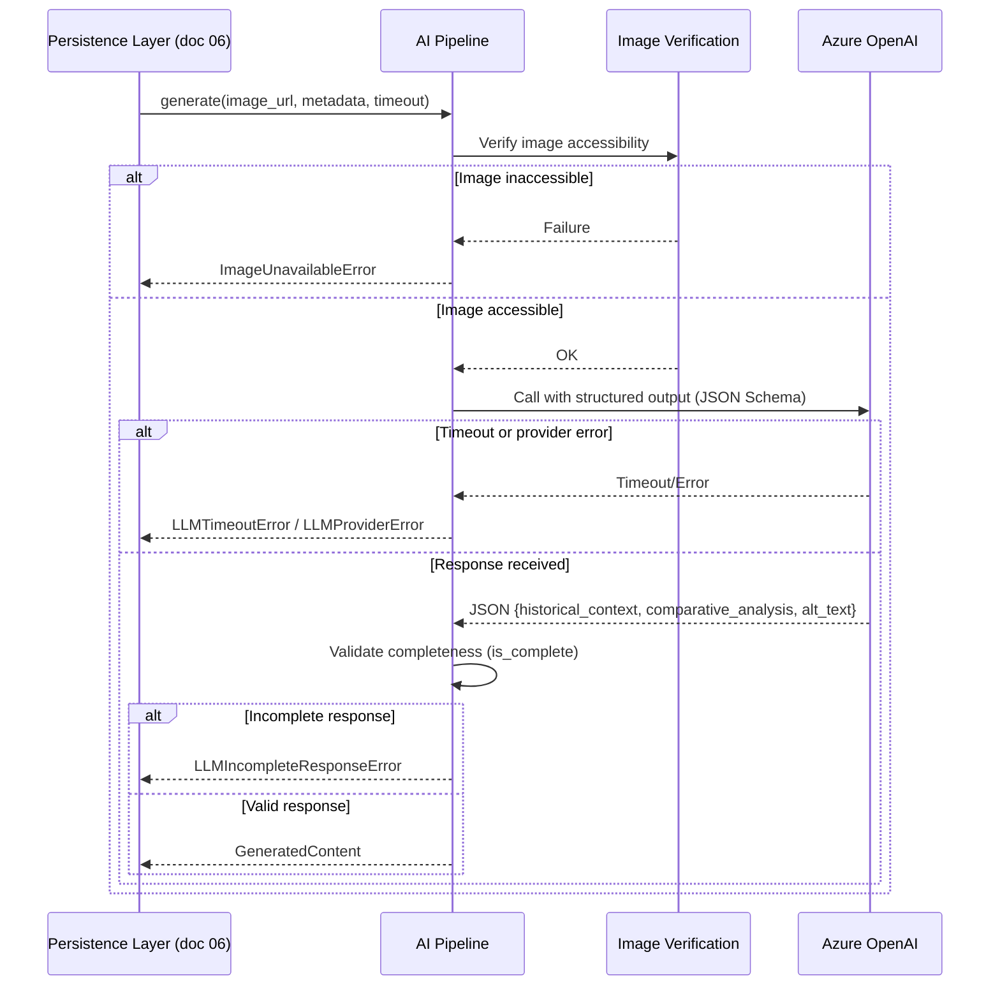

# AI Pipeline — Insight Card and Alt Text — Art Archive AI

**Version:** 1.0
**Date:** 2026-07-03
**Status:** In Review
**Base Documents:** [02 — Requirements](./02-requirements.md), [03 — Use Cases](./03-use-cases.md), [04 — System Architecture](./04-architecture.md), [05 — Database](./05-database.md), [06 — Persistence Flow](./06-persistence-flow.md), [07 — API Contract](./07-api-contract-en.md)

---

## 1. Purpose

This document details the internal workings of the **AI Pipeline Module** (doc 04, §4), triggered by the "Trigger AI Pipeline" node of the persistence flow (doc 06, §2) through the `ai_pipeline.generate(...)` function referenced in its pseudocode (doc 06, §5).

**Scope:** this document covers the technical stages of the pipeline — input collection, structural prompt assembly, model call, response validation — from raw input to structured output ready for persistence (doc 05). **It does not cover** the exact text of the prompts nor their versioning and evolution strategy — that is the responsibility of **doc 11 — Prompt Engineering**.

---

## 2. Pipeline Overview



The pipeline **does not fetch data from the Harvard API on its own** — the entity that assembles the input `metadata` is the On-Demand Persistence layer (doc 06), which has already obtained the data via the Harvard Proxy module before calling the pipeline. This separation of responsibility keeps the pipeline testable in isolation (doc 99, Phase 3) without depending on any external network beyond Azure OpenAI.

---

## 3. Input Contract

```python
async def generate(
    image_url: str,
    metadata: ArtworkMetadata,
    timeout: int,  # RNF-002: 60s, total budget passed down by the Persistence layer
) -> GeneratedContent:
    ...
```

```python
@dataclass
class ArtworkMetadata:
    title: str
    artists: list[str]           # artist names (people with role="Artist")
    date_display: str | None     # "dated" field from the Harvard API
    period: str | None
    culture: str | None
    classification: str | None
    technique: str | None
    medium: str | None
```

**Rationale for field selection:** the chosen fields map directly to the elements required by RF-002 (historical period, artistic movement, artist biography, cultural influences) and RF-003 (palette, technique, style). Fields missing from the artwork are simply omitted from the prompt — covering the incomplete metadata scenario (RF-002, scenario 2) without any additional conditional logic in the pipeline.

---

## 4. Step 1 — Image Accessibility Validation

Before any call to the LLM, the pipeline verifies that `image_url` is accessible (a lightweight request, e.g. `HEAD`, with a short timeout independent of the 60s generation budget).

**Design decision:** this check is proactive and separate from the LLM call, instead of letting Azure OpenAI fail while trying to fetch an invalid URL. This allows precisely distinguishing the **inaccessible image** scenario (RF-007, scenario 2) from a generic generation failure (RF-019) — without this step, both cases would produce the same indistinguishable error coming from the LLM API.

- **Failure at this step** → the pipeline raises `ImageUnavailableError`, stopping before incurring any LLM call cost.

---

## 5. Step 2 — Prompt Assembly

The prompt is composed of two parts:

- **System message:** defines the assistant's role (educational curator), the tone (didactic, accessible to non-specialists), and the required output format — see doc 11 for the exact text and its versioning.
- **User message:** contains the image (`image_url`) and the available `ArtworkMetadata` fields, formatted as structured context.

**Structured output (central technical decision):** the call to Azure OpenAI uses **structured output via JSON Schema** (function calling / `response_format: json_schema`), forcing the model to return exactly the three fields below, typed as string:

```json
{
  "historical_context": "string",
  "comparative_analysis": "string",
  "alt_text": "string"
}
```

This approach replaces free-text parsing and drastically reduces the incidence of malformed responses (RF-019) — the LLM provider itself guarantees the shape of the JSON; Step 4 validation only handles the **content** (empty fields, Alt Text length).

---

## 6. Step 3 — Call to Azure OpenAI

| Parameter    | Suggested Value                                                                           | Rationale                                                                                                                            |
| ------------ | ----------------------------------------------------------------------------------------- | ------------------------------------------------------------------------------------------------------------------------------------ |
| Model        | Multimodal Azure OpenAI model available under the educational subscription (e.g., GPT-4o) | Supports image input + structured output in a single call                                                                            |
| Temperature  | Low (e.g., 0.3–0.4)                                                                       | Prioritizes factual accuracy over creativity — reduces the risk of historical hallucination (relevant to doc 14, Quality Evaluation) |
| `max_tokens` | Sufficient for the three fields (e.g., 800–1000)                                          | Avoids truncation of `comparative_analysis`, typically the longest field                                                             |
| Timeout      | Budget remaining within the total 60s (RNF-002), net of the time already spent in Step 1  | Ensures the pipeline never exceeds the limit defined in doc 06                                                                       |
| Retries      | **None automatic**                                                                        | See Section 8, decision 3                                                                                                            |

- **Failure at this step** (timeout or provider error) → the pipeline raises `LLMTimeoutError` or `LLMProviderError`.

---

## 7. Step 4 — Response Schema Validation

Even with structured output, the pipeline validates the **content** before returning:

```python
def is_complete(self) -> bool:
    return (
        bool(self.historical_context.strip())
        and bool(self.comparative_analysis.strip())
        and 50 <= len(self.alt_text.strip()) <= 300  # RF-007
    )
```

If `is_complete()` returns `False`, the pipeline raises `LLMIncompleteResponseError` — handled by the Persistence layer exactly like any other generation failure (doc 06, node "Response contains the 3 fields? No").

---

## 8. Technical Decisions and Rationale

| #   | Decision                                                                      | Reason                                                                                                                                                                               |
| --- | ----------------------------------------------------------------------------- | ------------------------------------------------------------------------------------------------------------------------------------------------------------------------------------ |
| 1   | Structured output (JSON Schema/function calling) instead of free-text parsing | Reduces the incidence of malformed responses (RF-019) by delegating shape validation to the LLM provider itself                                                                      |
| 2   | Proactive image accessibility validation before the LLM call                  | Allows precisely distinguishing RF-007 (scenario 2 — inaccessible image) from a generic generation failure (RF-019)                                                                  |
| 3   | No automatic retry attempt within the pipeline                                | Keeps the 60s budget (RNF-002) predictable and not duplicated; a failure is reported immediately to the user (RF-019) instead of risking exceeding the timeout with a second attempt |
| 4   | A single LLM call generates all three fields simultaneously                   | RF-009 requires the Alt Text to be generated in the same operation as the Insight Card — avoids duplicated inference cost and possible inconsistency between the texts               |
| 5   | Low temperature (0.3–0.4)                                                     | Prioritizes factual accuracy, relevant to the quality evaluation of the generated content (doc 14)                                                                                   |
| 6   | The pipeline does not fetch metadata from the Harvard API on its own          | Keeps the module testable in isolation via script/CLI (doc 99, Phase 3), with no network dependency beyond Azure OpenAI                                                              |

---

## 9. Output Contract

```python
@dataclass
class GeneratedContent:
    historical_context: str
    comparative_analysis: str
    alt_text: str
    prompt_version: str  # RNF-006 — identifier of the prompt version used (doc 11)

    def is_complete(self) -> bool:
        ...
```

Maps directly to the columns of `artwork_ai_content` (doc 05, §5.4) at the persistence step — no additional transformation is needed between the pipeline output and the `INSERT` described in doc 06.

---

## 10. Pipeline Error Handling

| Internal Exception           | Step Where It Occurs | Mapping in doc 06                                                    | Mapping in doc 07 (API)  |
| ---------------------------- | -------------------- | -------------------------------------------------------------------- | ------------------------ |
| `ImageUnavailableError`      | Step 1               | Node "Response within timeout? No" (treated as a generation failure) | `502 GENERATION_FAILED`  |
| `LLMTimeoutError`            | Step 3               | Node "Response within timeout? No"                                   | `504 GENERATION_TIMEOUT` |
| `LLMProviderError`           | Step 3               | Node "Response within timeout? No"                                   | `502 GENERATION_FAILED`  |
| `LLMIncompleteResponseError` | Step 4               | Node "Response contains the 3 fields? No"                            | `502 GENERATION_FAILED`  |

> The pending issue already recorded in docs 03 (§5) and 06 (§7) remains: today, `ImageUnavailableError` interrupts the entire generation, with no warning Alt Text produced. This document does not resolve this pending issue — it only names the corresponding exception for implementation purposes.

---

## 11. Internal Sequence Diagram

Details what happens "inside" the "Trigger AI Pipeline" node of doc 06 (§2):



---

## 12. Traceability

| Pipeline Step              | Related Requirements                    | Related Documents            |
| -------------------------- | --------------------------------------- | ---------------------------- |
| Image validation (Step 1)  | RF-007 (scenario 2)                     | doc 03 (§5), doc 06 (§7)     |
| Prompt assembly (Step 2)   | RF-002, RF-003                          | doc 11 (text and versioning) |
| LLM call (Step 3)          | RF-002, RF-003, RF-007, RF-009, RNF-002 | doc 04 (§4), doc 06 (§5, §6) |
| Schema validation (Step 4) | RF-002, RF-003, RF-007, RF-019          | doc 06 (§2)                  |
| Output contract            | RNF-006                                 | doc 05 (§5.4)                |

> The complete matrix, connecting requirements to architecture components and test cases, will be formalized in document 16 — Traceability Matrix.
