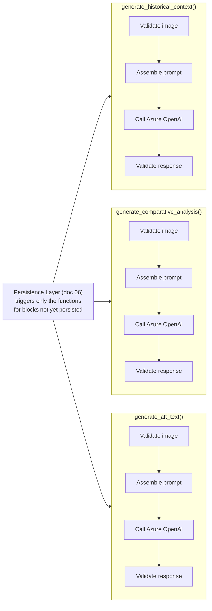
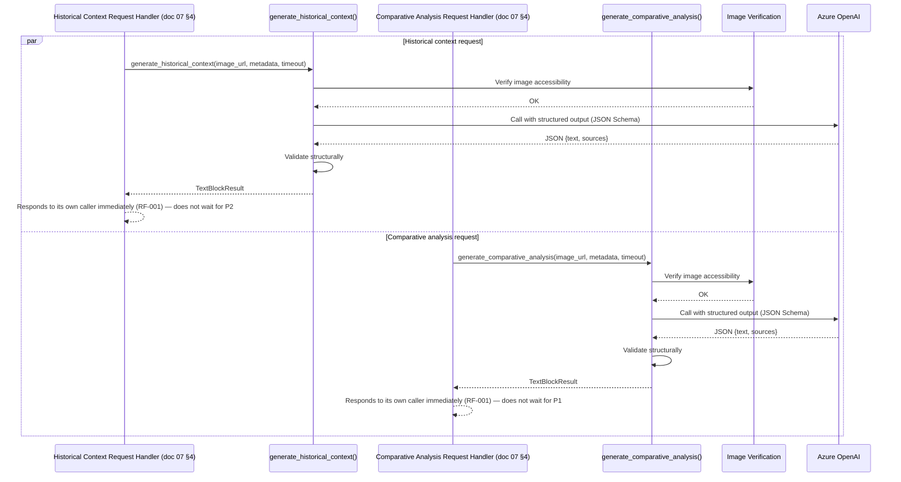
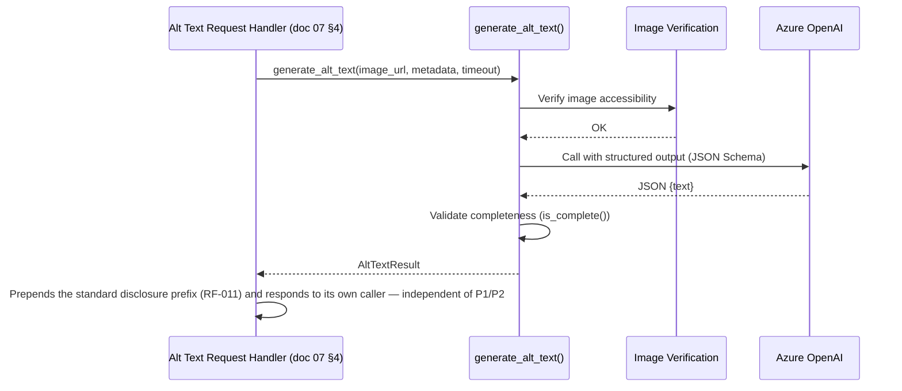

# AI Pipeline — Insight Card and Alt Text — Art Archive AI

**Version:** 2.1
**Date:** 2026-07-26
**Status:** In Review
**Base Documents:** [02.1 — Insight Card](./requeriments/02.1-insight-card.md), [02.2 — Alt Text](./requeriments/02.2-alt-text.md), [02.5 — Non-Functional](./requeriments/02.5-non-functional.md), [04 — System Architecture](./04-architecture.md), [05 — Database](./05-database.md), [06 — Persistence Flow](./06-persistence-flow.md)

---

## 1. Purpose

This document details the internal workings of the **AI Pipeline Module** (doc 04, §4), which the persistence layer (doc 06) calls independently for each of the three content blocks — historical context, comparative analysis, and Alt Text.

**Scope:** this document covers the technical stages of the pipeline — input collection, structural prompt assembly, model call, response validation — from raw input to structured output ready for persistence (doc 05). **It does not cover** the exact text of the prompts nor their versioning and evolution strategy — that is the responsibility of **doc 11 — Prompt Engineering**.

> **Change Note (2026-07-26):** revised to align with doc 02.1 (RF-001 through RF-004, RF-009, RF-010) and doc 02.2 (RF-011, RF-013), which superseded the original `02-requirements.md` this pipeline was first designed against. The previous version modeled **one** LLM call producing all three fields together (former §8, Decision 4), matching a single-row, all-fields-`NOT NULL` schema. That is no longer correct: RF-001 requires the historical-context and comparative-analysis blocks to be checked and generated **independently**, and RF-013 requires Alt Text to be generated through its **own fully separate dedicated call**. This version splits the pipeline into **three independent generation functions**, each callable on its own, matching the independently-nullable columns introduced in doc 05 (§4). It also adds source-relevance handling (RF-010), which the previous version did not model.
>
> **Change Note (2026-07-26, v2.1):** §11 is corrected — `generate_historical_context()` and `generate_comparative_analysis()` are invoked by **two separate HTTP request handlers**, one per dedicated endpoint (doc 07, §4), not by a single persistence-layer handler that calls both via `asyncio.gather`. The two calls may still happen concurrently in practice, since the front-end fires both requests at essentially the same time on artwork visit (doc 04, §7.1), but neither backend handler waits on, or knows about, the other.

---

## 2. Pipeline Overview

The pipeline now exposes **three independent entry points**, each following the same four-step shape, but callable in isolation:



Per RF-001, the persistence layer only invokes the function(s) corresponding to the block(s) actually missing from the database — zero, one, two, or all three of these functions may run for a given request, and none of them waits on, or is blocked by, the others' outcome.

The pipeline **does not fetch data from the Harvard API on its own** — the entity that assembles the input `metadata` is the On-Demand Persistence layer (doc 06), which has already obtained the data via the Harvard Proxy module before calling any of the three functions. This separation of responsibility keeps the pipeline testable in isolation without depending on any external network beyond Azure OpenAI.

---

## 3. Input Contract

```python
async def generate_historical_context(
    image_url: str,
    metadata: ArtworkMetadata,
    timeout: int,  # RNF-002: budget remaining within the shared 60s window
) -> TextBlockResult: ...

async def generate_comparative_analysis(
    image_url: str,
    metadata: ArtworkMetadata,
    timeout: int,
) -> TextBlockResult: ...

async def generate_alt_text(
    image_url: str,
    metadata: ArtworkMetadata,
    timeout: int,
) -> AltTextResult: ...
```

```python
@dataclass
class ArtworkMetadata:
    title: str
    artists: list[str]           # artist names (people with role="Artist")
    date_display: str | None     # "dated" field from the Harvard API
    period: str | None
    culture: str | None
    classification: str | None
    technique: str | None
    medium: str | None
```

**Rationale for field selection:** the chosen fields map directly to the elements required by RF-002 (historical period, artistic movement, artist biography, cultural influences) and RF-003 (period, technique, or culture similarity). Fields missing from the artwork are simply omitted from the prompt — covering the incomplete-metadata scenarios (RF-002 scenario 2, RF-003's equivalent, RF-011 scenario 2) without any additional conditional logic in the pipeline.

All three functions receive the same `image_url` and `metadata` — the artwork's data is fetched once by the persistence layer and passed to whichever of the three functions are actually invoked (RF-001).

---

## 4. Step 1 — Image Accessibility Validation

Before any call to the LLM, each of the three functions independently verifies that `image_url` is accessible (a lightweight request, e.g. `HEAD`, with a short timeout independent of the 60s generation budget). This is duplicated per function rather than hoisted into a shared pre-check because the three calls are not guaranteed to run within the same request (RF-001 may trigger only one or two of them on a given visit; RF-013 always calls `generate_alt_text` through its own separate path).

**Design decision:** this check is proactive and separate from the LLM call, instead of letting Azure OpenAI fail while trying to fetch an invalid URL. This allows precisely distinguishing an **inaccessible image** failure from a generic generation failure (RF-007, RF-011 scenario 3) — without this step, both cases would produce the same indistinguishable error coming from the LLM API.

- **Failure at this step** → the function raises `ImageUnavailableError`, stopping before incurring any LLM call cost.

---

## 5. Step 2 — Prompt Assembly

Each function assembles its **own** system + user prompt pair — see doc 11 for the exact text and versioning of each of the three prompts. Unlike the single combined prompt in the previous version of this document, there is no shared prompt text between the three calls beyond the common metadata-formatting convention.

**Structured output per call:** each of the three calls uses **structured output via JSON Schema** (function calling / `response_format: json_schema`), scoped to that call's own fields:

```json
// generate_historical_context / generate_comparative_analysis
{
  "text": "string — may be an empty string if there is not enough reliable information (RF-002/RF-003, scenario 3) or no appropriate source (RF-010)",
  "sources": ["string — URL"]
}
```

```json
// generate_alt_text
{
  "text": "string — descriptive alt text (visual description only; see note below)"
}
```

**Disclosure prefix is not requested from the LLM.** RF-011 requires the exact wording _"The text was generated by an AI system and may contain inaccuracies."_ to open every successfully generated Alt Text. Asking the model to reproduce this sentence verbatim on every call risks small wording drift; instead, the model is only asked for the visual description, and the persistence layer (doc 06) prepends the fixed disclosure string in code before persisting/returning the value. The fallback message used on failure (RF-011, scenario 3, "Was not possible to generate an alt text for this image.") is a distinct string and never carries the disclosure prefix.

This approach replaces free-text parsing and drastically reduces the incidence of malformed responses — the LLM provider itself guarantees the shape of the JSON; Step 4 validation only handles the **content** each call is responsible for.

---

## 6. Step 3 — Call to Azure OpenAI

| Parameter    | Suggested Value                                                                                                              | Rationale                                                                                                                                                                                                                        |
| ------------ | ---------------------------------------------------------------------------------------------------------------------------- | -------------------------------------------------------------------------------------------------------------------------------------------------------------------------------------------------------------------------------- |
| Model        | Multimodal Azure OpenAI model available under the educational subscription (e.g., GPT-4o)                                    | Supports image input + structured output in a single call                                                                                                                                                                        |
| Temperature  | Low (e.g., 0.3–0.4) for all three calls                                                                                      | Prioritizes factual accuracy over creativity — reduces the risk of historical hallucination (relevant to doc 14, Quality Evaluation)                                                                                             |
| `max_tokens` | Sized per call: higher for `historical_context`/`comparative_analysis` (e.g., 600–800), lower for `alt_text` (e.g., 150–200) | Each call now only produces its own field — no need for a single shared budget large enough for all three fields at once                                                                                                         |
| Timeout      | Budget remaining within the shared 60s window (RNF-002), net of the time already spent in that call's Step 1                 | Each call independently respects the 60s ceiling; RNF-002's "shared window" means the overall visit is only a timeout if **none** of the triggered calls return in time — one call's timeout does not cancel or extend another's |
| Retries      | **None automatic**                                                                                                           | See Section 8, decision 3                                                                                                                                                                                                        |
| Web search   | Enabled for `generate_historical_context` and `generate_comparative_analysis` only                                           | RF-009 — open web search, no predefined source list, used to enrich these two blocks; not required for `alt_text`, which describes only the visible image                                                                        |

- **Failure at this step** (timeout or provider error) → the function raises `LLMTimeoutError` or `LLMProviderError`, scoped to that call only. A failure in one call has no effect on the other two.

---

## 7. Step 4 — Response Validation

Unlike the previous version, an **empty `text` field is not, by itself, a failure** for `generate_historical_context` or `generate_comparative_analysis` — RF-002 (scenario 3) and RF-003 (scenario 3.2) require the LLM to return `""` rather than fabricate content when it lacks reliable information, and RF-010 (scenario 10.2) requires the same when no source survives the relevance check. Step 4 therefore validates **structural** completeness only:

```python
class TextBlockResult:
    text: str
    sources: list[str]
    prompt_version: str

    def is_structurally_valid(self) -> bool:
        # "text" and "sources" must both be present and correctly typed;
        # "text" MAY legitimately be an empty string (RF-002/RF-003 scenario 3, RF-010 scenario 10.2)
        # "sources" MUST be empty whenever "text" is empty
        return isinstance(self.text, str) and isinstance(self.sources, list) and (
            self.sources == [] if self.text == "" else True
        )
```

```python
class AltTextResult:
    text: str
    prompt_version: str

    def is_complete(self) -> bool:
        # unlike the two text blocks above, RF-011 defines no "insufficient information"
        # path for Alt Text — an empty or missing result here is always a technical failure
        return bool(self.text.strip())
```

If `is_structurally_valid()` / `is_complete()` returns `False`, the corresponding function raises `LLMIncompleteResponseError` — handled by the persistence layer exactly like any other generation failure for that specific block (doc 06).

**Source-relevance filtering (RF-010):** the LLM is instructed (doc 11) to self-filter the `sources` it returns to only those containing relevant information about the artwork, its artist, period, technique, or culture, and to return an empty `text` together with an empty `sources` array if no source it consulted meets that bar. The pipeline does not run a second, independent relevance check — doing so would require a second LLM call, defeating the purpose of a single structured-output round trip — it trusts the same call's self-filtering, consistent with the existing no-fabrication rule already delegated to the model.

---

## 8. Technical Decisions and Rationale

| #   | Decision                                                                                             | Reason                                                                                                                                                                                                                                                                                                            |
| --- | ---------------------------------------------------------------------------------------------------- | ----------------------------------------------------------------------------------------------------------------------------------------------------------------------------------------------------------------------------------------------------------------------------------------------------------------- |
| 1   | Structured output (JSON Schema/function calling) instead of free-text parsing                        | Reduces the incidence of malformed responses by delegating shape validation to the LLM provider itself, for each of the three calls independently                                                                                                                                                                 |
| 2   | Proactive image accessibility validation before each LLM call                                        | Allows precisely distinguishing an inaccessible-image failure from a generic generation failure, per block                                                                                                                                                                                                        |
| 3   | No automatic retry attempt within any of the three calls                                             | Keeps the 60s budget (RNF-002) predictable and not duplicated; a failure is reported immediately for that block instead of risking exceeding the timeout with a second attempt                                                                                                                                    |
| 4   | **Three independent LLM calls — one per block** (historical context, comparative analysis, Alt Text) | Replaces the previous single-call design. RF-001 requires the historical-context and comparative-analysis blocks to be checked and generated independently (0, 1, or 2 calls depending on what is missing); RF-013 requires Alt Text to be generated through its own dedicated call, decoupled from the other two |
| 5   | Low temperature (0.3–0.4) for all three calls                                                        | Prioritizes factual accuracy, relevant to the quality evaluation of the generated content (doc 14)                                                                                                                                                                                                                |
| 6   | The pipeline does not fetch metadata from the Harvard API on its own                                 | Keeps the module testable in isolation via script/CLI, with no network dependency beyond Azure OpenAI                                                                                                                                                                                                             |
| 7   | Empty `text` is a valid, non-error outcome for the two Insight Card blocks                           | RF-002/RF-003 (scenario 3) and RF-010 (scenario 10.2) require the LLM to admit insufficient information or a lack of an appropriate source rather than fabricate content — this is intentionally distinct from Alt Text (RF-011), which has no equivalent "insufficient information" path                         |

---

## 9. Output Contract

```python
@dataclass
class TextBlockResult:
    text: str                # "" if insufficient information or no appropriate source
    sources: list[str]       # always [] when text == ""
    prompt_version: str      # RNF-006 — identifier of the prompt version used (doc 11)

@dataclass
class AltTextResult:
    text: str                 # visual description only — the persistence layer prepends the disclosure sentence (RF-011) before use
    prompt_version: str       # RNF-006
```

`TextBlockResult` (returned by `generate_historical_context` and `generate_comparative_analysis`) maps to the corresponding `*_prompt_version`/`*_generated_at` column pair in `artwork_ai_content` plus rows in `artwork_content_sources` (doc 05, §4/§5.4/§5.5). `AltTextResult` maps to the `alt_text`/`alt_text_prompt_version`/`alt_text_generated_at` columns. In both cases, persistence only occurs when `text` is non-empty (doc 06) — no additional transformation is needed between a function's output and the corresponding `UPDATE`/`INSERT`.

---

## 10. Pipeline Error Handling

| Internal Exception           | Raised By                                                               | Mapping in doc 06                                                                                                                    | Mapping in doc 07 (API)                                                                                                                                 |
| ---------------------------- | ----------------------------------------------------------------------- | ------------------------------------------------------------------------------------------------------------------------------------ | ------------------------------------------------------------------------------------------------------------------------------------------------------- |
| `ImageUnavailableError`      | Any of the three functions, Step 1                                      | That block's generation is treated as failed, independent of the other two blocks (doc 06 §2/§3/§4)                                  | `historical_context`/`comparative_analysis`: `200` with that field `""`. `alt_text`: `200` with the fallback message (RF-011 scenario 3). Never a `5xx` |
| `LLMTimeoutError`            | `generate_historical_context` / `generate_comparative_analysis`, Step 3 | That specific request times out; the Insight Card's combined timeout message (doc 06 §5) is only shown if **both** requests time out | `504 GENERATION_TIMEOUT` on that specific endpoint (doc 07 §4)                                                                                          |
| `LLMTimeoutError`            | `generate_alt_text`, Step 3                                             | Treated as any other Alt Text generation failure (doc 06 §4) — Alt Text has no timeout-specific status                               | `200` with the fallback message — this endpoint never returns a `5xx` (doc 07 §4)                                                                       |
| `LLMProviderError`           | Any of the three functions, Step 3                                      | That block's generation is treated as failed, independent of the other two                                                           | Same mapping as `ImageUnavailableError` above — `200` with empty field or fallback message, never a `5xx`                                               |
| `LLMIncompleteResponseError` | Any of the three functions, Step 4                                      | That block's generation is treated as failed, independent of the other two                                                           | Same mapping as `ImageUnavailableError` above                                                                                                           |

A failure in one function never raises an exception that propagates to, or cancels, the other two — each of the three is caught and handled independently by its own request handler (doc 06), consistent with RF-001's per-block independence and RF-007's rule that the Insight Card only shows an error when **both** of its two requests come back without content (doc 06, §5).

---

## 11. Internal Sequence Diagrams

### 11.1 Historical Context and Comparative Analysis Requests (Both Missing)

Details what happens when a visitor's page load fires the two Insight Card requests at essentially the same time and both blocks turn out to be missing for that artwork. **`P1` and `P2` are two separate request handlers, backing two separate endpoints (doc 07, §4)** — they are drawn on the same timeline only to show that they happen concurrently; neither knows about, waits on, or shares state with the other. Each returns directly to its own caller once its own block settles — there is no shared "wait for both" step on the backend (that recombination happens in the front-end, doc 06 §5).



`generate_alt_text` is not shown in this diagram — see Section 11.2 below. Per RF-013, it is triggered by a third, fully separate request (doc 07, §4) whenever the front-end renders the artwork's image and the Alt Text is not yet persisted, independent of whichever Insight Card blocks are or are not being (re)generated at the same time.

### 11.2 Alt Text Request (Missing)

Details what happens when `GET /artworks/{artwork_id}/alt-text` (doc 07, §4) is fired and the block is not yet persisted. **`P3` is its own request handler**, fully decoupled from `P1`/`P2` above — it may run before, after, or concurrently with either of them, with no shared state or synchronization point.



Unlike `generate_historical_context`/`generate_comparative_analysis`, a failure at any step here (`ImageUnavailableError`, `LLMTimeoutError`, `LLMProviderError`, `LLMIncompleteResponseError`) never reaches `P3` as a result to forward — it resolves to the standard fallback message instead, with no equivalent to `TextBlockResult`'s empty-but-valid outcome (doc 06, §4; Section 10 above).

---

## 12. Traceability

| Pipeline Element                                | Related Requirements                                               | Related Documents   |
| ----------------------------------------------- | ------------------------------------------------------------------ | ------------------- |
| Independent per-block invocation                | RF-001, RF-013                                                     | doc 06 (§2, §3, §4) |
| Image validation (Step 1)                       | RF-007, RF-011 (scenario 3)                                        | doc 06 (§9)         |
| `generate_historical_context` prompt (Step 2)   | RF-002                                                             | doc 11              |
| `generate_comparative_analysis` prompt (Step 2) | RF-003                                                             | doc 11              |
| `generate_alt_text` prompt (Step 2)             | RF-011                                                             | doc 11              |
| Web search during Step 3                        | RF-009                                                             | doc 11              |
| Source-relevance self-filtering                 | RF-010                                                             | doc 11              |
| Empty-text-is-valid handling (Step 4)           | RF-002 (scenario 3), RF-003 (scenario 3.2), RF-010 (scenario 10.2) | doc 06              |
| Alt Text completeness (Step 4)                  | RF-011                                                             | doc 06              |
| Shared 60s budget across the three calls        | RNF-002                                                            | doc 06 (§8)         |
| Output contract                                 | RNF-006                                                            | doc 05 (§5.4, §5.5) |

> The complete matrix, connecting requirements to architecture components and test cases, will be formalized in document 16 — Traceability Matrix.
