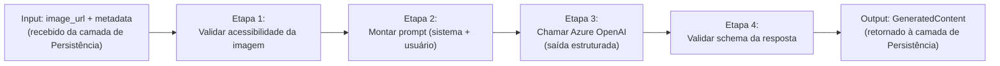
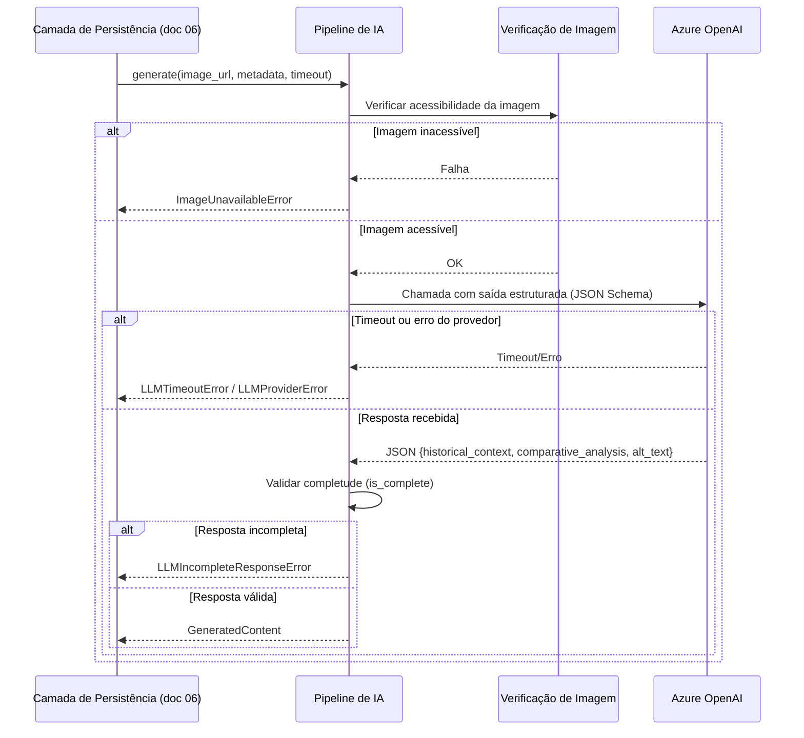

# Pipeline de IA — Insight Card e Alt Text — Art Archive AI

**Versão:** 1.0
**Data:** 2026-07-03
**Status:** Em revisão
**Documentos base:** [02 — Requisitos](./02-requisitos.md), [03 — Casos de Uso](./03-casos-de-uso.md), [04 — Arquitetura do Sistema](./04-arquitetura.md), [05 — Banco de Dados](./05-banco-de-dados.md), [06 — Fluxo de Persistência](./06-fluxo-persistencia.md), [07 — API Contract](./07-api-contract.md)

---

## 1. Objetivo

Este documento detalha o funcionamento interno do **Módulo Pipeline de IA** (doc 04, §4), acionado pelo nó "Acionar Pipeline de IA" do fluxo de persistência (doc 06, §2) através da função `ai_pipeline.generate(...)` referenciada em seu pseudocódigo (doc 06, §5).

**Escopo:** este documento cobre os estágios técnicos do pipeline — coleta de input, montagem estrutural do prompt, chamada ao modelo, validação da resposta — do input bruto ao output estruturado pronto para persistência (doc 05). **Não cobre** o texto exato dos prompts nem sua estratégia de versionamento e evolução — isso é responsabilidade do **doc 11 — Prompt Engineering**.

---

## 2. Visão Geral do Pipeline



O pipeline **não busca dados da Harvard API por conta própria** — quem monta o `metadata` de entrada é a camada de Persistência sob Demanda (doc 06), que já obteve os dados via módulo Harvard Proxy antes de chamar o pipeline. Essa separação de responsabilidade mantém o pipeline testável isoladamente (doc 99, Fase 3) sem depender de rede externa além do Azure OpenAI.

---

## 3. Contrato de Entrada (Input)

```python
async def generate(
    image_url: str,
    metadata: ArtworkMetadata,
    timeout: int,  # RNF-002: 60s, orçamento total repassado pela camada de Persistência
) -> GeneratedContent:
    ...
```

```python
@dataclass
class ArtworkMetadata:
    title: str
    artists: list[str]           # nomes dos artistas (people com role="Artist")
    date_display: str | None     # campo "dated" da Harvard API
    period: str | None
    culture: str | None
    classification: str | None
    technique: str | None
    medium: str | None
```

**Justificativa da seleção de campos:** os campos escolhidos mapeiam diretamente aos elementos exigidos por RF-002 (período histórico, movimento artístico, biografia do artista, influências culturais) e RF-003 (paleta, técnica, estilo). Campos ausentes na obra são simplesmente omitidos do prompt — cobrindo o cenário de metadados incompletos (RF-002, cenário 2) sem lógica condicional adicional no pipeline.

---

## 4. Etapa 1 — Validação de Acessibilidade da Imagem

Antes de qualquer chamada ao LLM, o pipeline verifica que `image_url` está acessível (requisição leve, ex. `HEAD`, com timeout curto e independente do orçamento de 60s da geração).

**Decisão de design:** essa verificação é proativa e separada da chamada ao LLM, em vez de deixar a Azure OpenAI falhar ao tentar buscar uma URL inválida. Isso permite diferenciar com precisão o cenário de **imagem inacessível** (RF-007, cenário 2) de uma falha genérica de geração (RF-019) — sem essa etapa, ambos os casos produziriam o mesmo erro indistinguível vindo da API do LLM.

- **Falha nesta etapa** → pipeline lança `ImageUnavailableError`, interrompendo antes de qualquer custo de chamada ao LLM.

---

## 5. Etapa 2 — Montagem do Prompt

O prompt é composto por duas partes:

- **Mensagem de sistema:** define o papel do assistente (curador educativo), o tom (didático, acessível a não-especialistas) e o formato de saída exigido — ver doc 11 para o texto exato e seu versionamento.
- **Mensagem de usuário:** contém a imagem (`image_url`) e os campos de `ArtworkMetadata` disponíveis, formatados como contexto estruturado.

**Saída estruturada (decisão técnica central):** a chamada ao Azure OpenAI usa **saída estruturada via JSON Schema** (function calling / `response_format: json_schema`), forçando o modelo a retornar exatamente os três campos abaixo, tipados como string:

```json
{
  "historical_context": "string",
  "comparative_analysis": "string",
  "alt_text": "string"
}
```

Essa abordagem substitui o parsing de texto livre e reduz drasticamente a incidência de respostas malformadas (RF-019) — o próprio provedor do LLM garante a forma do JSON; a validação da Etapa 4 cuida apenas do **conteúdo** (campos vazios, tamanho do Alt Text).

---

## 6. Etapa 3 — Chamada ao Azure OpenAI

| Parâmetro    | Valor sugerido                                                                             | Justificativa                                                                                                                        |
| ------------ | ------------------------------------------------------------------------------------------ | ------------------------------------------------------------------------------------------------------------------------------------ |
| Modelo       | Modelo multimodal do Azure OpenAI disponível na assinatura educacional (ex.: GPT-4o)       | Suporta entrada de imagem + saída estruturada em uma única chamada                                                                   |
| Temperatura  | Baixa (ex.: 0.3–0.4)                                                                       | Prioriza precisão factual sobre criatividade — reduz risco de alucinação histórica (relevante para o doc 14, Avaliação de Qualidade) |
| `max_tokens` | Suficiente para os três campos (ex.: 800–1000)                                             | Evita truncamento do `comparative_analysis`, tipicamente o campo mais longo                                                          |
| Timeout      | Orçamento restante dentro dos 60s totais (RNF-002), descontado o tempo já gasto na Etapa 1 | Garante que o pipeline nunca excede o limite definido no doc 06                                                                      |
| Tentativas   | **Nenhuma automática**                                                                     | Ver Seção 8, decisão 3                                                                                                               |

- **Falha nesta etapa** (timeout ou erro do provedor) → pipeline lança `LLMTimeoutError` ou `LLMProviderError`.

---

## 7. Etapa 4 — Validação do Schema de Resposta

Mesmo com saída estruturada, o pipeline valida o **conteúdo** antes de retornar:

```python
def is_complete(self) -> bool:
    return (
        bool(self.historical_context.strip())
        and bool(self.comparative_analysis.strip())
        and 50 <= len(self.alt_text.strip()) <= 300  # RF-007
    )
```

Se `is_complete()` retornar `False`, o pipeline lança `LLMIncompleteResponseError` — tratado pela camada de Persistência exatamente como qualquer outra falha de geração (doc 06, nó "Resposta contém os 3 campos? Não").

---

## 8. Decisões Técnicas e Justificativas

| #   | Decisão                                                                           | Motivo                                                                                                                                                                                 |
| --- | --------------------------------------------------------------------------------- | -------------------------------------------------------------------------------------------------------------------------------------------------------------------------------------- |
| 1   | Saída estruturada (JSON Schema/function calling) em vez de parsing de texto livre | Reduz a incidência de respostas malformadas (RF-019) ao delegar a validação de forma ao próprio provedor do LLM                                                                        |
| 2   | Validação proativa de acessibilidade da imagem antes da chamada ao LLM            | Permite diferenciar precisamente RF-007 (cenário 2 — imagem inacessível) de uma falha genérica de geração (RF-019)                                                                     |
| 3   | Nenhuma tentativa automática de retry dentro do pipeline                          | Mantém o orçamento de 60s (RNF-002) previsível e não duplicado; uma falha é reportada imediatamente ao usuário (RF-019) em vez de arriscar exceder o timeout com uma segunda tentativa |
| 4   | Uma única chamada ao LLM gera os três campos simultaneamente                      | RF-009 exige que o Alt Text seja gerado na mesma operação do Insight Card — evita custo duplicado de inferência e possível inconsistência entre os textos                              |
| 5   | Temperatura baixa (0.3–0.4)                                                       | Prioriza precisão factual, relevante para a avaliação de qualidade do conteúdo gerado (doc 14)                                                                                         |
| 6   | Pipeline não busca metadados da Harvard API por conta própria                     | Mantém o módulo testável isoladamente via script/CLI (doc 99, Fase 3), sem dependência de rede além do Azure OpenAI                                                                    |

---

## 9. Contrato de Saída (Output)

```python
@dataclass
class GeneratedContent:
    historical_context: str
    comparative_analysis: str
    alt_text: str
    prompt_version: str  # RNF-006 — identificador da versão do prompt usada (doc 11)

    def is_complete(self) -> bool:
        ...
```

Mapeamento direto para as colunas de `artwork_ai_content` (doc 05, §5.4) na etapa de persistência — nenhuma transformação adicional é necessária entre o output do pipeline e o `INSERT` descrito no doc 06.

---

## 10. Tratamento de Erros do Pipeline

| Exceção interna              | Etapa onde ocorre | Mapeamento no doc 06                                                 | Mapeamento no doc 07 (API) |
| ---------------------------- | ----------------- | -------------------------------------------------------------------- | -------------------------- |
| `ImageUnavailableError`      | Etapa 1           | Nó "Resposta dentro do timeout? Não" (tratado como falha de geração) | `502 GENERATION_FAILED`    |
| `LLMTimeoutError`            | Etapa 3           | Nó "Resposta dentro do timeout? Não"                                 | `504 GENERATION_TIMEOUT`   |
| `LLMProviderError`           | Etapa 3           | Nó "Resposta dentro do timeout? Não"                                 | `502 GENERATION_FAILED`    |
| `LLMIncompleteResponseError` | Etapa 4           | Nó "Resposta contém os 3 campos? Não"                                | `502 GENERATION_FAILED`    |

> A pendência já registrada nos docs 03 (§5) e 06 (§7) permanece: hoje, `ImageUnavailableError` interrompe toda a geração, sem gerar nenhum Alt Text de aviso. Este documento não resolve essa pendência — apenas nomeia a exceção correspondente para fins de implementação.

---

## 11. Diagrama de Sequência Interno

Detalha o que acontece "dentro" do nó "Acionar Pipeline de IA" do doc 06 (§2):



---

## 12. Rastreabilidade

| Etapa do Pipeline             | Requisitos Relacionados                 | Documentos Relacionados        |
| ----------------------------- | --------------------------------------- | ------------------------------ |
| Validação de imagem (Etapa 1) | RF-007 (cenário 2)                      | doc 03 (§5), doc 06 (§7)       |
| Montagem do prompt (Etapa 2)  | RF-002, RF-003                          | doc 11 (texto e versionamento) |
| Chamada ao LLM (Etapa 3)      | RF-002, RF-003, RF-007, RF-009, RNF-002 | doc 04 (§4), doc 06 (§5, §6)   |
| Validação de schema (Etapa 4) | RF-002, RF-003, RF-007, RF-019          | doc 06 (§2)                    |
| Contrato de saída             | RNF-006                                 | doc 05 (§5.4)                  |

> A matriz completa, conectando requisitos a componentes de arquitetura e casos de teste, será formalizada no documento 16 — Matriz de Rastreabilidade.
